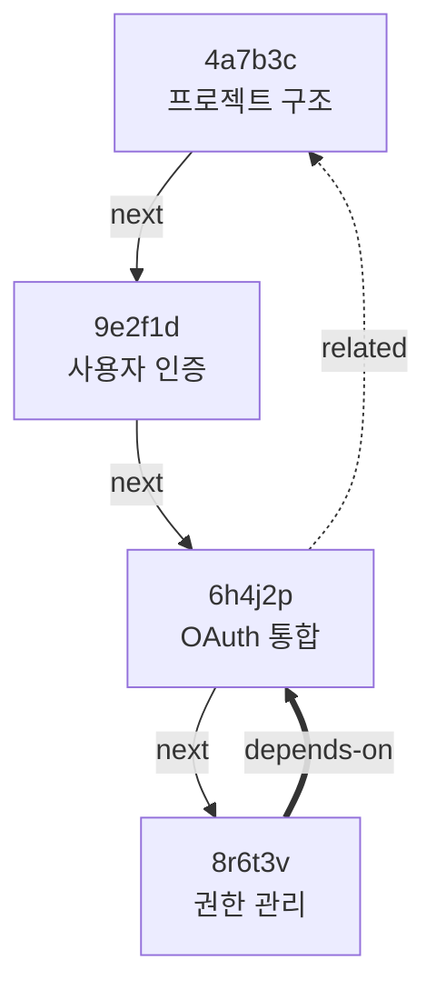

## 11. Checkpoint ID 연결

Checkpoint 간의 연결은 AI 작업 흐름의 맥락을 파악하고 의존성을 추적하는 핵심 메커니즘입니다. 이 장에서는 12-hex ID 체계와 양방향 연결 시스템을 다룹니다.

### 12-hex ID 체계

#### ID 구조

```
Checkpoint ID: 12자리 16진수
형식: [timestamp:8][random:4]

예시: 4a7b3c9e2f1d
        │      │
        │      └─ Random (4 hex digits)
        └──────── Timestamp-based (8 hex digits)

특징:
1. 시간순 정렬 가능
2. 충돌 확률 극히 낮음
3. 사람이 읽기 용이한 길이
4. Git SHA와 혼동 방지
```

#### ID 생성 알고리즘

```javascript
function generateCheckpointId() {
  // 1. 타임스탬프 기반 (첫 8자리)
  const timestamp = Date.now();
  const timestampHex = timestamp.toString(16).slice(-8);

  // 2. 랜덤 데이터 (마지막 4자리)
  const random = crypto.randomBytes(2);
  const randomHex = random.toString('hex');

  // 3. 결합
  const id = timestampHex + randomHex;

  // 4. 충돌 검증
  if (checkpointExists(id)) {
    // 충돌 시 재생성 (매우 드묾)
    return generateCheckpointId();
  }

  return id;
}

// 예시 생성
generateCheckpointId(); // "65e9a1b3c2f4"
generateCheckpointId(); // "65e9a1b47d3a" (1초 후)
generateCheckpointId(); // "65e9a5f29e1b" (1시간 후)
```

#### ID 파싱

```bash
# ID에서 타임스탬프 추출
entire checkpoint parse 4a7b3c9e2f1d

# 출력:
# Checkpoint ID: 4a7b3c9e2f1d
#
# Components:
#   Timestamp part: 4a7b3c9e (8 hex)
#   Random part: 2f1d (4 hex)
#
# Timestamp: 1249999006 (Unix)
# Created: 2009-08-11 18:30:06 +0900
#
# Random entropy: 16 bits
# Collision probability: ~1 in 65,536 per millisecond
```

#### 짧은 형태 사용

```bash
# 전체 ID
entire checkpoint info 4a7b3c9e2f1d

# 짧은 형태 (앞 6자리)
entire checkpoint info 4a7b3c

# 최소 형태 (앞 4자리, 유일하면)
entire checkpoint info 4a7b

# 충돌 시 경고
entire checkpoint info 4a7b
# Multiple checkpoints match '4a7b':
#   4a7b3c9e2f1d (사용자 인증 완료)
#   4a7b8f3a1e2c (OAuth 통합)
# Please use more characters (at least 6).
```

### 연결 타입

```
링크 타입:
┌────────────────────────────────────────┐
│ 1. Sequential Links (순차적)          │
│    previous ←→ next                    │
│    시간순 이전/다음 checkpoint         │
│                                        │
│ 2. Related Links (관련)               │
│    related ←→ related                  │
│    논리적으로 관련된 checkpoint        │
│                                        │
│ 3. Parent Links (계층)                │
│    parent → children                   │
│    파생 관계                           │
│                                        │
│ 4. Dependency Links (의존성)          │
│    depends-on → required-by            │
│    기능 의존성                         │
└────────────────────────────────────────┘
```

### Sequential Links (순차 연결)

#### 자동 생성

```bash
# Checkpoint 생성 시 자동으로 이전 checkpoint와 연결

# 첫 번째 checkpoint
entire checkpoint create --message "A"
# ✓ Checkpoint: 4a7b3c (no previous)

# 두 번째 checkpoint
entire checkpoint create --message "B"
# ✓ Checkpoint: 9e2f1d
# ✓ Linked: previous=4a7b3c

# 세 번째 checkpoint
entire checkpoint create --message "C"
# ✓ Checkpoint: 6h4j2p
# ✓ Linked: previous=9e2f1d

# 결과 체인:
# 4a7b3c → 9e2f1d → 6h4j2p
```

#### 양방향 링크

```json
// Checkpoint 4a7b3c (A)
{
  "id": "4a7b3c9e2f1d",
  "message": "A",
  "links": {
    "previous": null,
    "next": "9e2f1d6h4j2p"
  }
}

// Checkpoint 9e2f1d (B)
{
  "id": "9e2f1d6h4j2p",
  "message": "B",
  "links": {
    "previous": "4a7b3c9e2f1d",
    "next": "6h4j2p3k8m2n"
  }
}

// Checkpoint 6h4j2p (C)
{
  "id": "6h4j2p3k8m2n",
  "message": "C",
  "links": {
    "previous": "9e2f1d6h4j2p",
    "next": null
  }
}
```

#### 순회

```bash
# 이전 checkpoint로 이동
entire checkpoint prev

# 출력:
# Current: 6h4j2p (C)
# Previous: 9e2f1d (B)
#
# Restoring to checkpoint 9e2f1d...
# ✓ Restored

# 다음 checkpoint로 이동
entire checkpoint next

# 출력:
# Current: 9e2f1d (B)
# Next: 6h4j2p (C)
#
# Restoring to checkpoint 6h4j2p...
# ✓ Restored

# 여러 단계 이동
entire checkpoint prev -n 3  # 3개 이전
entire checkpoint next -n 2  # 2개 다음
```

### Related Links (관련 연결)

#### 수동 연결

```bash
# 관련 checkpoint 연결
entire checkpoint link 6h4j2p \
  --related 4a7b3c \
  --note "기본 인증 구조를 참조하여 OAuth 구현"

# 양방향 링크 자동 생성
# 6h4j2p → 4a7b3c (related)
# 4a7b3c → 6h4j2p (related)

# 여러 checkpoint 연결
entire checkpoint link 6h4j2p \
  --related 4a7b3c \
  --related 9e2f1d \
  --related 3k8m2n
```

#### 연결 조회

```bash
# Checkpoint의 모든 관련 링크
entire checkpoint links 6h4j2p

# 출력:
# Checkpoint: 6h4j2p (OAuth 통합 완료)
#
# Sequential:
#   Previous: 9e2f1d (사용자 인증 완료)
#   Next: 8r6t3v (권한 관리 추가)
#
# Related:
#   → 4a7b3c (프로젝트 구조 완성)
#     Note: 기본 인증 구조를 참조하여 OAuth 구현
#     Created: 2h ago
#
#   → 9e2f1d (사용자 인증 완료)
#     Note: OAuth는 기본 인증을 확장
#     Created: 1h 30m ago
#
#   → 3k8m2n (API 엔드포인트 정의)
#     Note: OAuth 엔드포인트 추가
#     Created: 1h ago
#
# Referenced by:
#   ← 8r6t3v (권한 관리 추가)
#     Note: OAuth 프로바이더별 권한 설정
#   ← 2q4w6e (세션 관리)
#     Note: OAuth 토큰 세션 처리
```

### Parent Links (계층 연결)

#### 파생 checkpoint

```bash
# 특정 checkpoint에서 새 브랜치 시작
entire checkpoint branch 4a7b3c \
  --name "alternative-auth" \
  --message "다른 인증 방식 실험"

# 출력:
# ✓ New checkpoint branch created
# ✓ Parent: 4a7b3c (프로젝트 구조 완성)
# ✓ Child: 7g5h3j (다른 인증 방식 실험)
#
# This creates a parallel development path.

# 구조:
# 4a7b3c ─┬─ 9e2f1d → 6h4j2p (main path)
#         │
#         └─ 7g5h3j (alternative path)
```

#### 계층 구조 조회

```bash
# Checkpoint 트리
entire checkpoint tree 4a7b3c

# 출력:
# 4a7b3c (프로젝트 구조 완성)
# ├─ 9e2f1d (사용자 인증 완료) [main]
# │  ├─ 5t7y9u (비밀번호 검증 강화)
# │  └─ 6h4j2p (OAuth 통합 완료)
# │     └─ 8r6t3v (권한 관리 추가)
# │
# └─ 7g5h3j (다른 인증 방식 실험) [alternative-auth]
#    ├─ 1i2j3k (생체 인증 추가)
#    └─ 4l5m6n (2FA 구현)
```

### Dependency Links (의존성 연결)

#### 명시적 의존성

```bash
# 의존성 선언
entire checkpoint link 8r6t3v \
  --depends-on 6h4j2p \
  --reason "OAuth 통합이 완료되어야 권한 관리 가능"

# 양방향 링크:
# 8r6t3v → 6h4j2p (depends-on)
# 6h4j2p → 8r6t3v (required-by)

# 여러 의존성
entire checkpoint link 2q4w6e \
  --depends-on 6h4j2p \
  --depends-on 8r6t3v \
  --reason "OAuth와 권한이 모두 필요"
```

#### 의존성 검증

```bash
# Checkpoint 복원 시 의존성 확인
entire checkpoint restore 2q4w6e

# 출력:
# Restoring checkpoint 2q4w6e (세션 관리)...
#
# Checking dependencies:
#   ✓ 6h4j2p (OAuth 통합 완료) - satisfied
#   ✓ 8r6t3v (권한 관리 추가) - satisfied
#
# All dependencies satisfied.
# Proceeding with restore...

# 의존성 불만족 시:
entire checkpoint restore 8r6t3v
git reset --hard 4a7b3c  # OAuth 이전으로 되돌림

entire checkpoint restore 2q4w6e

# 출력:
# ⚠ Dependency check failed
#
# Checkpoint 2q4w6e depends on:
#   ✗ 6h4j2p (OAuth 통합 완료) - missing
#     Current code is at 4a7b3c
#   ✓ 8r6t3v (권한 관리 추가) - satisfied
#
# Options:
#   [a] Auto-restore dependencies
#   [c] Continue anyway (may break)
#   [x] Cancel restore
#
# Choose:
```

### 자동 링크 추론

Entire CLI는 코드 변경을 분석하여 자동으로 관련성을 추론합니다.

#### 파일 기반 추론

```bash
# AI가 같은 파일을 수정하면 자동 연결

# Checkpoint A: src/auth/index.ts 생성
entire checkpoint create --message "A"
# ✓ Created: 4a7b3c

# Checkpoint B: src/payment/index.ts 생성
entire checkpoint create --message "B"
# ✓ Created: 9e2f1d
# (no auto-link: 다른 파일)

# Checkpoint C: src/auth/index.ts 수정
entire checkpoint create --message "C"
# ✓ Created: 6h4j2p
# ✓ Auto-linked to 4a7b3c (same file modified)
#   Files in common: src/auth/index.ts
```

#### 코드 기반 추론

```bash
# 함수/클래스 참조 분석

# Checkpoint A: class User 정의
entire checkpoint create --message "A"

# Checkpoint B: User 클래스 사용
entire checkpoint create --message "B"
# ✓ Auto-linked to checkpoint A
#   Reason: References class User (defined in A)

# Checkpoint C: User 클래스 확장
entire checkpoint create --message "C"
# ✓ Auto-linked to checkpoint A
#   Reason: Extends class User (defined in A)
```

#### 의미 기반 추론

```bash
# 대화 내용 분석으로 자동 연결

# Checkpoint A
$ AI: 사용자 인증 시스템 만들어줘
entire checkpoint create --message "A"

# Checkpoint B
$ AI: 아까 만든 인증 시스템에 OAuth 추가해줘
entire checkpoint create --message "B"
# ✓ Auto-linked to checkpoint A
#   Reason: Conversation mentions "아까 만든 인증"
#   Confidence: 95%

# 사용자 확인 요청
# Suggested link: B → A
# Reason: Conversation reference
# Accept? (Y/n):
```

### 링크 그래프

#### 그래프 생성

```bash
# 전체 checkpoint 그래프
entire checkpoint graph

# 출력 (ASCII):
# Session: abc123
#
#     4a7b3c (A)
#        ├──→ 9e2f1d (B)
#        │     ├──→ 5t7y9u (B1)
#        │     └──→ 6h4j2p (B2)
#        │           └──→ 8r6t3v (B2a)
#        │
#        └──→ 7g5h3j (C)
#              └──→ 1i2j3k (C1)
#
# Legend:
#   ──→ : Sequential link
#   ··→ : Related link
#   ══→ : Dependency link
```

#### 그래프 필터링

```bash
# 특정 타입만 표시
entire checkpoint graph --links sequential
entire checkpoint graph --links related
entire checkpoint graph --links dependency

# 특정 checkpoint 중심
entire checkpoint graph --center 6h4j2p --depth 2

# 출력:
#     4a7b3c (A)
#        │
#     9e2f1d (B)
#        │
#  ┌─> 6h4j2p (OAuth 통합) <─┐
#  │      │                   │
#  │   8r6t3v (권한 관리)     │
#  │                          │
# 5t7y9u (검증)      2q4w6e (세션)
#  (related)          (depends-on)
```

#### 그래프 내보내기

```bash
# DOT 형식 (Graphviz)
entire checkpoint graph --format dot > graph.dot

# 생성된 graph.dot:
digraph checkpoints {
  "4a7b3c" [label="프로젝트 구조\n4a7b3c"];
  "9e2f1d" [label="사용자 인증\n9e2f1d"];
  "6h4j2p" [label="OAuth 통합\n6h4j2p"];

  "4a7b3c" -> "9e2f1d" [label="next"];
  "9e2f1d" -> "6h4j2p" [label="next"];
  "6h4j2p" -> "4a7b3c" [label="related", style="dashed"];
}

# 이미지 생성
dot -Tpng graph.dot -o graph.png
dot -Tsvg graph.dot -o graph.svg

# JSON 형식
entire checkpoint graph --format json > graph.json

# Mermaid 형식 (마크다운 호환)
entire checkpoint graph --format mermaid > graph.md
```

**graph.md** (Mermaid):
```markdown

```

### 링크 분석

#### 영향 분석

```bash
# Checkpoint 변경 시 영향받는 checkpoint 찾기
entire checkpoint impact 6h4j2p

# 출력:
# Analyzing impact of checkpoint 6h4j2p...
#
# Direct impact (required-by):
#   8r6t3v (권한 관리 추가)
#   2q4w6e (세션 관리)
#
# Indirect impact (chains):
#   8r6t3v → 5d6e7f → 9g0h1i (3 levels deep)
#   2q4w6e → 3a4b5c (2 levels deep)
#
# Total checkpoints affected: 7
#
# If you modify or delete 6h4j2p:
#   ⚠ 7 checkpoints may need updates
#   ⚠ 2 direct dependencies will break
```

#### 역방향 추적

```bash
# Checkpoint의 모든 조상 찾기
entire checkpoint ancestors 8r6t3v

# 출력:
# Ancestors of 8r6t3v (권한 관리 추가):
#
# Direct:
#   6h4j2p (OAuth 통합 완료) - parent
#   6h4j2p (OAuth 통합 완료) - depends-on
#
# Ancestry chain:
#   4a7b3c (프로젝트 구조 완성)
#     → 9e2f1d (사용자 인증 완료)
#     → 6h4j2p (OAuth 통합 완료)
#     → 8r6t3v (권한 관리 추가) ← current
#
# Total ancestors: 3
```

#### 경로 찾기

```bash
# 두 checkpoint 간 경로 찾기
entire checkpoint path 4a7b3c 8r6t3v

# 출력:
# Finding path from 4a7b3c to 8r6t3v...
#
# Found 2 paths:
#
# Path 1 (sequential - 3 hops):
#   4a7b3c → 9e2f1d → 6h4j2p → 8r6t3v
#
# Path 2 (mixed - 2 hops):
#   4a7b3c ··→ 6h4j2p ══→ 8r6t3v
#   (related)   (dependency)
#
# Shortest path: Path 2 (2 hops)
```

### 링크 검증

#### 무결성 검사

```bash
# 모든 링크의 무결성 검증
entire checkpoint verify-links

# 출력:
# Verifying checkpoint links...
#
# Checking 53 checkpoints...
#
# Issues found:
#
# 1. Broken link:
#    From: 8r6t3v (권한 관리)
#    To: 9z9z9z (존재하지 않음)
#    Type: related
#    Action: Remove broken link? (y/N)
#
# 2. Orphan checkpoint:
#    ID: 3k8m2n (API 정의)
#    No incoming or outgoing links
#    Action: Link to nearest checkpoint? (y/N)
#
# 3. Circular dependency:
#    Path: 6h4j2p → 8r6t3v → 2q4w6e → 6h4j2p
#    Action: Break cycle? (y/N)
#
# Summary:
#   Total links: 127
#   Valid: 124
#   Broken: 1
#   Orphans: 1
#   Cycles: 1
```

#### 자동 복구

```bash
# 자동으로 링크 문제 수정
entire checkpoint fix-links --auto

# 출력:
# Auto-fixing link issues...
#
# ✓ Removed 1 broken link
# ✓ Linked 1 orphan checkpoint
# ✓ Broke 1 circular dependency
#
# All links are now valid.
```

### 실전 활용

#### 기능 개발 추적

```bash
# 인증 기능 개발 과정

# 1. 기초
entire checkpoint create --message "기본 구조" --tag foundation
# ID: 4a7b3c

# 2. 로그인
entire checkpoint create --message "로그인" --tag feature
# Auto-linked to 4a7b3c (sequential)

# 3. OAuth (병렬 개발)
entire checkpoint branch 4a7b3c --message "OAuth 실험"
# ID: 7g5h3j
# Linked to 4a7b3c (parent)

# 4. 권한 (OAuth 의존)
entire checkpoint create --message "권한 관리"
entire checkpoint link current --depends-on 7g5h3j
# 권한은 OAuth 필요

# 5. 그래프 확인
entire checkpoint graph --tag feature

# 출력:
#     4a7b3c (기본 구조)
#        ├──→ 9e2f1d (로그인) [main]
#        │
#        └──→ 7g5h3j (OAuth 실험) [experimental]
#              ║
#              ╚══→ 8r6t3v (권한 관리) [depends]
```

#### 버그 추적

```bash
# 버그가 발생한 checkpoint 찾기

# 1. 현재 버그 있음
npm test
# ✗ auth test failed

# 2. 이전 checkpoint들 테스트
entire checkpoint ancestors current | while read id; do
  entire checkpoint restore $id
  npm test && echo "✓ $id OK" || echo "✗ $id FAIL"
done

# 출력:
# ✓ 4a7b3c OK
# ✓ 9e2f1d OK
# ✗ 6h4j2p FAIL ← 여기서 버그 발생
# ✗ 8r6t3v FAIL

# 3. 버그 원인 checkpoint 확인
entire checkpoint show 6h4j2p --conversation
# 이 checkpoint에서 무엇을 변경했는지 확인
```

#### 리팩토링 계획

```bash
# 영향도 분석으로 안전한 리팩토링

# 1. 리팩토링 대상 checkpoint 선정
entire checkpoint list --tag refactor-candidate

# 2. 영향도 확인
entire checkpoint impact 6h4j2p

# 출력:
# 7 checkpoints affected
# 2 direct dependencies

# 3. 안전한 순서로 리팩토링
# 의존성이 적은 것부터 시작

entire checkpoint list --sort dependencies-asc
# 1. 3k8m2n (0 dependencies)
# 2. 7g5h3j (1 dependency)
# 3. 6h4j2p (2 dependencies)
# ...
```

### 베스트 프랙티스

```bash
# 1. 의미있는 링크 생성
entire checkpoint link current --related <id> \
  --note "명확한 관계 설명"

# 2. 의존성 명시
entire checkpoint link current --depends-on <id> \
  --reason "왜 의존하는지 설명"

# 3. 정기적인 검증
entire checkpoint verify-links

# 4. 그래프 시각화로 구조 파악
entire checkpoint graph --format mermaid > arch.md

# 5. 영향도 분석 후 변경
entire checkpoint impact <id>  # 변경 전 확인

# 6. 자동 링크 활용
# AI가 "이전에 만든" 등의 표현 사용 시
# 자동 링크 제안 수락
```

### 다음 장 예고

다음 장에서는 **Multi-Session 처리**를 다룹니다.

- 동시 세션 관리
- 세션 간 충돌 처리
- 세션 병합
- 세션 간 checkpoint 공유

---

**관련 문서**:
- [10. Checkpoint 시스템](/2026/02/11/entire-cli-guide-10-checkpoint-system/)
- [12. Multi-Session 처리](/2026/02/11/entire-cli-guide-12-multi-session/)
- [14. Storage 구조](/2026/02/11/entire-cli-guide-14-storage-structure/)
