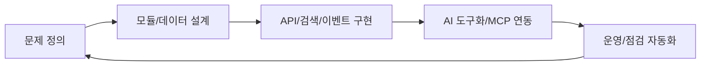

## Open Mercato를 한 문장으로

Open Mercato는 "기업용 업무 플랫폼(CRM/ERP/Commerce)을 모듈 단위로 조립·확장할 수 있는 AI-supportive 백엔드 프레임워크"에 가깝습니다.

README 핵심 메시지는 `Start with 80% done`입니다.

- 기본 비즈니스 기능을 즉시 사용
- 차별화가 필요한 20%만 커스텀
- 코어 포크 대신 모듈 확장/오버라이드 중심

---

## 플랫폼 관점의 핵심 축

1. 모듈형 아키텍처(자동 발견 + 오버라이드)
2. 멀티테넌트/RBAC/조직 계층
3. 검색/캐시/이벤트 기반 운영
4. AI Assistant + MCP 툴 연동
5. 모노레포 + CLI 생성기 기반 개발 효율

---

## 위키 학습 루프 (Mermaid)

---

## 이 시리즈가 다루는 범위

- 설치/실행/도커 운영
- 패키지 그래프와 코드 생성기
- 모듈 오토디스커버리 경계
- 데이터 보안(암호화 포함)
- API/OpenAPI/검색/이벤트/큐
- AI Assistant MCP 서버
- 문서 거버넌스 자동화

다음 장에서 실제 부트스트랩 절차를 다룹니다.

---

## 위키 링크

- `[[Open Mercato Wiki - Setup Bootstrap]]` → [02 로컬 설치/부트스트랩](/blog-repo/open-mercato-guide-02-local-setup-and-bootstrap/)
- `[[Open Mercato Wiki - Package Graph]]` → [03 모노레포/패키지 그래프](/blog-repo/open-mercato-guide-03-monorepo-and-package-graph/)
- `[[Open Mercato Wiki - Docker Ops]]` → [10 Docker 배포/운영](/blog-repo/open-mercato-guide-10-docker-deployment-and-operations/)
