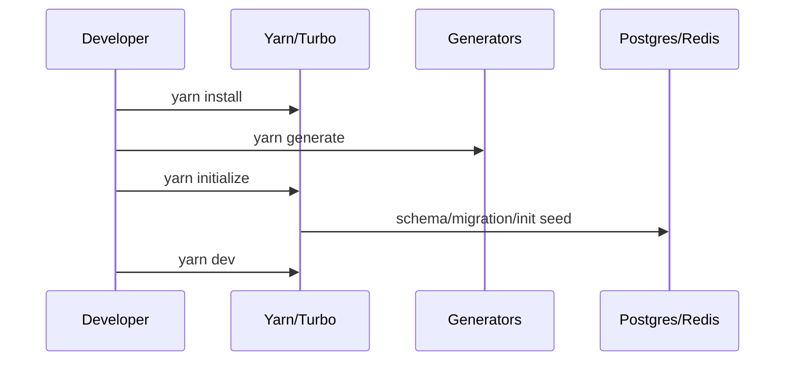

## 필수 버전

루트 `package.json` 기준:

- Node.js: `24.x`
- package manager: `yarn@4.12.0`

버전 불일치 시 `yarn generate`나 CLI 초기화 단계에서 오류가 날 가능성이 큽니다.

---

## 기본 부트스트랩 순서

```bash
git clone https://github.com/open-mercato/open-mercato.git
cd open-mercato
git checkout develop
yarn install
cp apps/mercato/.env.example apps/mercato/.env
yarn generate
yarn initialize
yarn dev
```

- `.env` 최소 필수: `DATABASE_URL`, `JWT_SECRET`, `REDIS_URL` 또는 `EVENTS_REDIS_URL`
- 진입: `http://localhost:3000/backend`

---

## 초기화 분기

루트 스크립트 기준:

- 일반 실행: `yarn dev`
- 완전 새 부팅: `yarn dev:greenfield`

`packages/cli/src/mercato.ts`를 보면 `init` 시 `--reinstall`, `--no-examples`, `--stresstest` 플래그 분기가 구현되어 있어 데이터셋 성격을 선택할 수 있습니다.

---

## 설치 파이프라인 (Mermaid)



---

## 윈도우/도커 권장 포인트

README 기준 윈도우는 fullapp dev docker 구성을 우선 권장합니다.

- 이유: 로컬 Node/파일시스템 차이 최소화
- CRLF 이슈 방지: `git config --global core.autocrlf input`

다음 장에서 모노레포 구조와 패키지 그래프를 정리합니다.

---

## 위키 링크

- `[[Open Mercato Wiki - Intro Map]]` → [01 소개/위키 맵](/blog-repo/open-mercato-guide-01-intro-and-wiki-map/)
- `[[Open Mercato Wiki - Monorepo Graph]]` → [03 모노레포/패키지 그래프](/blog-repo/open-mercato-guide-03-monorepo-and-package-graph/)
- `[[Open Mercato Wiki - Docker Ops]]` → [10 Docker 배포/운영](/blog-repo/open-mercato-guide-10-docker-deployment-and-operations/)
