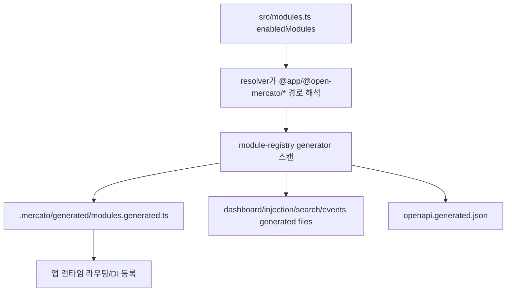

## 핵심 아이디어

Open Mercato는 모듈 파일 규약을 기반으로 등록 코드를 자동 생성합니다.

관련 코드:

- `packages/cli/src/lib/generators/module-registry.ts`
- `packages/cli/src/lib/generators/openapi.ts`
- `packages/cli/src/lib/resolver.ts`

---

## 자동 발견 대상

모듈 디렉토리(`src/modules/<module>`)에서 대표적으로 스캔되는 요소:

- `frontend/`, `backend/` 페이지
- `api/*` 라우트
- `cli.ts` 명령
- `setup.ts`, `acl.ts`, `di.ts`
- `search.ts`, `events.ts`, `notifications.ts`
- `widgets/injection/*`

즉 모듈 계약을 맞추면 등록 코드를 직접 손대지 않고도 시스템에 편입됩니다.

---

## 생성 파이프라인 (Mermaid)

---

## 실무 체크포인트

1. 새 모듈 추가 후 `yarn generate` 누락하지 않기
2. app override와 package 기본 구현의 우선순위 이해
3. 라우트/메타 파일 명명 규약 유지
4. generated 산출물 수동 편집 금지

---

## 확장성 관점

이 구조 덕분에 신규 모듈은 "파일 배치 + modules.ts 등록"으로 시작할 수 있고,
장기적으로는 팀별 vertical 모듈을 병렬로 개발하기 좋습니다.

다음 장에서 멀티테넌시·RBAC·암호화 등 데이터 경계를 다룹니다.

---

## 위키 링크

- `[[Open Mercato Wiki - Package Graph]]` → [03 모노레포/패키지 그래프](/blog-repo/open-mercato-guide-03-monorepo-and-package-graph/)
- `[[Open Mercato Wiki - Data Security]]` → [05 데이터/테넌시/RBAC/암호화](/blog-repo/open-mercato-guide-05-data-model-tenancy-rbac-and-encryption/)
- `[[Open Mercato Wiki - API OpenAPI]]` → [06 API/OpenAPI/Query Engine](/blog-repo/open-mercato-guide-06-api-openapi-and-query-engine/)
