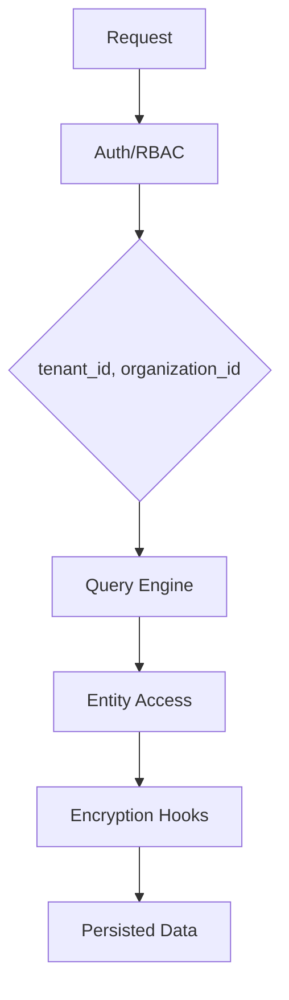

## 멀티테넌트 기본 원칙

AGENTS/README 전반에서 반복되는 규칙:

- 엔티티는 `tenant_id`, `organization_id` 스코프를 전제
- API에서 cross-tenant 데이터 노출 금지
- 모듈 간 직접 ORM 관계 최소화(식별자 기반 연계)

이 규칙이 커스텀 모듈 증가 시 데이터 경계를 지켜줍니다.

---

## RBAC 모델

피처 기반 권한(`module.action`)을 역할/사용자 단위로 부여하고,
페이지/API 메타에서 `requireFeatures`, `requireRoles`로 가드합니다.

권한 정책은 기능 추가 시 `acl.ts` + `setup.ts`를 함께 갱신하는 패턴을 따릅니다.

---

## 암호화 레이어

`packages/core/src/bootstrap.ts` 기준:

1. KMS/Vault 서비스 초기화
2. TenantDataEncryptionService 생성
3. 토글 + 헬스 체크 통과 시 ORM subscriber 등록
4. 실패 시 안전하게 경고 로그 + 기능 제한

즉 장애 시 전체 중단보다 "보수적 degrade"를 택합니다.

---

## 데이터 경계 다이어그램 (Mermaid)

---

## 구현 체크리스트

- [ ] 새 API에 tenant/org 필터 적용
- [ ] `zod` 기반 입력 검증
- [ ] 권한 피처 선언 + setup 기본 권한 동기화
- [ ] 민감 필드 암호화/해시 정책 검토

다음 장에서 API/OpenAPI와 쿼리 레이어를 봅니다.

---

## 위키 링크

- `[[Open Mercato Wiki - Module Auto Discovery]]` → [04 모듈 시스템/오토디스커버리](/blog-repo/open-mercato-guide-04-module-system-and-auto-discovery/)
- `[[Open Mercato Wiki - API OpenAPI]]` → [06 API/OpenAPI/Query Engine](/blog-repo/open-mercato-guide-06-api-openapi-and-query-engine/)
- `[[Open Mercato Wiki - AI MCP ACL]]` → [09 AI Assistant/MCP](/blog-repo/open-mercato-guide-09-ai-assistant-and-mcp-tooling/)
