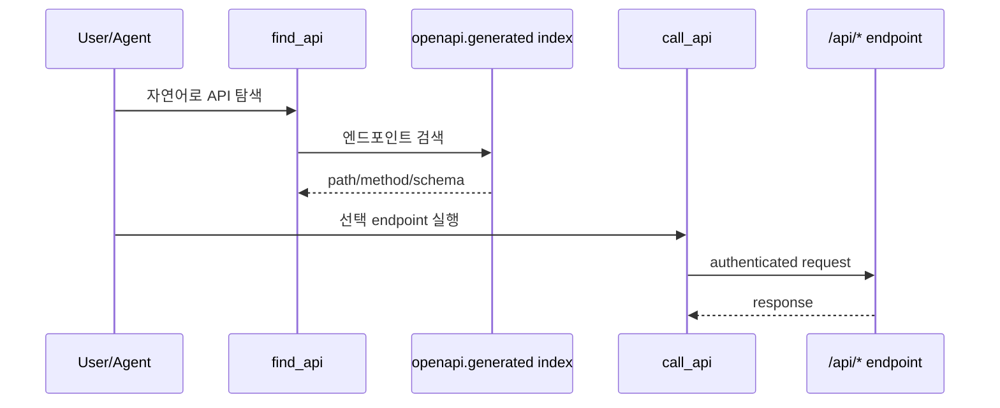

## API 설계 원칙

AGENTS 기준으로 API 라우트는 `openApi` export를 권장/요구하며,
CRUD 경로는 공통 팩토리(`makeCrudRoute`)와 query index 연계를 강조합니다.

---

## OpenAPI 자동 생성

`packages/cli/src/lib/generators/openapi.ts`는:

- 모듈 API route 파일 스캔
- 메서드(GET/POST/PUT/PATCH/DELETE) 감지
- `openapi.generated.json` 생성

이 산출물이 MCP의 API 발견 도구(`find_api`, `call_api`)와 연결됩니다.

---

## API 발견/실행 루프 (Mermaid)

---

## 운영 시 주의점

1. 모듈 API 추가 후 `yarn generate` 재실행
2. OpenAPI 필수 필드(summary/operationId) 품질 유지
3. API schema와 실제 validator 불일치 방지
4. 다중 테넌트 컨텍스트 누락 여부 점검

---

## 권장 문서화 단위

- 엔티티별 CRUD
- 액션형 API(비동기 작업, 워크플로우 트리거)
- 권한 요구사항
- 에러 코드/재시도 정책

다음 장에서 검색 인덱싱과 성능 계층을 봅니다.

---

## 위키 링크

- `[[Open Mercato Wiki - Data Security]]` → [05 데이터/테넌시/RBAC/암호화](/blog-repo/open-mercato-guide-05-data-model-tenancy-rbac-and-encryption/)
- `[[Open Mercato Wiki - Search Service]]` → [07 검색 인덱싱/성능](/blog-repo/open-mercato-guide-07-search-indexing-and-performance/)
- `[[Open Mercato Wiki - AI API Discover]]` → [09 AI Assistant/MCP](/blog-repo/open-mercato-guide-09-ai-assistant-and-mcp-tooling/)
