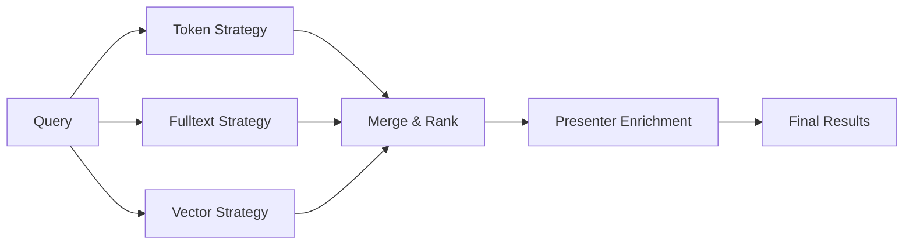

## SearchService 구조

`packages/search/src/service.ts` 기준 SearchService는:

- 여러 전략을 병렬 실행
- 실패 전략은 graceful degradation
- 결과는 병합/랭킹으로 통합
- presenter 보강 로직으로 UI 표현력 유지

---

## 전략 계층

일반적으로 다음 3축을 조합합니다.

1. tokens 검색
2. fulltext 검색
3. vector 검색

프로젝트 환경에 따라 가용 전략을 동적으로 선택하고 fallback 전략을 둘 수 있습니다.

---

## 검색 파이프라인 (Mermaid)

---

## 성능/운영 체크포인트

- 인덱스 생성/갱신 주기와 이벤트 연계
- reindex loop 방지(README/CHANGELOG에서 강조된 개선점)
- 테넌트별 인덱스 격리/키 설계
- 검색 실패 시 fallback 품질

---

## AI와의 연결

MCP 서버는 도구/엔드포인트 인덱싱에서도 검색 서비스를 재사용합니다.

즉 검색 계층은 사용자 UI뿐 아니라 AI tool discovery에도 공통 기반이 됩니다.

다음 장에서 이벤트/큐/워크플로우 자동화 축을 다룹니다.

---

## 위키 링크

- `[[Open Mercato Wiki - API Layer]]` → [06 API/OpenAPI/Query Engine](/blog-repo/open-mercato-guide-06-api-openapi-and-query-engine/)
- `[[Open Mercato Wiki - Events Queue]]` → [08 이벤트/큐/워크플로우 자동화](/blog-repo/open-mercato-guide-08-events-queue-and-workflow-automation/)
- `[[Open Mercato Wiki - AI Tool Discovery]]` → [09 AI Assistant/MCP](/blog-repo/open-mercato-guide-09-ai-assistant-and-mcp-tooling/)
