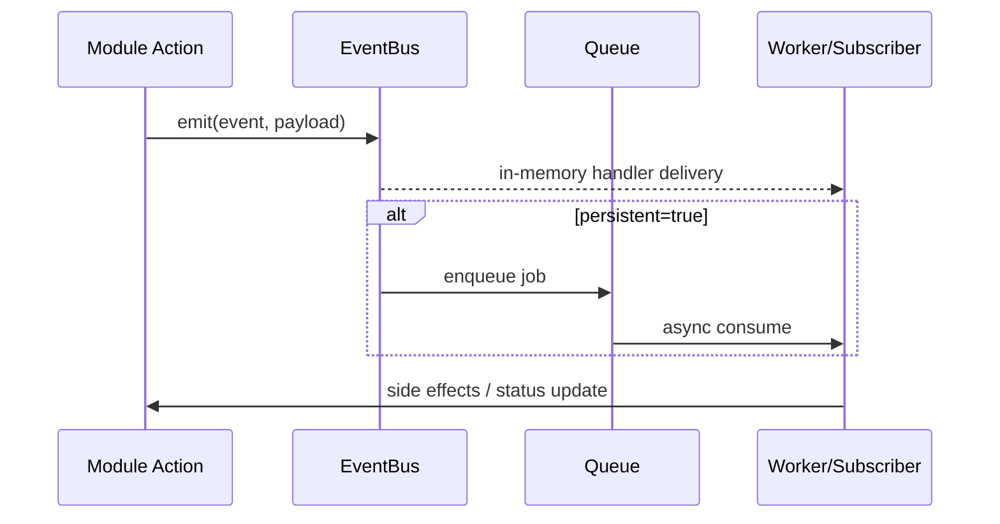

## 이벤트 버스 핵심

`packages/events/src/bus.ts`는 이벤트 패턴 매칭(`*` 와일드카드 포함),
메모리 전달, 그리고 옵션 기반 persistent queue enqueue를 제공합니다.

---

## 큐 전략

`packages/queue/src/factory.ts` 기준 전략 2개:

- `local`: 파일/로컬 기반
- `async`: Redis/BullMQ 기반

환경/운영 단계에 따라 동일 인터페이스로 교체할 수 있습니다.

---

## 자동화 흐름 (Mermaid)

---

## 워크플로우 자동화 설계 포인트

1. 이벤트 이름 규약 일관성(`module.entity.action`)
2. idempotent handler 설계
3. 재시도/중복 실행 대응
4. 실패 이벤트의 관측/알림 체계

---

## 왜 중요한가

CRM/ERP 시나리오는 주문/결제/재고/알림 등 연쇄 반응이 많아,
동기 처리만으로는 확장성과 복원력을 확보하기 어렵습니다.

이벤트+큐 구조는 업무 자동화 확장에 핵심입니다.

다음 장에서 AI Assistant/MCP 툴링과 어떻게 결합되는지 봅니다.

---

## 위키 링크

- `[[Open Mercato Wiki - Search Service]]` → [07 검색 인덱싱/성능](/blog-repo/open-mercato-guide-07-search-indexing-and-performance/)
- `[[Open Mercato Wiki - AI MCP]]` → [09 AI Assistant/MCP](/blog-repo/open-mercato-guide-09-ai-assistant-and-mcp-tooling/)
- `[[Open Mercato Wiki - Docker Ops]]` → [10 Docker 배포/운영](/blog-repo/open-mercato-guide-10-docker-deployment-and-operations/)
