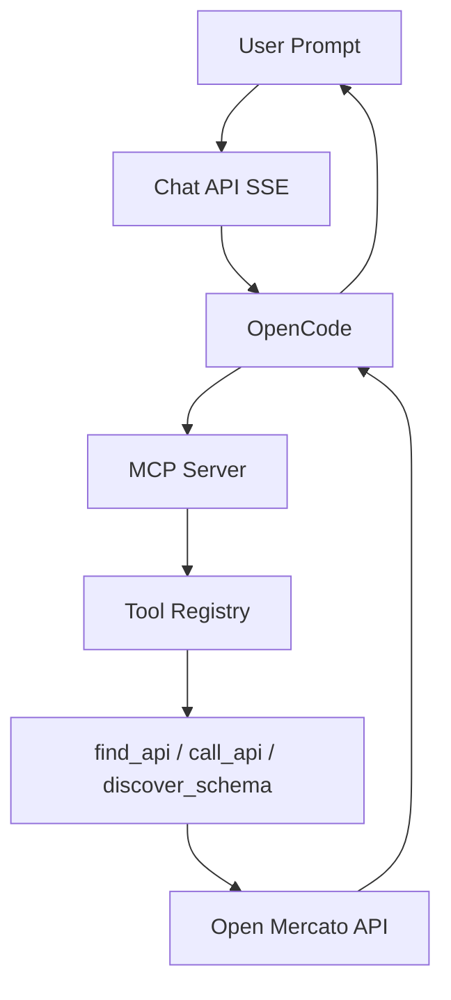

## 아키텍처 핵심

`packages/ai-assistant`는 프론트 채팅 UI와 MCP 서버를 결합해,
LLM이 스키마 탐색과 API 실행을 안전하게 수행하도록 설계되어 있습니다.

---

## MCP 서버 동작

`mcp-server.ts` 기준 주요 기능:

1. API key 또는 컨텍스트 기반 인증
2. 사용자 ACL 기반 tool 필터링
3. tool call 실행/오류 표준화
4. 시작 시 tool 로딩 + 검색 인덱싱

---

## 도구 레이어

- registry: `tool-registry.ts`
- discovery: `api-discovery-tools.ts`
- 실행 핵심 도구: `find_api`, `call_api`

README의 권장 루프:

- `discover_schema` -> `find_api` -> `call_api`

---

## AI 호출 흐름 (Mermaid)

---

## 운영 체크포인트

- MCP dev/serve 모드 구분(`yarn mcp:dev`, `yarn mcp:serve`)
- API key 수명/권한 관리
- 도구별 requiredFeatures 검증
- 에러 응답 표준화 및 로그 추적

---

## 실무 적용 팁

AI가 직접 mutation API를 호출하는 경우,
`call_api` 앞단에서 사용자 확인/정책 게이트를 추가하는 것이 안전합니다.

다음 장에서 Docker 기반 운영과 배포 흐름을 다룹니다.

---

## 위키 링크

- `[[Open Mercato Wiki - API Layer]]` → [06 API/OpenAPI/Query Engine](/blog-repo/open-mercato-guide-06-api-openapi-and-query-engine/)
- `[[Open Mercato Wiki - Search Service]]` → [07 검색 인덱싱/성능](/blog-repo/open-mercato-guide-07-search-indexing-and-performance/)
- `[[Open Mercato Wiki - Docker Ops]]` → [10 Docker 배포/운영](/blog-repo/open-mercato-guide-10-docker-deployment-and-operations/)
