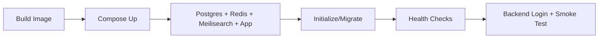

## compose 파일 역할

README/docker 문서 기준 주요 선택지:

- `docker-compose.fullapp.dev.yml`: 개발(소스 마운트 + 핫리로드)
- `docker-compose.fullapp.yml`: 운영/프로덕션 스택
- `docker-compose.yml`: 로컬 DB/Redis 중심 보조 구성

---

## 운영 환경 변수

특히 프로덕션에서 강하게 관리해야 할 값:

- `JWT_SECRET`
- `POSTGRES_PASSWORD`
- `MEILISEARCH_MASTER_KEY`
- 필요 시 LLM API 키

기본값 의존 상태로 운영에 올리지 않는 것이 중요합니다.

---

## 배포 흐름 (Mermaid)

---

## 운영 점검 체크리스트

- [ ] DB 마이그레이션 상태 확인
- [ ] Redis/Queue 연결 확인
- [ ] 검색 인덱스 상태 확인
- [ ] AI Assistant MCP 헬스체크
- [ ] 로그/메트릭 수집 파이프라인 확인

---

## 장애 대응

- compose 서비스 충돌 시 포트/볼륨 중복 우선 점검
- 벡터 확장(pgvector) 설치 여부 검증
- init/reinstall 플로우를 staging에서 먼저 테스트

다음 장에서는 위키 문서 자체를 점검하는 자동화 체계를 설계합니다.

---

## 위키 링크

- `[[Open Mercato Wiki - Setup Bootstrap]]` → [02 로컬 설치/부트스트랩](/blog-repo/open-mercato-guide-02-local-setup-and-bootstrap/)
- `[[Open Mercato Wiki - Doc Automation]]` → [11 문서 점검 자동화 체계](/blog-repo/open-mercato-guide-11-documentation-governance-and-automation/)
- `[[Open Mercato Wiki - Extension Roadmap]]` → [12 커스터마이징/Eject 로드맵](/blog-repo/open-mercato-guide-12-customization-eject-and-extension-roadmap/)
