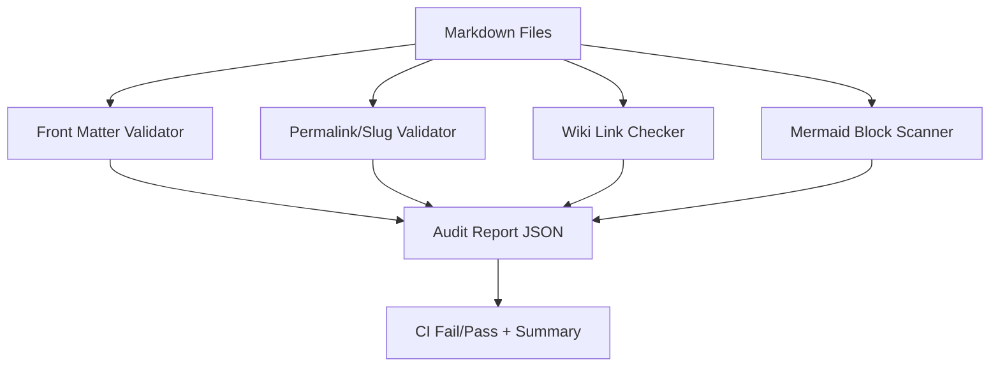

## 왜 자동화가 필요한가

위키형 문서는 노드가 늘어날수록 아래 문제가 생깁니다.

- 끊어진 링크
- 챕터 번호/slug 충돌
- Front Matter 누락
- Mermaid 블록 문법 오류
- 인덱스와 실제 파일 불일치

따라서 "문서 생성"과 "문서 점검"을 분리한 자동화 체계가 필요합니다.

---

## 문서 점검 파이프라인 (Mermaid)



---

## 예시: 문서 점검 스크립트(초안)

```bash
#!/usr/bin/env bash
set -euo pipefail

ROOT="/home/blog"
POSTS="$ROOT/_posts"
INDEX="$ROOT/open-mercato-guide.md"

echo "[1] front matter/permalink 검사"
rg -n "^permalink:" "$POSTS"/2026-02-19-open-mercato-guide-*.md >/dev/null

echo "[2] 위키 링크 대상 검사"
for f in "$POSTS"/2026-02-19-open-mercato-guide-*.md; do
  rg -n "\[\[Open Mercato Wiki" "$f" >/dev/null || {
    echo "missing wiki links: $f"; exit 1;
  }
done

echo "[3] 인덱스 목차 링크 검사"
for n in $(seq -w 1 12); do
  rg -n "open-mercato-guide-$n-" "$INDEX" >/dev/null || {
    echo "missing toc item for chapter $n"; exit 1;
  }
done

echo "[4] jekyll build"
cd "$ROOT"
bundle exec jekyll build >/dev/null

echo "audit ok"
```

---

## CI 연동 예시

```yaml
name: wiki-audit
on:
  pull_request:
    paths:
      - '_posts/**'
      - '*-guide.md'

jobs:
  audit:
    runs-on: ubuntu-latest
    steps:
      - uses: actions/checkout@v4
      - run: ./scripts/wiki-audit-open-mercato.sh
```

---

## 운영 체크리스트

- [ ] 새 챕터 추가 시 인덱스 목차/상호 링크 동시 갱신
- [ ] Mermaid 다이어그램 최소 1개 포함
- [ ] front matter `original_url` 유지
- [ ] 빌드 검증(`bundle exec jekyll build`) 통과

다음 장에서 standalone app + eject 기반 확장 로드맵으로 마무리합니다.

---

## 위키 링크

- `[[Open Mercato Wiki - Intro Map]]` → [01 소개/위키 맵](/blog-repo/open-mercato-guide-01-intro-and-wiki-map/)
- `[[Open Mercato Wiki - Docker Ops]]` → [10 Docker 배포/운영](/blog-repo/open-mercato-guide-10-docker-deployment-and-operations/)
- `[[Open Mercato Wiki - Extension Roadmap]]` → [12 커스터마이징/Eject 로드맵](/blog-repo/open-mercato-guide-12-customization-eject-and-extension-roadmap/)
