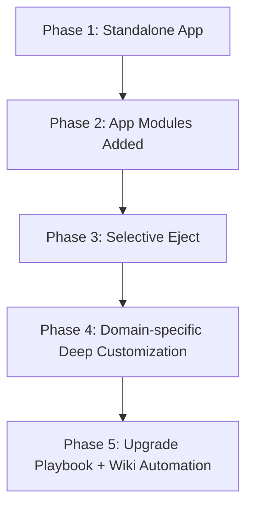

## 권장 전략: Standalone 우선

README가 강조하는 기본 전략은 다음입니다.

1. `create-mercato-app`으로 독립 앱 생성
2. `src/modules`에 앱 전용 모듈 추가
3. 코어 패키지는 업스트림 업데이트를 계속 수용

이 방식이 장기 유지보수 비용을 가장 낮춥니다.

---

## 깊은 커스터마이징: eject

`mercato eject`는 특정 코어 모듈을 앱 로컬로 복사해 내부 구현까지 수정 가능하게 합니다.

대상 예시(README 기준):

- catalog, customers, sales, workflows, currencies 등

---

## 확장 로드맵 (Mermaid)

---

## 단계별 실행 가이드

### 1) 시작 단계

- 코어 모듈 그대로 사용
- 도메인 요구는 app 모듈로 추가

### 2) 임계점 판단

- 코어 모듈 내부 로직 변경이 잦아지면 eject 고려
- eject는 최소 모듈 단위로 제한

### 3) 업그레이드 전략

- eject 모듈 목록 문서화
- 릴리즈 노트(CHANGELOG) 기준 영향도 점검
- 머지 전략(수동 diff + 테스트) 정례화

---

## 최종 체크리스트

- [ ] 코어 포크 없이 운영 가능한가?
- [ ] eject 모듈 수를 최소로 유지하는가?
- [ ] 문서 자동화(11장)로 위키/구현 동기화가 되는가?
- [ ] 모듈별 테스트/권한/데이터 경계가 보장되는가?

이로써 Open Mercato 위키 가이드 시리즈를 마칩니다.

---

## 위키 링크

- `[[Open Mercato Wiki - Monorepo Graph]]` → [03 모노레포/패키지 그래프](/blog-repo/open-mercato-guide-03-monorepo-and-package-graph/)
- `[[Open Mercato Wiki - Module Auto Discovery]]` → [04 모듈 시스템/오토디스커버리](/blog-repo/open-mercato-guide-04-module-system-and-auto-discovery/)
- `[[Open Mercato Wiki - Doc Automation]]` → [11 문서 점검 자동화 체계](/blog-repo/open-mercato-guide-11-documentation-governance-and-automation/)
