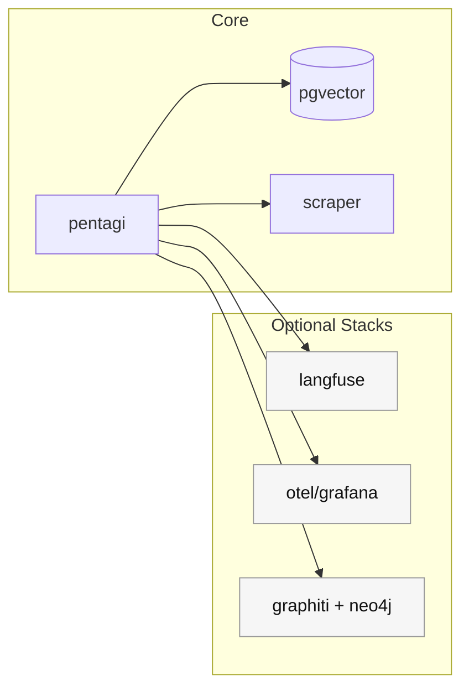

## 핵심 아이디어: “실행은 컨테이너로, 제어는 서버로”

PentAGI는 작업을 수행하는 도구/프로세스를 **Docker 기반 실행 환경**으로 넘기고,  
백엔드 서버는 이를 **오케스트레이션 + 기록 + UI 제공**으로 다룹니다.

이 모델이 중요한 이유는 단순합니다.

- 보안 테스트는 위험할 수 있고(의도치 않은 부작용 포함)
- 외부와 통신하거나 툴을 실행해야 하며
- 그래서 실행 환경을 격리하는 것이 운영 안전성의 핵심이 됩니다.

---

## 기본 `docker-compose.yml` 구성

기본 compose 파일은 크게 4개 구성요소가 보입니다.

1) **pentagi**: 메인 서버(프론트/백엔드 포함 이미지)  
2) **pgvector**: PostgreSQL + pgvector(영속 저장/임베딩)  
3) **pgexporter**: PostgreSQL exporter(메트릭)  
4) **scraper**: 격리 브라우저(웹 인텔리전스)

그리고 네트워크/볼륨은 다음을 기본으로 둡니다.

- `pentagi-network`(코어)
- `observability-network` / `langfuse-network`(확장용, 기본 compose에도 정의)
- `pentagi-data`, `pentagi-ssl`, `pentagi-postgres-data` 등

---

## 포트/볼륨/네트워크 관점 체크포인트

운영에서 실수를 많이 하는 지점만 짚으면:

- **노출 포트**: 기본은 `127.0.0.1:8443` 바인딩이지만, 외부 공개 시 방화벽/리버스 프록시/인증을 함께 설계해야 합니다.
- **docker.sock 마운트**: 편리하지만 강력합니다. 워커 노드 분리나 TLS 원격 도커를 고려할 이유가 여기에서 나옵니다.
- **데이터 볼륨**: `/opt/pentagi/data`, `/opt/pentagi/ssl` 등은 업그레이드/백업 전략이 필요합니다.

---

## 확장 스택: Langfuse / Graphiti / Observability

저장소에는 다음 확장 compose가 존재합니다.

- `docker-compose-langfuse.yml`
- `docker-compose-graphiti.yml`
- `docker-compose-observability.yml`

**중요:** 확장 compose들은 “기본 compose와 함께” 실행해야 합니다.

```bash
docker compose -f docker-compose.yml -f docker-compose-langfuse.yml up -d
```

이 구조는 “필요한 기능만 선택해서 붙인다”는 점에서 장점이 큽니다.

---

## 워커 노드(2-노드) 배포를 고려하는 이유

README와 `examples/guides/worker_node.md`는 보안상 **2-노드 아키텍처**를 권장합니다.

- 메인 노드: UI/오케스트레이션(상대적으로 신뢰)
- 워커 노드: 실제 툴 실행/컨테이너 생성(위험 영역)

이 구조는 “도커 소켓/컨테이너 실행 권한”을 별도 호스트로 밀어내어
실수나 예상 못한 동작의 피해 범위를 줄입니다.

---

## 구성도를 한 번에 보기



---

## 참고 링크

- 워커 노드 가이드: `https://github.com/vxcontrol/pentagi/blob/master/examples/guides/worker_node.md`
- 인덱스(전체 목차): `/blog-repo/pentagi-guide/`

---

다음 글에서는 백엔드(Go)에서 **라우팅/서비스/DB/GraphQL**이 어떻게 연결되는지 살펴봅니다.

