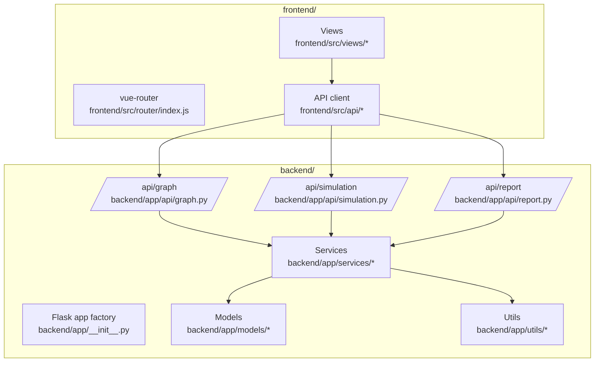
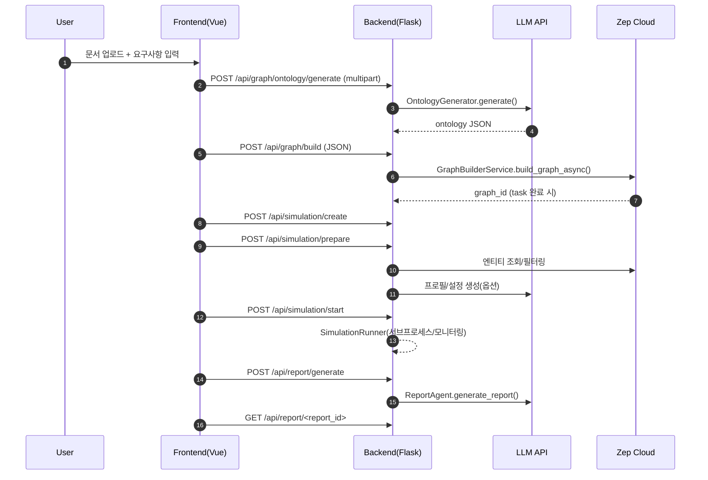

## 이 문서의 목적

- “어디에 무엇이 있고(Repo), 무엇이 어떤 순서로 동작하는지(Flow)”를 빠르게 잡습니다.
- 다음 챕터에서 API를 호출/디버깅할 때 필요한 **근거(파일/경로)**를 제공합니다.

---

## 빠른 요약

- UI는 `frontend/`(Vue 3 + Vite), API는 `backend/`(Flask)이며, 백엔드가 **LLM(OpenAI SDK 호환)** 과 **Zep Cloud**를 호출합니다(`backend/app/utils/llm_client.py`, `backend/app/services/graph_builder.py`).
- 백엔드 API는 3개 블루프린트로 나뉩니다: 그래프(`/api/graph/*`), 시뮬레이션(`/api/simulation/*`), 리포트(`/api/report/*`) (`backend/app/__init__.py`, `backend/app/api/*`).
- 프로젝트/태스크/시뮬레이션 상태는 주로 **파일로 영속화**됩니다(`backend/app/models/project.py`, `backend/app/models/task.py`, `backend/app/services/simulation_manager.py`).

---

## 시스템 컨텍스트(외부 의존 포함)

```mermaid
flowchart LR
  User[사용자] --> Browser[브라우저]
  Browser -->|SPA| FE[Frontend (Vue/Vite)]
  FE -->|HTTP /api/*| BE[Backend (Flask)]

  BE -->|LLM API| LLM[LLM Provider\n(OpenAI SDK compatible)]
  BE -->|Zep SDK| ZEP[Zep Cloud\nGraph + Memory]

  subgraph LocalDisk[로컬 디스크(컨테이너/호스트)]
    UP[backend/uploads\nprojects + simulations]
  end

  BE --> UP
```

---

## 컨테이너/컴포넌트(고수준)



---

## 대표 사용자 플로우(시퀀스)

“문서 업로드 → 그래프 생성 → 시뮬레이션 준비/실행 → 리포트 생성”을 한 번 돌릴 때의 전형적인 순서입니다. (실제 엔드포인트 명세는 각 API 파일 기준으로 확인)



---

## 백엔드 레이어링(파일 기준 “어디서 무엇을”)

### 1) 엔트리/설정

- `backend/run.py`: `Config.validate()`로 필수 키 검사 후 `create_app()` 실행
- `backend/app/config.py`: 루트 `.env`를 로드하고 `Config.LLM_*`, `Config.ZEP_API_KEY` 등 제공

### 2) API 라우팅

- `backend/app/__init__.py`: `graph_bp`, `simulation_bp`, `report_bp` 블루프린트를 `/api/*`에 마운트
- `backend/app/api/graph.py`: 업로드 → 본체 생성 → 그래프 빌드(비동기 태스크)
- `backend/app/api/simulation.py`: 시뮬레이션 생성/준비/실행/상태/인터뷰 등
- `backend/app/api/report.py`: 리포트 생성/상태/다운로드/채팅 등

### 3) 서비스(도메인 로직)

- 본체: `backend/app/services/ontology_generator.py`
- 그래프: `backend/app/services/graph_builder.py`
- 시뮬레이션 준비: `backend/app/services/simulation_manager.py`
- 시뮬레이션 실행/모니터링: `backend/app/services/simulation_runner.py`, `backend/app/services/simulation_ipc.py`
- 리포트: `backend/app/services/report_agent.py`

### 4) 상태/영속 모델

- 프로젝트 컨텍스트: `backend/app/models/project.py` (파일 저장)
- 태스크: `backend/app/models/task.py` (비동기 진행률/결과 저장)
- 시뮬레이션 상태 파일: `backend/app/services/simulation_manager.py`가 `backend/uploads/simulations/<id>/state.json` 저장

---

## 런타임 토폴로지(개발 모드 기준)

```mermaid
flowchart LR
  subgraph Host[호스트/컨테이너]
    FE[Vite dev server\n:3000]
    BE[Flask server\n:5001]
    SIM[Simulation subprocess(es)\n(OASIS scripts)]
    DISK[backend/uploads\nprojects + simulations]
  end

  FE <--> BE
  BE --> DISK
  BE <--> SIM
```

---

## 근거(파일/경로)

- 프론트 스택: `frontend/package.json`, `frontend/src/*`
- 백엔드 앱/블루프린트: `backend/app/__init__.py`, `backend/app/api/*`
- 설정/키: `backend/app/config.py`, `.env.example`
- 그래프 빌드: `backend/app/services/graph_builder.py`
- 시뮬레이션 관리/실행: `backend/app/services/simulation_manager.py`, `backend/app/services/simulation_runner.py`
- 리포트: `backend/app/api/report.py`

---

## 주의사항/함정

- “상태가 서버에 저장된다”는 전제를 이해해야 합니다: 프론트가 모든 데이터를 들고 다니기보다, `backend/uploads` 아래에 프로젝트/시뮬레이션 상태를 남기는 구조입니다.
- `simulation.py`는 라우트가 매우 많습니다(상태/타임라인/인터뷰/환경 종료 등). 기능을 찾을 때는 `@simulation_bp.route(...)`를 먼저 검색하는 것이 빠릅니다.

---

## TODO/확인 필요

- 인증/인가(로그인, 권한 검사)는 이 레포의 API 레이어에서 명시적으로 보이지 않습니다. 데모/내부 환경 전제인지, 운영 배포 시 보안 모델을 어떻게 가져갈지 확인이 필요합니다.
- 운영 환경에서의 프로세스 모델(멀티 워커, 로드밸런싱)과 `SimulationRunner`의 프로세스/파일 핸들링은 부하 테스트를 통해 확인 필요.

---

## 위키 링크

- [[MiroFish Guide - Intro]] / [소개 및 개요](/blog-repo/mirofish-guide-01-intro/)
- [[MiroFish Guide - Installation]] / [설치 및 빠른 시작](/blog-repo/mirofish-guide-02-installation/)
- [[MiroFish Guide - Usage]] / [실전 사용 패턴](/blog-repo/mirofish-guide-04-usage/)
- [[MiroFish Guide - Best Practices]] / [운영/확장/베스트 프랙티스](/blog-repo/mirofish-guide-05-best-practices/)

다음 글에서는 “한 번 돌려보기” 관점으로 **실전 사용 체크리스트**를 정리합니다.
