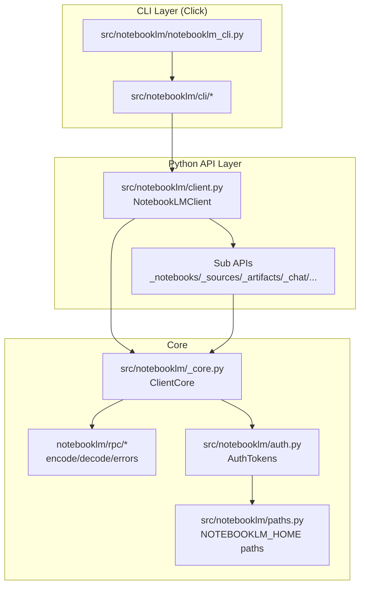
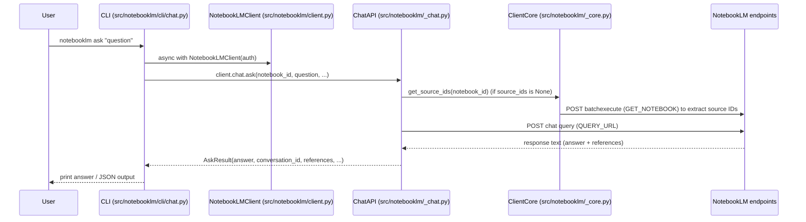

마지막 업데이트: 2026-03-10

## 이 문서의 목적

`notebooklm-py`를 “팀에서 유지보수 가능한 형태로” 쓰기 위해, **어떤 컴포넌트가 어떤 책임을 갖고 어떻게 호출되는지**를 코드 근거로 정리합니다.

## 빠른 요약

- Python API의 중심은 `NotebookLMClient`이며, 기능별 서브 API(`notebooks/sources/artifacts/chat/...`)를 조합합니다. (근거: `src/notebooklm/client.py`)
- RPC 호출의 중심은 `ClientCore.rpc_call()`이고, `notebooklm.rpc.*`가 인코딩/디코딩/에러 매핑을 담당합니다. (근거: `src/notebooklm/_core.py`, `src/notebooklm/rpc/*`)
- CLI는 `pyproject.toml`의 엔트리포인트 `notebooklm = notebooklm.notebooklm_cli:main`으로 시작하며, `src/notebooklm/notebooklm_cli.py`에서 Click 커맨드들을 등록합니다. (근거: `pyproject.toml`, `src/notebooklm/notebooklm_cli.py`)
- 채팅(`ask`)은 RPC가 아니라 별도 쿼리 엔드포인트로 POST를 수행하는 구현이 있습니다. (근거: `src/notebooklm/_chat.py`, `src/notebooklm/cli/chat.py`)

## 근거(파일/경로)

- 클라이언트/서브 API 구성: `src/notebooklm/client.py`, `src/notebooklm/_notebooks.py`, `src/notebooklm/_sources.py`, `src/notebooklm/_artifacts.py`, `src/notebooklm/_chat.py`, `src/notebooklm/_research.py`, `src/notebooklm/_sharing.py`, `src/notebooklm/_notes.py`, `src/notebooklm/_settings.py`
- 코어(RPC/HTTP/캐시): `src/notebooklm/_core.py`
- 인증/경로: `src/notebooklm/auth.py`, `src/notebooklm/paths.py`, `src/notebooklm/cli/session.py`
- CLI 구조/명령어: `src/notebooklm/notebooklm_cli.py`, `src/notebooklm/cli/*`, `docs/cli-reference.md`
- 안정성 정책(내부 API 경계): `docs/stability.md`

## 시스템 컨텍스트(Context Diagram)

```mermaid
flowchart LR
  U[User / CI / Agent] -->|CLI| CLI[notebooklm CLI\nsrc/notebooklm/notebooklm_cli.py]
  U -->|Python| PY[Python App\nNotebookLMClient]

  CLI --> LIB[notebooklm-py library\nsrc/notebooklm/*]
  PY --> LIB

  CLI -->|login| PW[Playwright\n(browser automation)]
  PW -->|OAuth in browser| NLM_UI[notebooklm.google.com]

  LIB -->|undocumented HTTP/RPC| NLM_API[NotebookLM endpoints\n(undocumented)]
  LIB -->|cookies/tokens| STATE[Local state\nNOTEBOOKLM_HOME/\n(storage_state.json, context.json)]
```

## 컴포넌트/컨테이너(Component/Container Diagram)



## 대표 요청 시퀀스(Sequence) — `notebooklm ask`

CLI `ask`는 `NotebookLMClient`를 열고 `client.chat.ask(...)`를 호출합니다. (근거: `src/notebooklm/cli/chat.py`, `src/notebooklm/_chat.py`)



## 런타임 토폴로지(Runtime Topology)

```mermaid
flowchart LR
  subgraph Local["Local Machine"]
    P[Python/CLI process]
    C[httpx.AsyncClient\n(src/notebooklm/_core.py)]
    FS[NOTEBOOKLM_HOME/\n(storage_state.json, context.json)]
  end

  P --> C
  P --> FS
  C -->|HTTPS| G[Google endpoints\nnotebooklm.google.com\n+ related domains]
```

## 주의사항/함정

- `_core.py` 및 `rpc/*`는 `docs/stability.md`에서 **internal API**로 분류됩니다. 직접 의존하면 업스트림 변경에 취약해집니다. (근거: `docs/stability.md`)
- `ask`는 `_chat.py`에서 자체 쿼리 요청/파서를 갖고 있어, 다른 RPC 호출과 에러 패턴이 다를 수 있습니다. (근거: `src/notebooklm/_chat.py`)

## TODO / 확인 필요

- NotebookLM 서버의 RPC ID/응답 포맷은 구글 변경에 따라 바뀔 수 있으며, 변경 감지/대응 방식은 운영 정책(모니터링/알림)으로 확정이 필요합니다. (근거: `docs/stability.md`, `docs/rpc-health.yml`은 워크플로우로 존재)
 - NotebookLM 서버의 RPC ID/응답 포맷은 구글 변경에 따라 바뀔 수 있으며, 변경 감지/대응 방식은 운영 정책(모니터링/알림)으로 확정이 필요합니다. (근거: `docs/stability.md`, `.github/workflows/rpc-health.yml`)

---

다음 글에서는 CLI/Python 관점에서 “안전한 사용 패턴(자동화/병렬/다운로드)”을 예시와 함께 정리합니다.

notebooklm-py는 NotebookLM을 “코드로” 다루기 위해 크게 아래 영역을 제공합니다.

1. **Notebooks**: 노트북 생성/조회/삭제/이름 변경
2. **Sources**: URL/파일/YouTube/Drive/텍스트 등 소스 추가 및 fulltext/guide 조회
3. **Chat**: 소스 기반 Q&A, 히스토리, 페르소나(모드) 설정
4. **Artifacts(Studio)**: 오디오/비디오/슬라이드/퀴즈/플래시카드/리포트/마인드맵 등 생성·다운로드
5. **Research**: 웹/Drive 리서치 에이전트 + 자동 임포트
6. **Sharing/Notes**: 공유/권한 및 노트 저장

---

## 코드 구조(리포 기준 빠른 지도)

리포지토리 `src/notebooklm/` 아래에 도메인별 모듈이 분리되어 있습니다.

- `client.py`: 클라이언트 엔트리(세션/핸들)
- `_notebooks.py`, `_sources.py`, `_chat.py`, `_artifacts.py`, `_research.py`, `_sharing.py`, `_notes.py`: 기능별 서브 클라이언트
- `auth.py`, `_settings.py`, `paths.py`: 인증/설정/경로 및 상태 저장
- `notebooklm_cli.py`: `notebooklm` CLI 엔트리

---

## 다음에 볼 것

- `docs/python-api.md` (async API 개요)
- `docs/cli-reference.md` (명령어 전체)
- `docs/configuration.md` (스토리지/환경변수/CI)

---

*다음 글에서는 실전 사용 패턴을 정리합니다.*
