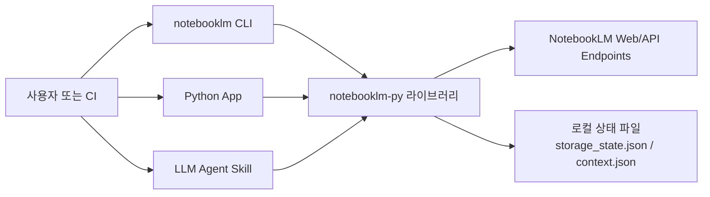

마지막 업데이트: 2026-03-10

## 이 문서의 목적

`notebooklm-py`가 어떤 계층에서 무엇을 제공하는지, 그리고 왜 이 프로젝트가 단순 래퍼가 아니라 자동화용 툴체인으로 보이는지를 짧게 잡는 문서입니다.

## 빠른 요약

- 프로젝트는 `Python API`, `CLI`, `Agent Skill`의 3개 인터페이스를 전면에 둡니다. 근거: `README.md`, `pyproject.toml`, `src/notebooklm/data/SKILL.md`
- 범위는 노트북 CRUD, 소스 추가, 채팅, 리서치, 공유, 생성물 생성/다운로드까지 포함합니다. 근거: `README.md`, `src/notebooklm/client.py`
- 공식 API가 아니라 구글의 undocumented endpoint와 RPC를 사용하므로, 서버 변경 리스크를 전제로 해야 합니다. 근거: `README.md`, `docs/stability.md`

## 근거(파일/경로)

- 패키지 메타데이터와 CLI 엔트리포인트: `pyproject.toml`
- 프로젝트 소개와 범위: `README.md`
- 메인 클라이언트: `src/notebooklm/client.py`
- 에이전트 스킬 문서: `src/notebooklm/data/SKILL.md`

## 제공 범위

| 영역 | 내용 | 근거 |
|------|------|------|
| 노트북 | 생성, 조회, 이름 변경, 삭제, 공유 | `README.md`, `src/notebooklm/_notebooks.py` |
| 소스 | URL, YouTube, 파일, Drive, 텍스트, 리서치 import | `README.md`, `src/notebooklm/_sources.py`, `src/notebooklm/_research.py` |
| 채팅 | 질문, 대화 이력, note 저장 | `src/notebooklm/_chat.py`, `src/notebooklm/cli/chat.py` |
| 생성물 | 오디오, 비디오, 슬라이드, 리포트, 퀴즈, 플래시카드, 마인드맵 등 | `README.md`, `src/notebooklm/_artifacts.py` |
| 다운로드/내보내기 | MP3, MP4, PDF, PPTX, Markdown, JSON, CSV | `README.md`, `docs/cli-reference.md`, `src/notebooklm/_artifacts.py` |

## 시스템 컨텍스트

이 다이어그램은 `notebooklm` 스크립트, `NotebookLMClient`, 그리고 에이전트 스킬 문서가 모두 동일 라이브러리를 호출한다는 점을 보여줍니다. 근거: `pyproject.toml`, `src/notebooklm/client.py`, `src/notebooklm/data/SKILL.md`

## 왜 이 프로젝트가 실무형 자동화 툴인가

- `pyproject.toml`은 공개 패키지, CLI 스크립트, 개발 의존성, 테스트/커버리지/린트 설정까지 갖추고 있습니다.
- `docs/`는 CLI, Python API, 설정, 릴리즈, RPC 개발, 트러블슈팅 문서를 따로 유지합니다.
- `.github/workflows/`는 품질, nightly E2E, RPC health, package publish/verify를 분리합니다.

즉 이 저장소는 “개인 스크립트”보다 “지속 운용되는 툴”에 가깝습니다.

## 주의사항/함정

- 이 프로젝트는 공식 SDK가 아닙니다. `README.md`가 직접 “Unofficial”과 undocumented API 리스크를 경고합니다.
- 운영 안정성은 구글 서버 응답 형식과 RPC ID 유지에 의존합니다. 근거: `docs/stability.md`, `.github/workflows/rpc-health.yml`
- 자동화가 쉬워 보여도 실제 인증은 브라우저 세션 쿠키에 의존합니다. 근거: `src/notebooklm/auth.py`, `docs/configuration.md`

## TODO/확인 필요

- NotebookLM 서버 정책 또는 계정 약관 변화에 대한 공식 보장은 저장소 근거로 확인되지 않습니다.
- 생성물별 구체적 쿼터 수치는 문서나 코드에 고정 수치로 적혀 있지 않습니다.

## 위키 링크

- `[[notebooklm-py Guide - 설치와 인증]]` [다음 문서](/blog-repo/notebooklm-py-guide-02-install-auth/)
- `[[notebooklm-py Guide - 아키텍처와 호출 계층]]` [아키텍처](/blog-repo/notebooklm-py-guide-03-architecture/)
- [시리즈 허브](/blog-repo/notebooklm-py-guide/)

