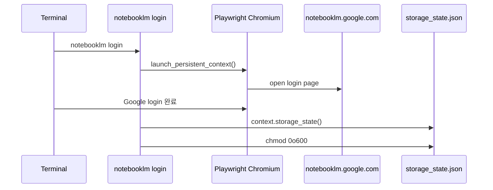

마지막 업데이트: 2026-03-10

## 이 문서의 목적

로컬 개발자, CI, 병렬 에이전트가 `notebooklm-py`를 실제로 쓰기 위해 필요한 설치 경로와 인증 상태 파일 구조를 정리합니다.

## 빠른 요약

- 기본 설치는 `pip install notebooklm-py`, 브라우저 로그인까지 쓰려면 `pip install "notebooklm-py[browser]"`와 `playwright install chromium`이 필요합니다. 근거: `README.md`, `pyproject.toml`
- 기본 상태 디렉터리는 `~/.notebooklm`이며, `NOTEBOOKLM_HOME`으로 전체 경로를 옮길 수 있습니다. 근거: `docs/configuration.md`, `src/notebooklm/paths.py`
- CI나 파일 쓰기 제한 환경에서는 `NOTEBOOKLM_AUTH_JSON`을 우선 경로로 사용할 수 있습니다. 근거: `docs/configuration.md`, `src/notebooklm/auth.py`

## 근거(파일/경로)

- 설치 명령: `README.md`, `pyproject.toml`
- 로그인 구현: `src/notebooklm/cli/session.py`
- 경로 해석: `src/notebooklm/paths.py`
- 설정/환경 변수: `docs/configuration.md`, `.env.example`

## 설치 절차

```bash
pip install notebooklm-py
pip install "notebooklm-py[browser]"
playwright install chromium
```

개발용이면 저장소 문서가 `uv pip install -e ".[dev]"` 흐름도 제시합니다. 근거: `docs/development.md`

## 인증 경로 1: 브라우저 로그인

```bash
notebooklm login
notebooklm list
```

`login` 명령은 Playwright를 import하고, 필요하면 Chromium 설치를 점검한 뒤 `https://notebooklm.google.com/`으로 이동합니다. 로그인 후 `storage_state.json`을 저장하고 파일 권한을 `0o600`으로 제한합니다. 근거: `src/notebooklm/cli/session.py`



## 인증 경로 2: 환경 변수 주입

```bash
export NOTEBOOKLM_AUTH_JSON='{"cookies":[...],"origins":[]}'
notebooklm list
```

문서상 우선순위는 `--storage` > `NOTEBOOKLM_AUTH_JSON` > `$NOTEBOOKLM_HOME/storage_state.json` > 기본 경로입니다. 근거: `docs/configuration.md`

## 상태 파일 구조

| 파일/변수 | 역할 | 근거 |
|-----------|------|------|
| `storage_state.json` | Playwright 기반 인증 쿠키 저장 | `docs/configuration.md`, `src/notebooklm/auth.py` |
| `context.json` | 현재 notebook/conversation 컨텍스트 저장 | `docs/configuration.md`, `src/notebooklm/paths.py` |
| `browser_profile/` | 로그인용 지속 프로필 | `docs/configuration.md`, `src/notebooklm/cli/session.py` |
| `NOTEBOOKLM_HOME` | 전체 상태 경로 변경 | `docs/configuration.md`, `src/notebooklm/paths.py` |
| `NOTEBOOKLM_AUTH_JSON` | 파일 없는 인라인 인증 | `docs/configuration.md`, `src/notebooklm/auth.py` |

## 병렬 실행 시 권장 패턴

- 여러 에이전트가 동시에 `notebooklm use`를 쓰면 `context.json`을 덮어쓸 수 있습니다.
- 병렬 환경에서는 가능한 경우 `--notebook` 또는 `-n` 옵션으로 명시적 notebook ID를 넘기는 편이 안전합니다.
- 계정 또는 작업 단위로 `NOTEBOOKLM_HOME`을 분리하는 것도 문서화돼 있습니다.

이 내용은 upstream skill 문서에도 반복 강조됩니다. 근거: `src/notebooklm/data/SKILL.md`, `docs/configuration.md`

## 주의사항/함정

- `NOTEBOOKLM_AUTH_JSON`이 설정된 상태에서는 `notebooklm login`을 실행할 수 없도록 막아둡니다. 근거: `src/notebooklm/cli/session.py`
- Google이 자동화 로그인을 차단할 수 있어 `browser_profile/` 초기화가 필요할 수 있습니다. 근거: `docs/troubleshooting.md`
- 실제 세션 쿠키는 만료되므로, CSRF 토큰 자동 갱신만으로는 장기 운용을 보장하지 않습니다. 근거: `docs/configuration.md`, `docs/troubleshooting.md`

## TODO/확인 필요

- 쿠키 만료 주기는 저장소에서 “보통 며칠~몇 주” 수준으로만 설명하며, 고정 수치는 없습니다.
- 기업 SSO, 2FA, 보안 챌린지 환경에서의 완전 자동화 절차는 별도 문서로 확정돼 있지 않습니다.

## 위키 링크

- `[[notebooklm-py Guide - 소개 및 범위]]` [이전 문서](/blog-repo/notebooklm-py-guide-01-intro/)
- `[[notebooklm-py Guide - 아키텍처와 호출 계층]]` [다음 문서](/blog-repo/notebooklm-py-guide-03-architecture/)
- [시리즈 허브](/blog-repo/notebooklm-py-guide/)

