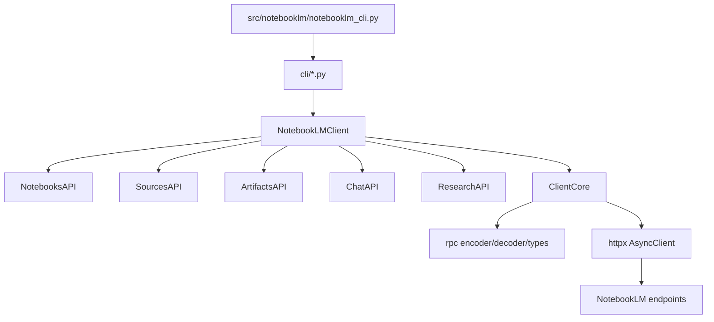
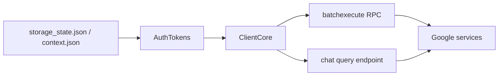
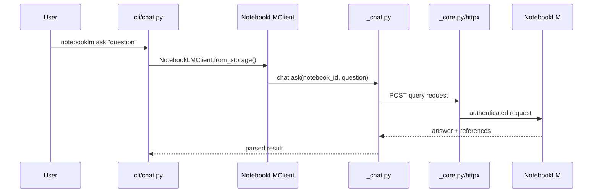

마지막 업데이트: 2026-03-10

## 이 문서의 목적

`notebooklm-py`가 어떤 계층으로 나뉘어 있고, CLI와 Python API가 같은 코어를 어떻게 공유하는지 이해하는 것이 목적입니다.

## 빠른 요약

- 공개 진입점은 `NotebookLMClient`와 `notebooklm` CLI입니다. 근거: `src/notebooklm/client.py`, `pyproject.toml`, `src/notebooklm/notebooklm_cli.py`
- 실제 API 도메인은 `_notebooks.py`, `_sources.py`, `_artifacts.py`, `_chat.py` 같은 namespaced API 클래스로 나뉩니다. 근거: `src/notebooklm/client.py`
- 하부 호출은 `ClientCore.rpc_call()`과 `rpc/encoder.py`, `rpc/decoder.py`가 담당합니다. 근거: `src/notebooklm/_core.py`, `src/notebooklm/rpc/*`

## 근거(파일/경로)

- 계층 개요: `docs/development.md`
- 메인 클라이언트: `src/notebooklm/client.py`
- 코어 요청 처리: `src/notebooklm/_core.py`
- CLI 등록: `src/notebooklm/notebooklm_cli.py`

## 계층도

## 런타임 토폴로지

## 대표 흐름: `ask`

`ChatAPI.ask()`는 일반 RPC와 다른 쿼리 경로를 사용합니다. 이 점이 채팅 계층을 별도로 봐야 하는 이유입니다. 근거: `src/notebooklm/_chat.py`, `src/notebooklm/cli/chat.py`

## 설계 포인트

- `NotebookLMClient`는 하위 API를 생성자에서 모두 구성합니다. 근거: `src/notebooklm/client.py`
- `ArtifactsAPI`는 `NotesAPI`를 주입받습니다. 즉 생성물과 노트 기능이 느슨하게 연결돼 있습니다. 근거: `src/notebooklm/client.py`
- `ClientCore`는 auth refresh callback을 받아 인증 실패 시 자동 재시도합니다. 근거: `src/notebooklm/_core.py`

## 주의사항/함정

- `_chat.py`는 일반 RPC 경로와 동작 방식이 다르므로, 장애 패턴도 다를 수 있습니다.
- undocumented RPC ID가 변경되면 전체 계층이 깨질 수 있어 `rpc-health.yml`이 이를 보완합니다.
- 내부 모듈 이름에 underscore가 붙어 있어도 실질 기능 대부분이 여기에 있습니다. public facade만 `NotebookLMClient`로 제한한 구조입니다.

## TODO/확인 필요

- NotebookLM 서버의 내부 endpoint 분리 정책은 저장소 코드 밖 정보 없이는 더 확정할 수 없습니다.
- deployment/runtime 서버 구성은 클라이언트 저장소에서 직접 보이지 않으므로 “Google services” 수준으로만 표현했습니다.

## 위키 링크

- `[[notebooklm-py Guide - 설치와 인증]]` [이전 문서](/blog-repo/notebooklm-py-guide-02-install-auth/)
- `[[notebooklm-py Guide - CLI와 Python API]]` [다음 문서](/blog-repo/notebooklm-py-guide-04-cli-python-api/)
- [시리즈 허브](/blog-repo/notebooklm-py-guide/)

