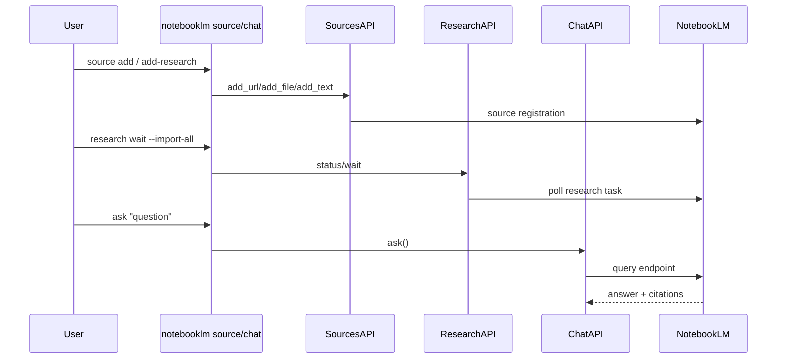

마지막 업데이트: 2026-03-10

## 이 문서의 목적

NotebookLM의 핵심 워크플로우인 “자료 넣기 -> 리서치 확장 -> 질문하기”를 `notebooklm-py`에서 어떻게 자동화하는지 정리합니다.

## 빠른 요약

- `SourcesAPI`는 URL, 텍스트, 파일, Drive, YouTube, research import를 다룹니다. 근거: `src/notebooklm/_sources.py`, `src/notebooklm/_research.py`
- `ChatAPI.ask()`는 답변과 레퍼런스, 대화 이력까지 다룹니다. 근거: `src/notebooklm/_chat.py`
- 일부 citation은 snippet 기반이라 원문 매핑이 완벽하지 않을 수 있습니다. 근거: `src/notebooklm/_chat.py`, `src/notebooklm/data/SKILL.md`

## 근거(파일/경로)

- 소스 처리: `src/notebooklm/_sources.py`, `src/notebooklm/cli/source.py`
- 리서치: `src/notebooklm/_research.py`, `docs/cli-reference.md`
- 채팅: `src/notebooklm/_chat.py`, `src/notebooklm/cli/chat.py`

## 소스 타입

| 입력 | 처리 경로 | 근거 |
|------|-----------|------|
| 일반 URL | `add_url()` | `src/notebooklm/_sources.py` |
| 텍스트 | `add_text()` | `src/notebooklm/_sources.py` |
| 파일 | `add_file()` | `src/notebooklm/_sources.py` |
| Google Drive | `add_drive()` | `src/notebooklm/_sources.py` |
| 리서치 | `ResearchAPI`와 `source add-research` | `src/notebooklm/_research.py`, `docs/cli-reference.md` |

## 대표 흐름



## 실전 패턴

```bash
notebooklm source add "https://en.wikipedia.org/wiki/Artificial_intelligence"
notebooklm source add ./paper.pdf
notebooklm source add-research "latest RAG benchmarks" --mode deep --no-wait
notebooklm research wait --import-all
notebooklm ask "핵심 차이점만 정리해줘" --json
```

## 병렬/자동화 관점 체크포인트

- 리서치와 소스 처리는 비동기 상태 전이가 있으므로 `wait` 계열 명령을 적절히 써야 합니다.
- citation text는 NotebookLM 내부 인덱스 기준 snippet일 수 있어, downstream 시스템이 “정확한 원문 위치”를 요구하면 추가 매핑이 필요합니다.
- 파일 업로드는 텍스트/마크다운에서 edge case가 있어, `docs/troubleshooting.md`는 `add_text` 우회도 안내합니다.

## 주의사항/함정

- X/Twitter 같은 보호된 사이트는 잘못된 에러 페이지가 source로 들어갈 수 있습니다. 근거: `docs/troubleshooting.md`
- 리서치와 대화는 네트워크/쿼터 상태에 민감합니다.
- 대화 이력과 현재 컨텍스트를 혼동하면 다른 notebook에서 질문할 수 있으므로 automation에서는 ID를 명시하는 편이 안전합니다.

## TODO/확인 필요

- research mode별 내부 동작 차이(예: fast/deep의 서버 처리 비용)는 저장소 근거만으로는 정량화되지 않습니다.
- NotebookLM이 각 source type을 실제로 어떻게 인덱싱하는지는 클라이언트 저장소만으로는 완전히 보이지 않습니다.

## 위키 링크

- `[[notebooklm-py Guide - CLI와 Python API]]` [이전 문서](/blog-repo/notebooklm-py-guide-04-cli-python-api/)
- `[[notebooklm-py Guide - 생성물과 다운로드]]` [다음 문서](/blog-repo/notebooklm-py-guide-06-artifacts-downloads/)
- [시리즈 허브](/blog-repo/notebooklm-py-guide/)

