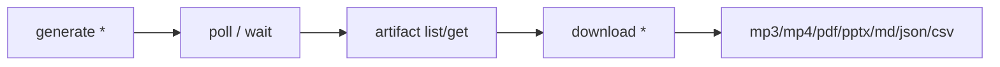

마지막 업데이트: 2026-03-10

## 이 문서의 목적

NotebookLM Studio 생성물 생성과 다운로드를 자동화할 때 어떤 타입과 옵션이 있는지, 그리고 왜 운영 시 재시도 설계가 중요한지 설명합니다.

## 빠른 요약

- 생성 대상은 audio, video, slide deck, report, quiz, flashcards, infographic, mind map, data table까지 넓습니다. 근거: `README.md`, `docs/cli-reference.md`, `src/notebooklm/_artifacts.py`
- CLI `generate` 계층은 `--retry`와 지수 백오프를 내장합니다. 근거: `src/notebooklm/cli/generate.py`
- 다운로드 계층은 타입별 포맷 차이와 batch download를 지원합니다. 근거: `src/notebooklm/_artifacts.py`, `docs/cli-reference.md`

## 근거(파일/경로)

- 생성 로직: `src/notebooklm/cli/generate.py`
- 생성물 API: `src/notebooklm/_artifacts.py`
- 다운로드 명령: `src/notebooklm/cli/download.py`, `docs/cli-reference.md`

## 생성물 유형

| 타입 | 생성 명령 | 다운로드 포맷 |
|------|-----------|---------------|
| Audio | `generate audio` | MP3, MP4 |
| Video | `generate video` | MP4 |
| Slide Deck | `generate slide-deck` | PDF, PPTX |
| Report | `generate report` | Markdown |
| Quiz / Flashcards | `generate quiz`, `generate flashcards` | JSON, Markdown, HTML |
| Mind Map | `generate mind-map` | JSON |
| Data Table | `generate data-table` | CSV |

근거: `README.md`, `docs/cli-reference.md`, `src/notebooklm/_artifacts.py`

## 생성 -> 대기 -> 다운로드 흐름



## 백오프와 재시도

`cli/generate.py`는 `RETRY_INITIAL_DELAY = 60.0`, `RETRY_MAX_DELAY = 300.0` 상수를 두고, rate limit 시 지수 백오프 기반 재시도를 수행합니다. 이 값은 긴 생성 작업이 사용자 체감과 운영 시간을 동시에 잡아먹을 수 있다는 뜻이기도 합니다.

```bash
notebooklm generate audio "focus on chapter 3" --retry 3 --wait
notebooklm generate report --format study-guide --wait
notebooklm download report ./study-guide.md
```

## 웹 UI 대비 차별점

- batch download
- quiz/flashcards structured export
- mind map JSON extraction
- data table CSV export
- slide deck PPTX export
- individual slide revision

이 항목들은 `README.md`와 `docs/cli-reference.md`에서 직접 “Beyond the Web UI”로 정리돼 있습니다.

## 주의사항/함정

- 생성은 가장 rate limit에 민감한 영역입니다.
- `--wait`는 편하지만 한 번에 긴 blocking이 걸릴 수 있어, 에이전트 자동화에서는 상태 polling과 작업 분할이 더 안정적입니다.
- 일부 생성물은 “생성 완료처럼 보이나 실제 artifact가 누락”되는 케이스가 트러블슈팅 문서에 있습니다. 근거: `docs/troubleshooting.md`

## TODO/확인 필요

- artifact type별 내부 RPC payload 차이는 `_artifacts.py`에 넓게 흩어져 있어, 필요하면 별도 심화 챕터로 뽑아야 합니다.
- 생성 속도와 성공률은 계정 상태와 NotebookLM 서버 로드에 따라 달라집니다.

## 위키 링크

- `[[notebooklm-py Guide - 소스, 리서치, 채팅]]` [이전 문서](/blog-repo/notebooklm-py-guide-05-sources-research-chat/)
- `[[notebooklm-py Guide - 테스트, CI, 보안, 운영]]` [다음 문서](/blog-repo/notebooklm-py-guide-07-testing-ci-security/)
- [시리즈 허브](/blog-repo/notebooklm-py-guide/)

