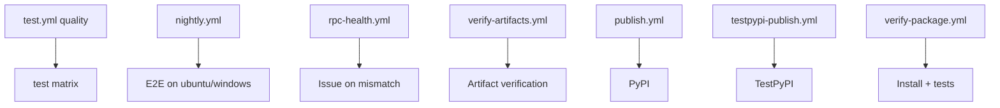

마지막 업데이트: 2026-03-10

## 이 문서의 목적

이 프로젝트를 팀이나 자동화 파이프라인에서 지속 운용하려면 테스트 전략, CI 구조, 인증 시크릿 처리, 운영 리스크를 같이 봐야 합니다.

## 빠른 요약

- 테스트는 `unit`, `integration`, `e2e` 3계층으로 분리됩니다. 근거: `docs/development.md`, `tests/`
- CI는 품질 검사, 멀티 OS/멀티 Python 테스트, nightly E2E, RPC health, package publish/verify로 분할됩니다. 근거: `.github/workflows/*.yml`
- 보안상 핵심은 `storage_state.json`, `NOTEBOOKLM_AUTH_JSON`, Google 세션 쿠키 보호입니다. 근거: `src/notebooklm/auth.py`, `docs/configuration.md`, `SECURITY.md`

## 근거(파일/경로)

- 테스트 구조: `docs/development.md`, `tests/unit`, `tests/integration`, `tests/e2e`
- CI: `.github/workflows/test.yml`, `nightly.yml`, `rpc-health.yml`, `publish.yml`, `verify-package.yml`
- 보안: `SECURITY.md`, `src/notebooklm/auth.py`, `src/notebooklm/cli/session.py`

## 테스트 구조

| 레이어 | 특징 | 근거 |
|--------|------|------|
| Unit | 네트워크 없이 빠른 검증 | `docs/development.md`, `tests/unit` |
| Integration | mock/VCR 기반 | `docs/development.md`, `tests/integration` |
| E2E | 실제 인증, 실제 NotebookLM 호출 | `docs/development.md`, `tests/e2e` |

`pyproject.toml`은 커버리지 branch 측정과 `fail_under = 90`을 정의하지만, CI `test.yml`의 실제 pytest 실행은 `--cov-fail-under=70`으로 동작합니다. 즉 로컬 정책과 CI gate를 분리해 운용합니다.

## CI 파이프라인 개요

## 운영 체크포인트

- nightly E2E는 `NOTEBOOKLM_AUTH_JSON`, `NOTEBOOKLM_READ_ONLY_NOTEBOOK_ID`, `NOTEBOOKLM_GENERATION_NOTEBOOK_ID` 같은 시크릿에 의존합니다.
- `rpc-health.yml`은 인증 실패와 RPC ID mismatch를 구분해 issue를 자동 생성합니다.
- `verify-artifacts.yml`은 생성물 타입별 존재 여부를 점검합니다.

## 보안 포인트

- `storage_state.json`은 민감한 세션 쿠키를 담으므로 소유자 전용 권한으로 저장합니다. 근거: `src/notebooklm/cli/session.py`
- `auth.py`는 쿠키 도메인 allowlist와 regional Google domain whitelist를 둡니다.
- 시크릿은 CI에서 env var로 주입하는 경로를 공식 문서가 권장합니다.

## 주의사항/함정

- fork 저장소에서는 E2E가 비활성화되거나 제한됩니다. 근거: `verify-package.yml`, `rpc-health.yml`
- 보안 문제의 상당수는 라이브러리 코드보다 “세션 쿠키 관리”에서 발생합니다.
- rate limit와 세션 만료 때문에 nightly가 안정적이어도 장기적으로는 시크릿 교체 운영이 필요합니다.

## TODO/확인 필요

- 브랜치 전략은 `main`, `develop`이 워크플로우에 등장하지만 CONTRIBUTING 문서에서 강한 규칙으로 고정되진 않습니다.
- 배포 전략을 blue/green 또는 rolling 같은 인프라 패턴으로 부르기엔 이 저장소가 라이브러리 중심이라 부적절합니다.

## 위키 링크

- `[[notebooklm-py Guide - 생성물과 다운로드]]` [이전 문서](/blog-repo/notebooklm-py-guide-06-artifacts-downloads/)
- `[[notebooklm-py Guide - 문서 점검 자동화와 트러블슈팅]]` [다음 문서](/blog-repo/notebooklm-py-guide-08-doc-automation-troubleshooting/)
- [시리즈 허브](/blog-repo/notebooklm-py-guide/)

