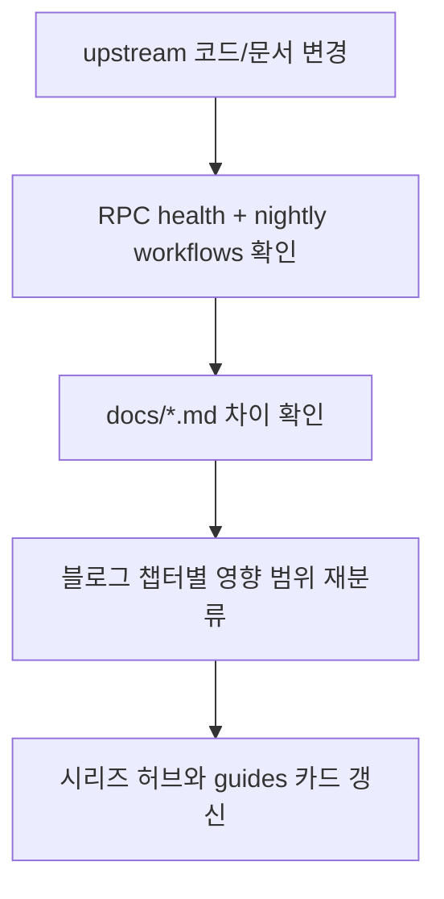

마지막 업데이트: 2026-03-10

## 이 문서의 목적

v2 시리즈에서 필수로 넣는 “문서 점검 자동화” 노드입니다. 저장소 안에 이미 있는 자동 점검 메커니즘과, 문서를 갱신할 때 어떤 파일을 우선 추적해야 하는지 정리합니다.

## 빠른 요약

- RPC 변경 감지는 `scripts/check_rpc_health.py`와 `rpc-health.yml`이 담당합니다.
- 특정 이슈 조사용 진단 스크립트로 `scripts/diagnose_get_notebook.py`가 있습니다.
- 운영 중 가장 자주 보는 문서는 `docs/troubleshooting.md`, `docs/configuration.md`, `docs/cli-reference.md`, `CHANGELOG.md`입니다.

## 근거(파일/경로)

- RPC 자동 점검: `scripts/check_rpc_health.py`, `.github/workflows/rpc-health.yml`
- 장애 진단: `scripts/diagnose_get_notebook.py`
- 사용자 대응 문서: `docs/troubleshooting.md`, `docs/configuration.md`, `CHANGELOG.md`

## 문서 점검 자동화 흐름



## 블로그 갱신용 체크리스트

- `README.md`에서 기능 범위나 설치 절차가 바뀌었는지 확인
- `pyproject.toml`에서 버전, 의존성, 엔트리포인트가 바뀌었는지 확인
- `src/notebooklm/client.py`와 `src/notebooklm/_*.py`에서 API surface가 늘었는지 확인
- `docs/cli-reference.md`, `docs/configuration.md`, `docs/troubleshooting.md`에서 사용자 워크플로우가 바뀌었는지 확인
- `.github/workflows/*.yml`과 `scripts/*.py`에서 운영/점검 루프가 바뀌었는지 확인

## 예시 자동화 명령

```bash
git pull
pytest tests/integration -q
python scripts/check_rpc_health.py
rg -n "generate|download|NOTEBOOKLM_AUTH_JSON|rpc" README.md docs src/notebooklm
```

위 명령들은 저장소 내부 근거를 빠르게 훑어 “가이드 어느 챕터를 다시 써야 하는지” 판단하는 최소 세트입니다.

## 대표 장애와 1차 대응

| 증상 | 1차 대응 | 근거 |
|------|----------|------|
| 인증 오류 | `notebooklm auth check`, 필요 시 `notebooklm login` | `docs/troubleshooting.md` |
| RPC ID mismatch 의심 | debug 로그 + `check_rpc_health.py` | `docs/troubleshooting.md`, `scripts/check_rpc_health.py` |
| X/Twitter source 오염 | pre-fetch 후 파일로 추가 | `docs/troubleshooting.md` |
| generation 불안정 | `--retry`, 대기, source 수 축소 | `docs/troubleshooting.md`, `src/notebooklm/cli/generate.py` |

## 주의사항/함정

- 자동 점검 스크립트는 근본적으로 실제 NotebookLM 응답에 의존하므로, 네트워크 또는 계정 문제도 함께 섞여 들어옵니다.
- 문서 갱신 자동화가 있다고 해도, 블로그 글의 재구성 판단은 사람이 해야 합니다.
- `diagnose_get_notebook.py` 같은 스크립트는 특정 이슈를 겨냥하므로, 범용 헬스체크와 혼동하면 안 됩니다.

## TODO/확인 필요

- 장기적으로는 블로그 생성 스킬이 `CHANGELOG.md` diff와 워크플로우 변경을 자동 분류하는 단계까지 확장될 수 있습니다.
- 현재 저장소에는 “문서 변경 시 블로그 포스트 자동 생성”까지 포함된 공식 스크립트는 없습니다.

## 위키 링크

- `[[notebooklm-py Guide - 테스트, CI, 보안, 운영]]` [이전 문서](/blog-repo/notebooklm-py-guide-07-testing-ci-security/)
- `[[notebooklm-py Guide - 소개 및 범위]]` [처음으로](/blog-repo/notebooklm-py-guide-01-intro/)
- [시리즈 허브](/blog-repo/notebooklm-py-guide/)

