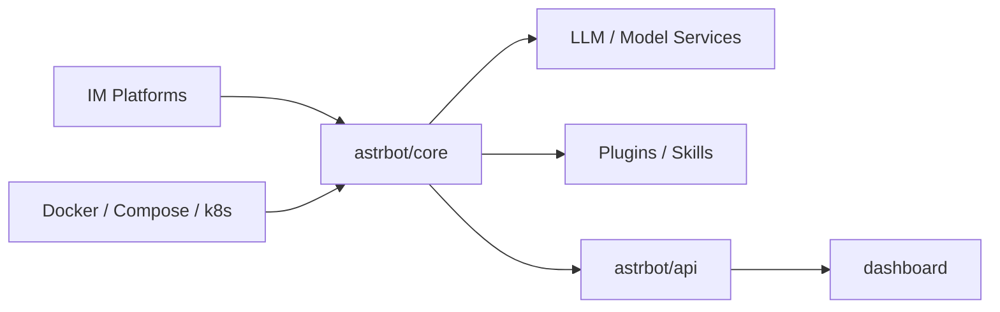

## AstrBot란?

GitHub Trending 기준으로 주목받는 **AstrBotDevs/AstrBot**를 한국어로 정리합니다.

- **한 줄 요약**: 여러 IM(메신저) 플랫폼 + LLM/플러그인/스킬을 통합하는 올인원 Agent 챗봇 인프라 (README 기준)
- **언어**: Python
- **오늘 스타**: +391 (2026-03-11 스냅샷)
- **원본**: https://github.com/AstrBotDevs/AstrBot

---

## Repo Map (빠른 구조)

- **코어/런타임**: `astrbot/` (core/cli/api/dashboard 등)
- **엔트리**: `main.py`
- **WebUI/문서**: `dashboard/`, `docs/`
- **배포**: `Dockerfile`, `compose.yml`, `k8s/`

---

## 이 가이드에서 다룰 것(예정)

- `uv` 기반 설치/실행, Docker/Compose 배포
- 핵심 개념(플러그인/스킬/지식베이스/샌드박스) 개요
- IM 플랫폼 연결 흐름과 모델 서비스 설정
- 운영 체크리스트(권한/토큰/리소스/업데이트)

---

*다음 글에서는 설치 및 빠른 시작을 정리합니다.*

