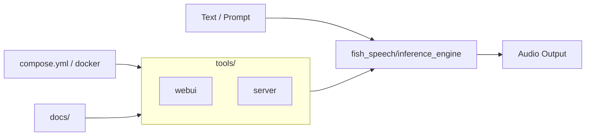

## fish-speech란?

GitHub Trending 기준으로 주목받는 **fishaudio/fish-speech**를 한국어로 정리합니다.

- **한 줄 요약**: SOTA Open Source TTS (README 기준)
- **언어**: Python
- **오늘 스타**: +277 (2026-03-11 스냅샷)
- **원본**: https://github.com/fishaudio/fish-speech

---

## Repo Map (빠른 구조)

- **코어 패키지**: `fish_speech/` (모델/텍스트/추론 엔진 등)
- **도구/서빙**: `tools/` (WebUI/Server)
- **문서/배포**: `docs/`, `compose.yml`, `docker/`

---

## 이 가이드에서 다룰 것(예정)

- 설치/실행 빠른 시작(공식 문서 + 로컬/Docker)
- 코드 구조(모델/추론/서빙) 개요
- WebUI/Server 기반 사용 패턴
- 운영 시 체크리스트(라이선스/리소스/보안)

---

*다음 글에서는 설치 및 빠른 시작을 정리합니다.*

