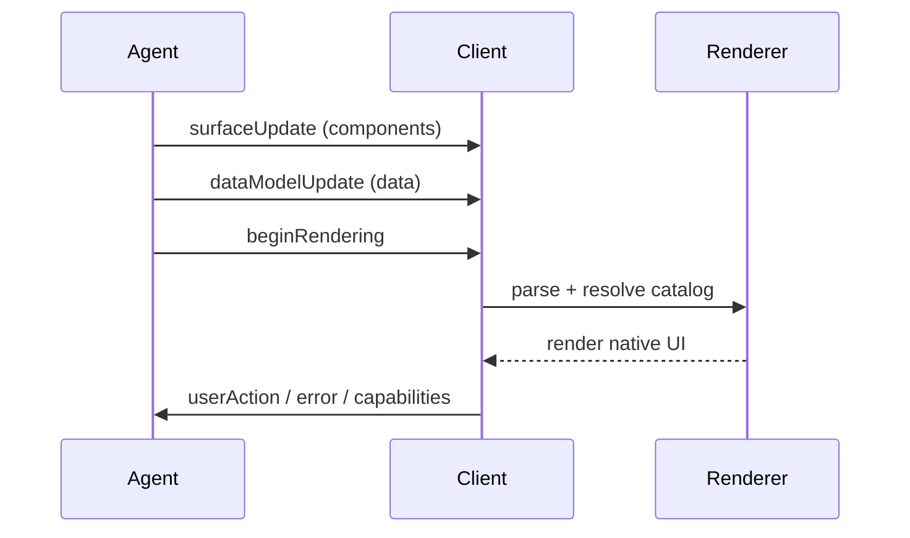

## 스펙은 문서 + JSON Schema로 동시에 제공된다

레포는 “사람이 읽는 문서”와 “기계가 검증하는 스키마”를 같이 둡니다.

- 문서: `docs/` (예: `docs/concepts/data-flow.md`)
- 스키마/정의: `specification/**/json/*` (예: `specification/v0_8/json/README.md`)

---

## 메시지 타입(스키마 설명 기준)

`specification/v0_8/json/README.md`는 server → client 메시지의 핵심 타입을 요약합니다.

- `beginRendering`
- `surfaceUpdate`
- `dataModelUpdate`
- `deleteSurface`

또한 client → server 이벤트 메시지 스키마(`client_to_server.json`)와, 카탈로그 설명 스키마(`catalog_description_schema.json`)도 함께 설명합니다.

---

## 버전 관점: v0.8(Stable) / v0.9(Draft)

문서 사이트의 홈(`docs/index.md`)는 스펙 버전을 “Stable vs Draft”로 구분해 안내합니다.

- v0.8: Stable
- v0.9: Draft (+ Evolution guide)

---

## 데이터 흐름을 “메시지 스트림”으로 보는 이유

`docs/concepts/data-flow.md`는 메시지를 JSON Lines(JSONL)로 스트리밍하는 이유를 설명합니다.

---

## 근거(파일/경로)

- 버전/문서 네비: `mkdocs.yaml`, `docs/index.md`
- 데이터 흐름: `docs/concepts/data-flow.md`
- v0.8 스키마 설명: `specification/v0_8/json/README.md`
- v0.8 문서 안내: `specification/v0_8/README.md`
- 스펙 검증 워크플로우: `.github/workflows/validate_specifications.yml`

---

## 위키 링크

- `[[A2UI Guide - Index]]` → [가이드 목차](/blog-repo/a2ui-guide/)
- `[[A2UI Guide - Renderers]]` → [04. 렌더러 & 통합](/blog-repo/a2ui-guide-04-renderers-and-integrations/)

---

*다음 글에서는 `renderers/`와 `agent_sdks/`를 중심으로 “클라이언트/서버 통합 지점”을 정리합니다.*

