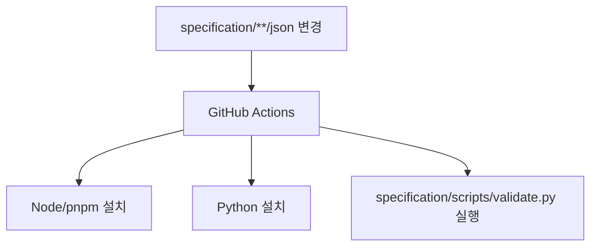

## tools/ 디렉토리: Composer/Editor/Inspector

레포에는 UI를 만들고/검사하는 도구가 별도 디렉토리로 존재합니다.

- `tools/composer/` (Next.js 설정 파일 존재: `tools/composer/next.config.ts`)
- `tools/editor/` (Vite 설정 파일 존재: `tools/editor/vite.config.ts`)
- `tools/inspector/`

각 도구는 `package.json`과 `tsconfig.json`을 가지고 있어, 독립적으로 빌드/테스트되는 패키지로 보입니다.

---

## 문서(사이트)는 MkDocs로 관리

`mkdocs.yaml`은 문서 사이트의 네비게이션(Introduction, Concepts, Guides, Reference, Specifications 등)을 정의합니다.

- 문서 소스: `docs/`
- 네비 정의: `mkdocs.yaml`

즉, 레포의 “진짜 스펙/설명”은 `README.md`만이 아니라 `docs/` 트리까지 포함해 봐야 합니다.

---

## 스펙 예제 검증 자동화(문서/코드 품질)

`.github/workflows/validate_specifications.yml`는 `specification/**/json/**` 변경 시 Python 스크립트(`specification/scripts/validate.py`)를 실행하도록 구성합니다.

---

## 기여 흐름(입구)

레포 최상위에 `CONTRIBUTING.md`가 존재합니다. 기여/개발 세부는 이 파일과 각 패키지별 `package.json` 스크립트를 기준으로 추적하는 것이 가장 안전합니다.

---

## 근거(파일/경로)

- 툴링: `tools/`
- 문서: `docs/`, `mkdocs.yaml`
- 스펙/검증: `specification/`, `.github/workflows/validate_specifications.yml`
- 기여: `CONTRIBUTING.md`

---

## 위키 링크

- `[[A2UI Guide - Index]]` → [가이드 목차](/blog-repo/a2ui-guide/)
- `[[A2UI Guide - Intro]]` → [01. 소개 & 위키 맵](/blog-repo/a2ui-guide-01-intro-and-wiki-map/)

---

*이 챕터는 “문서 점검/자동화 노드” 역할을 겸합니다. 필요 시 tools/composer·editor·inspector를 각각 분리 챕터로 확장할 수 있습니다.*

