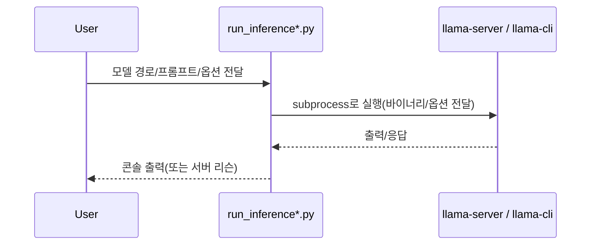

## 이 문서의 목적

- BitNet(bitnet.cpp) 레포에서 제공하는 **가장 짧은 실행 경로**를 “스크립트 기준”으로 정리합니다.
- 로컬 단일 실행(`run_inference.py`)과 서버 실행(`run_inference_server.py`)의 차이를 명확히 합니다.

---

## 빠른 요약

- `README.md`는 `run_inference.py -m ... -p ... -cnv` 형태의 기본 실행을 제시합니다.
- `run_inference.py`는 **프롬프트 필수**(`--prompt/-p`)이며, 모델 경로는 기본값이 존재합니다. (`run_inference.py`)
- `run_inference_server.py`는 `build/bin/llama-server`를 실행하도록 구성되어 있고, `--host/--port`를 지원합니다. (`run_inference_server.py`)

---

## 0) 전제: 모델/환경 준비

이 문서에서는 “이미 02장에서 `setup_env.py`까지 완료되어 모델 파일이 준비된 상태”를 전제로 합니다.

근거:
- 모델 다운로드 + `setup_env.py` 예시는 루트 `README.md`에 있습니다.

---

## 1) 단일 실행: `run_inference.py`

루트 README의 예시:

```bash
python run_inference.py \
  -m models/BitNet-b1.58-2B-4T/ggml-model-i2_s.gguf \
  -p "You are a helpful assistant" \
  -cnv
```

`run_inference.py`의 argparse 기준 주요 옵션:

- `-m/--model`: 모델 파일 경로(기본값 있음)
- `-p/--prompt`: 프롬프트(필수)
- `-t/--threads`: 스레드 수(기본 2)
- `-c/--ctx-size`: 컨텍스트 길이(기본 2048)
- `-temp/--temperature`: temperature(기본 0.8)
- `-cnv/--conversation`: chat mode(인스트럭트 모델용)

---

## 2) 서버 실행: `run_inference_server.py`

`run_inference_server.py`는 내부적으로 `build/bin/llama-server`(Windows는 `build/bin/Release/llama-server.exe` 후보 포함)를 실행합니다. (`run_inference_server.py`)

### 기본 실행(예시)

```bash
python run_inference_server.py \
  -m models/BitNet-b1.58-2B-4T/ggml-model-i2_s.gguf \
  --host 127.0.0.1 \
  --port 8080
```

argparse 기준 주요 옵션:

- `--host`: 리슨 주소(기본 `127.0.0.1`)
- `--port`: 리슨 포트(기본 `8080`)
- `-p/--prompt`: 시스템 프롬프트(선택)
- `-n/--n-predict`: 토큰 수(기본 4096)

> 참고: 스크립트 주석에 “server는 `-cnv` 미지원”이라고 명시돼 있습니다. (`run_inference_server.py`)

---

## 실행 흐름(단일 vs 서버)



---

## 주의사항/함정

- **서버 바이너리 경로**: `run_inference_server.py`는 `build/bin/llama-server`를 기대합니다. 빌드 산출물 경로가 다르면 실행이 실패합니다.
- **모델 경로**: `-m` 기본값이 있지만, 실제로는 여러분이 내려받은 모델 경로에 맞춰 지정하는 편이 안전합니다.

---

## TODO / 확인 필요

- 서버 모드에서 실제 HTTP 엔드포인트(요청/응답 스키마)는 `llama-server`(서브모듈 `3rdparty/llama.cpp`)의 문서/코드 기준으로 확인이 필요합니다.

---

## 위키 링크

- `[[BitNet Guide - Index]]` → [가이드 목차](/blog-repo/bitnet-guide/)
- `[[BitNet Guide - Build & Install]]` → [02. 설치 및 빌드](/blog-repo/bitnet-guide-02-build-and-install/)
- `[[BitNet Guide - Architecture]]` → [04. 구성요소/아키텍처](/blog-repo/bitnet-guide-04-architecture/)

---

*다음 글에서는 루트/서브모듈/디렉토리 기준으로 구성요소(특히 `3rdparty/llama.cpp`, `src/`, `gpu/`)를 구조화합니다.*

