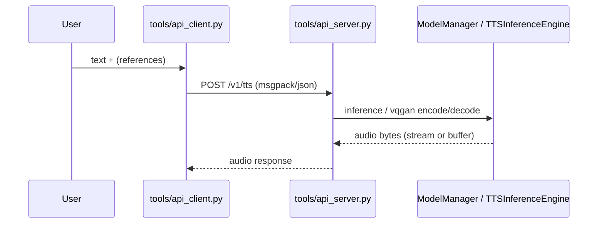

## 이 문서의 목적

- fish-speech의 추론 경로를 **3가지 시점**으로 나눠 정리합니다.
  - WebUI(Gradio)
  - API 서버(HTTP)
  - API 클라이언트(요청 생성)

---

## 빠른 요약

- WebUI 엔트리: `tools/run_webui.py` (Gradio 앱 빌드 후 `app.launch()`)
- API 서버 엔트리: `tools/api_server.py` (ASGI 앱 생성 후 `uvicorn.run(...)`)
- 헬스체크: `POST/GET /v1/health` (`tools/server/views.py`)
- `--api-key`를 설정하면 Bearer 토큰 인증을 요구합니다. (`tools/api_server.py`)

---

## 1) WebUI: `tools/run_webui.py`

기본 체크포인트 경로:

- `--llama-checkpoint-path`: `checkpoints/s2-pro`
- `--decoder-checkpoint-path`: `checkpoints/s2-pro/codec.pth`

기본 device:

- `--device`: 기본 `cuda` (단, MPS/XPU/CUDA 미사용 시 자동 감지 로직이 존재) (`tools/run_webui.py`)

실행 예시(파일 기준):

```bash
python tools/run_webui.py --device cuda
```

---

## 2) API 서버: `tools/api_server.py`

서버 실행 인자(parse_args):

- `--listen`: 기본 `127.0.0.1:8080`
- `--workers`: 기본 1
- `--api-key`: 기본 None(없으면 인증 패스스루)
- `--max-text-length`: 기본 0(제한 없음 의미로 해석 가능)

근거:
- `tools/server/api_utils.py`
- `tools/api_server.py`

실행 예시:

```bash
python tools/api_server.py --listen 0.0.0.0:8080
```

레포에는 “API 플래그 예시”가 `API_FLAGS.txt`로도 제공됩니다.

---

## 3) API 엔드포인트(서버 routes 기준)

대표 엔드포인트(발췌):

- `GET/POST /v1/health` (헬스 체크)
- `POST /v1/vqgan/encode`
- `POST /v1/vqgan/decode`

근거:
- `tools/server/views.py`

요청 포맷:

- `application/msgpack` / `application/json` / `multipart/form-data`를 지원하며, `format_response()`에서 클라이언트 선호(JSON vs msgpack)를 분기합니다. (`tools/server/api_utils.py`)

---

## 4) API 클라이언트: `tools/api_client.py`

`tools/api_client.py`는 `requests.post()`로 `/v1/tts`로 요청을 보내는 형태입니다.

주요 옵션(발췌):

- `--url/-u`: 기본 `http://127.0.0.1:8080/v1/tts`
- `--text/-t`: 필수
- `--reference_id` 또는 `--reference_audio`/`--reference_text` 조합
- `--api_key`: Bearer 토큰 값
- `--streaming`: 스트리밍 응답 처리(오디오를 chunk로 소비)

근거:
- `tools/api_client.py`

---

## 데이터 흐름(개략)



---

## 주의사항/함정

- API 서버는 `--api-key`가 설정되면 Bearer 인증을 강제합니다. 토큰 불일치 시 401이 납니다. (`tools/api_server.py`)
- 기본 체크포인트 경로가 “컨테이너/로컬 모두 `checkpoints/...`”로 고정된 형태이므로, 디렉토리 구조를 먼저 맞추는 것이 중요합니다. (`tools/run_webui.py`, `tools/server/api_utils.py`)

---

## TODO / 확인 필요

- `/v1/tts`의 정확한 요청/응답 스키마(필드/형식)는 `tools/server/views.py`의 해당 라우트 구현을 추가로 확인해 챕터에 보강하는 것이 좋습니다(본 문서는 엔트리/헬스/VQGAN 위주로 발췌).

---

## 위키 링크

- `[[fish-speech Guide - Index]]` → [가이드 목차](/blog-repo/fish-speech-guide/)
- `[[fish-speech Guide - Docker]]` → [03. Docker로 실행](/blog-repo/fish-speech-guide-03-docker/)
- `[[fish-speech Guide - Ops & Notes]]` → [05. 운영/주의사항](/blog-repo/fish-speech-guide-05-ops-and-notes/)

---

*다음 글에서는 라이선스/체크포인트 배포/운영 관점에서 반드시 확인할 항목을 정리합니다.*

