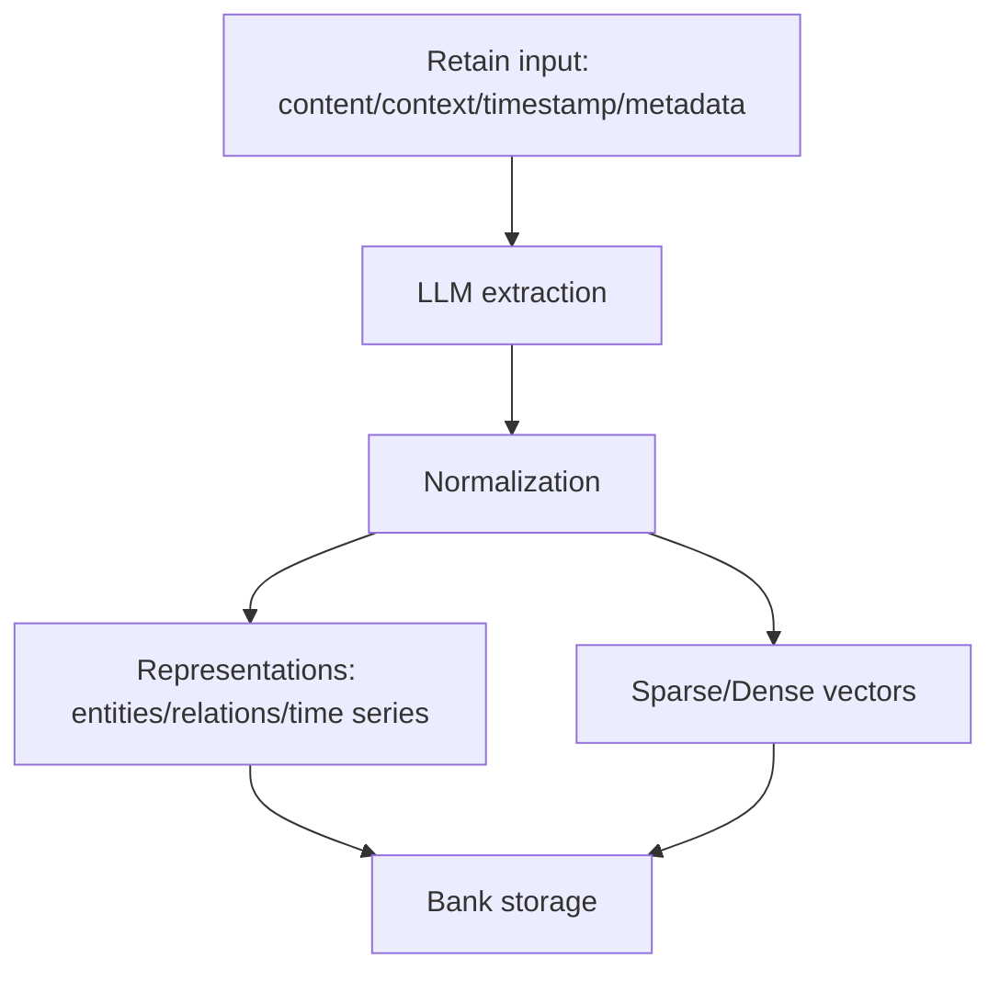
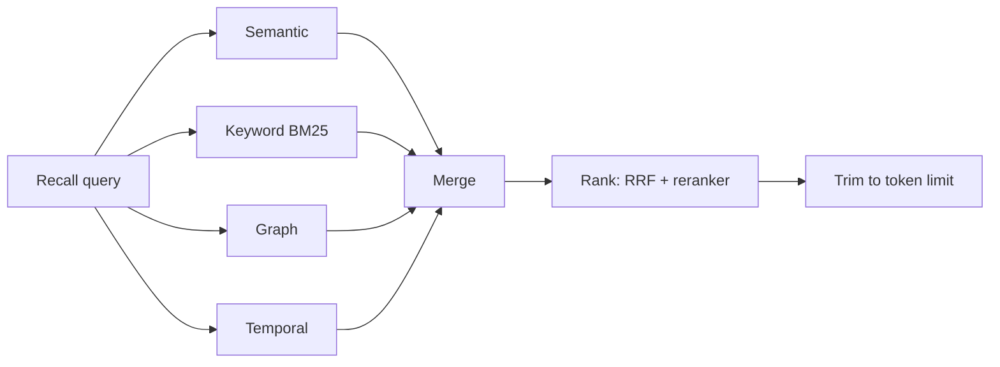

## 이 문서의 목적

- Hindsight의 핵심인 “학습하는 메모리”를, README에 적힌 개념을 기준으로 구조화합니다.
- retain/recall/reflect가 실제로 어떤 단계로 작동하는지(개략)를 Mermaid로 시각화합니다.

---

## 빠른 요약(README 기반)

Hindsight는 메모리를 “banks”에 저장하며, 메모리 타입을 다음처럼 설명합니다. (`README.md`)

- **World**: 세계에 대한 사실
- **Experiences**: 에이전트의 경험
- **Mental Models**: 반성(reflect)로 형성되는 이해/관찰

그리고 세 가지 핵심 연산을 제공합니다.

- **Retain**: 새 정보 저장
- **Recall**: 기억 검색
- **Reflect**: 기억을 바탕으로 통찰/관찰 생성

근거:
- `README.md` Architecture & Operations

---

## 1) Bank(메모리 은행) 모델

README는 “Memories in Hindsight are stored in banks (memory banks)”라고 명시합니다. 즉, bank는 멀티 테넌시/프로젝트/사용자별로 분리할 수 있는 1차 네임스페이스로 해석할 수 있습니다.

근거:
- `README.md`

---

## 2) Retain → Normalize → Index(개략)

README 설명:

- retain은 LLM으로 key facts/temporal data/entities/relationships를 추출하고,
- normalization을 거쳐 canonical entity/time series/search index + metadata를 만든다고 합니다.

근거:
- `README.md` Retain 섹션

---

## 3) Recall(검색) 전략 병렬 실행

README는 recall이 4가지 전략을 병렬로 수행한다고 설명합니다. (`README.md`)

- Semantic(Vector similarity)
- Keyword(BM25)
- Graph(Entity/temporal/causal links)
- Temporal(Time range filtering)

또한 결과를 merge한 뒤, reciprocal rank fusion + cross-encoder reranking으로 정렬한다고 설명합니다.

근거:
- `README.md` Recall 섹션

---

## 4) Reflect(반성)으로 “Mental Models” 강화

README는 reflect가 “기존 기억을 더 깊게 분석하여 새로운 연결을 만들고 이해를 형성”하는 용도라고 설명합니다. (`README.md`)

실무 적용 관점:

- retain은 “기록”
- recall은 “검색”
- reflect는 “정리/요약/새 규칙/새 관찰 생성”

---

## 주의사항/함정

- retain/reflect는 LLM 호출을 전제로 하는 설명이므로, 운영 시 비용/지연/키 관리가 중요합니다. (근거: Docker 실행에서 LLM 키 주입 필요)
- “per-user memories”는 metadata로 분리/필터링하는 방식이 README에 소개됩니다. 멀티유저 환경에서는 metadata 설계를 먼저 고정하는 것이 안전합니다. (`README.md` per-user memories 설명)

---

## TODO / 확인 필요

- “metadata가 실제 API 스키마에서 어떻게 표현되는지”는 REST API/SDK 레퍼런스를 확인해 필드 단위로 확정하는 것이 좋습니다(이 챕터는 README 개념 중심).

---

## 위키 링크

- `[[Hindsight Guide - Index]]` → [가이드 목차](/blog-repo/hindsight-guide/)
- `[[Hindsight Guide - Quickstart]]` → [03. 빠른 시작(로컬)](/blog-repo/hindsight-guide-03-quickstart/)
- `[[Hindsight Guide - Ops]]` → [05. 운영/배포/트러블슈팅](/blog-repo/hindsight-guide-05-ops-and-troubleshooting/)

---

*다음 글에서는 Docker/Helm/외부 DB 구성을 중심으로 운영 체크리스트를 정리합니다.*

