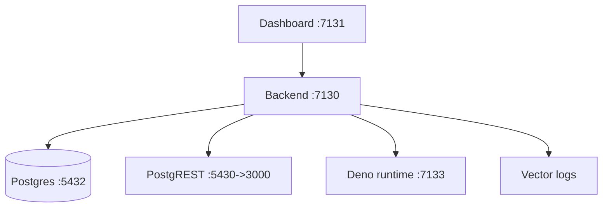

## 이 문서의 목적

- InsForge를 로컬에서 “일단 띄우고 대시보드에 접속”하는 데 필요한 Docker 실행 루트를 정리합니다.
- 개발용(`docker-compose.yml`)과 프로덕션 성격(`docker-compose.prod.yml`)의 차이를 파일 기준으로 설명합니다.

---

## 빠른 요약

- 빠른 시작(한국어): `i18n/README.ko.md`는 `cp .env.example .env` + `docker compose up` 흐름을 제시합니다.
- `docker-compose.yml`은 개발(타깃 `dev`, 소스/노드모듈 볼륨 등) 중심 구성입니다.
- `docker-compose.prod.yml`은 `insforge` 서비스를 빌드/실행하고, `deno`(함수 런타임), `vector`(로그) 등 운영형 서비스가 포함됩니다.

---

## 1) Quickstart(레포 문서 그대로)

`i18n/README.ko.md`의 예시:

```bash
git clone https://github.com/insforge/insforge.git
cd insforge
cp .env.example .env
docker compose up
```

근거:
- `i18n/README.ko.md`

---

## 2) 서비스/포트(Compose 기준)

### 개발 compose: `docker-compose.yml`

대표 포트:

- InsForge API: `7130:7130`
- InsForge Dashboard: `7131:7131`
- Auth 앱(추정): `7132:7132`
- Postgres: `5432:5432`
- PostgREST: `5430:3000`

근거:
- `docker-compose.yml`

### prod compose: `docker-compose.prod.yml`

추가 구성:

- `deno`: 함수 런타임(포트 `7133:7133`, `functions/server.ts` 실행)
- `vector`: 로그 수집/배송(health 체크: `http://localhost:7135/health` 접근 시도)

근거:
- `docker-compose.prod.yml`

---

## 3) 데이터/스토리지(Compose 기준)

로컬 실행에서 중요한 볼륨(발췌):

- Postgres 데이터: `postgres-data`
- 파일 스토리지: `storage-data` → 컨테이너 `/insforge-storage`
- 로그 공유: `shared-logs` → 컨테이너 `/insforge-logs`

근거:
- `docker-compose.yml`, `docker-compose.prod.yml`

---

## 실행 토폴로지(개략)



---

## 주의사항/함정

- `.env`에 `JWT_SECRET`, `ADMIN_PASSWORD` 등의 기본값이 포함될 수 있습니다. 로컬 개발은 괜찮아도 외부 노출/운영에서는 변경이 필요합니다. (근거: `docker-compose.yml`, `.env.example`)
- 포트(7130~7133, 5432/5430)가 이미 사용 중이면 기동에 실패합니다. 포트 충돌 시 compose 파일의 `ports`를 조정하세요. (근거: compose 파일)

---

## TODO / 확인 필요

- “대시보드 로그인 초기 계정(ADMIN_EMAIL/ADMIN_PASSWORD)”과 초기 마이그레이션 흐름은 `backend`의 마이그레이션 스크립트와 compose `command`를 읽고 운영 절차로 고정하는 것이 좋습니다(이 문서는 기동/포트 중심).

---

## 위키 링크

- `[[InsForge Guide - Index]]` → [가이드 목차](/blog-repo/insforge-guide/)
- `[[InsForge Guide - MCP Connection]]` → [03. 대시보드 & MCP 연결](/blog-repo/insforge-guide-03-mcp-connection/)
- `[[InsForge Guide - Architecture]]` → [04. 구성요소/아키텍처](/blog-repo/insforge-guide-04-architecture/)

---

*다음 글에서는 대시보드의 “Connect” 흐름과 레포 문서(README)에서 언급되는 MCP 연동 포인트를 정리합니다.*

