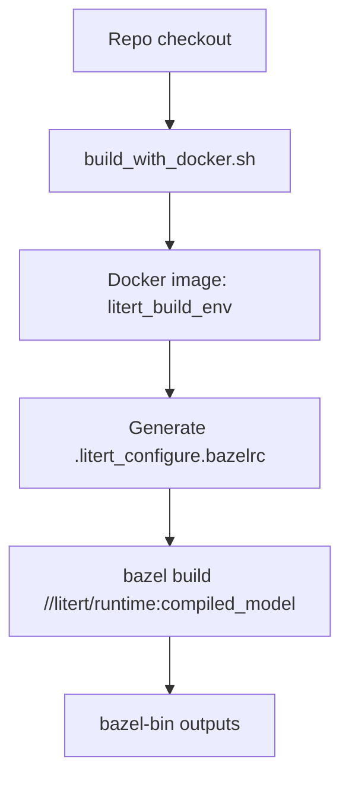

## 이 문서의 목적

- LiteRT를 로컬 환경에 Bazel/Android SDK/NDK 등을 직접 깔지 않고도 빌드할 수 있도록, 레포가 제공하는 **Docker 기반 hermetic 빌드 루트**를 정리합니다.
- “어떤 타깃을 빌드하는지 / 산출물을 어떻게 꺼내는지”까지 포함합니다.

---

## 빠른 요약(docker_build/README.md 기반)

- `docker_build/`는 “hermetic build environment”를 제공하며, 의존성 설치/서브모듈 초기화/설정 파일 생성까지 한 번에 처리한다고 설명합니다.
- 권장 실행: `./build_with_docker.sh`
- 예시 빌드 타깃: `//litert/runtime:compiled_model`
- 산출물은 컨테이너 내부 `bazel-bin/` 아래에 생성되며, `docker cp` 또는 interactive shell로 확인합니다.

근거:
- `docker_build/README.md`

---

## 1) 스크립트로 빌드(가장 간단)

`docker_build/README.md`의 안내:

```bash
./build_with_docker.sh
```

이 스크립트가 수행한다고 문서가 명시한 작업(요약):

- Docker 이미지 빌드(필수 의존성 포함)
- 현재 체크아웃 디렉토리를 컨테이너에 마운트
- 설정 파일 `.litert_configure.bazelrc` 생성
- 예시 타깃 빌드(`//litert/runtime:compiled_model`)

---

## 2) Docker Compose로 빌드

문서에는 다음 대안이 제시됩니다.

```bash
docker-compose up
```

근거:
- `docker_build/README.md`

---

## 3) 다른 Bazel 타깃을 빌드하고 싶다면

`docker_build/README.md`는 3가지 방법을 제시합니다.

1) `hermetic_build.Dockerfile`의 CMD 변경
2) `docker-compose.yml`의 command 변경
3) `docker run ... bash -c "bazel build //litert/your_custom:target"` 형태로 커맨드 주입

예시(문서):

```bash
docker run --rm --user $(id -u):$(id -g) -v $(pwd):/litert_build litert_build_env \
  bash -c "bazel build //litert/your_custom:target"
```

---

## 4) 산출물 가져오기

문서 예시:

```bash
docker cp <container>:/litert_build/bazel-bin/<path> .
```

또는 interactive shell:

```bash
docker run --rm -it --user $(id -u):$(id -g) -e HOME=/litert_build -e USER=$(id -un) \
  -v $(pwd):/litert_build litert_build_env bash
```

근거:
- `docker_build/README.md`

---

## 빌드 파이프라인(개략)



---

## 주의사항/함정

- Docker daemon 리소스(RAM/CPU)가 부족하면 빌드가 실패할 수 있다고 문서에 명시돼 있습니다. (`docker_build/README.md`)
- 서브모듈이 존재하므로, 소스 체크아웃 시 submodule 초기화가 필요합니다. `docker_build`는 이를 자동 처리한다고 설명하지만, 로컬에서 직접 빌드할 경우 `.gitmodules`를 확인하세요. (근거: `.gitmodules`, `docker_build/README.md`)

---

## TODO / 확인 필요

- “도커 빌드가 어떤 Bazel config(예: 플랫폼/Android toolchain)를 설정하는지”는 `docker_build/hermetic_build.Dockerfile`과 `./configure`(또는 `configure.py`)를 함께 읽고 확정하면 좋습니다.

---

## 위키 링크

- `[[LiteRT Guide - Index]]` → [가이드 목차](/blog-repo/litert-guide/)
- `[[LiteRT Guide - Build Systems]]` → [03. 빌드 시스템 개요](/blog-repo/litert-guide-03-build-systems/)
- `[[LiteRT Guide - Runtime Architecture]]` → [04. 런타임 구성요소](/blog-repo/litert-guide-04-runtime-architecture/)

---

*다음 글에서는 g3doc의 Bazel/CMake 빌드 문서를 근거로 “로컬 빌드 시스템” 관점에서 구조를 정리합니다.*

