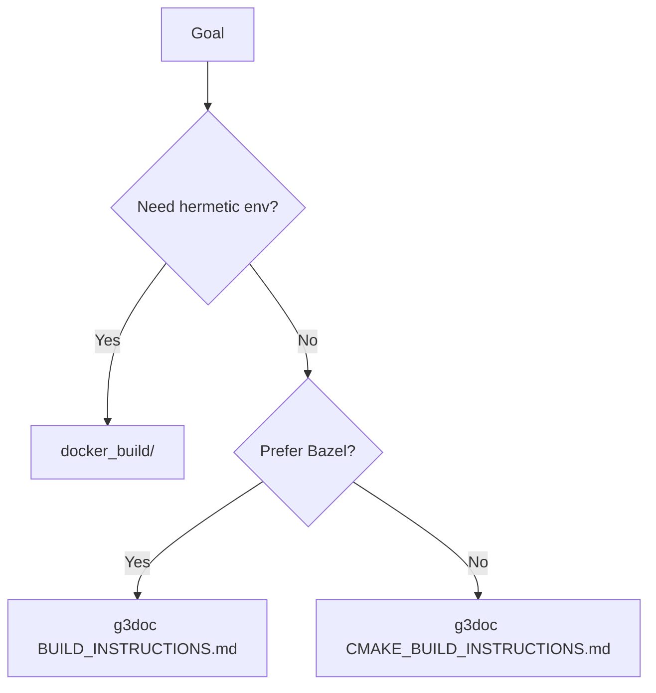

## 이 문서의 목적

- LiteRT의 소스 빌드 경로를 “Bazel vs CMake” 관점으로 정리합니다.
- 로컬 빌드 시 필요한 도구/설정 파일을 문서 근거로 연결합니다.

---

## 빠른 요약(근거)

- Bazel 빌드 문서: `g3doc/instructions/BUILD_INSTRUCTIONS.md`
- CMake 빌드 문서: `g3doc/instructions/CMAKE_BUILD_INSTRUCTIONS.md`
- 로컬 빌드는 `./configure`를 먼저 실행하는 흐름이 문서에 포함됩니다. (`BUILD_INSTRUCTIONS.md`)

---

## 1) Bazel(Bazelisk) 경로

### Bazelisk 설치(문서 예시)

`BUILD_INSTRUCTIONS.md`는 Bazelisk 설치를 권장하며, Linux/macOS/Windows 예시를 제공합니다.

### Linux 빌드 예시(문서)

```bash
git clone https://github.com/google-ai-edge/LiteRT.git
cd LiteRT
./configure

bazel build //litert/cc:litert_compiled_model
bazel build //litert/tools:benchmark_model
```

근거:
- `g3doc/instructions/BUILD_INSTRUCTIONS.md`

### Windows 빌드 힌트(문서)

문서는 Windows에서 `BAZEL_VC`, `BAZEL_SH` 환경 변수를 설정하고, `.bazelrc.user`에 `build --config=windows`를 추가하는 예시를 제공합니다.

근거:
- `g3doc/instructions/BUILD_INSTRUCTIONS.md`

---

## 2) CMake 경로

루트 `README.md`는 CMake/Bazel 빌드 문서 링크를 제공합니다.

- `./g3doc/instructions/CMAKE_BUILD_INSTRUCTIONS.md`
- `./g3doc/instructions/BUILD_INSTRUCTIONS.md`

근거:
- `README.md`

> CMake 예제 디렉토리로 `cmake_example/`가 존재하며 `CMakeLists.txt`가 포함됩니다(“예제/참고용” 성격).

---

## 3) 설정 파일/레포 특이사항

레포에는 Bazel 관련 설정 파일이 다수 존재합니다.

- `.bazelrc`, `.bazelversion`, `.bazeliskrc`, `WORKSPACE`
- 그리고 docker_build 경로에서 생성된다고 설명하는 `.litert_configure.bazelrc`

근거:
- 레포 파일 목록
- `docker_build/README.md`

또한 서브모듈이 존재합니다.

- `third_party/tensorflow` 서브모듈 (`.gitmodules`)

---

## 빌드 시스템 선택 가이드(개략)



---

## 주의사항/함정

- Bazel 빌드는 플랫폼별 config가 다르므로(`--config=macos_arm64`, `--config=windows` 등), 문서의 플랫폼 섹션을 그대로 따르는 것이 안전합니다. (`BUILD_INSTRUCTIONS.md`)
- 서브모듈을 포함하므로, 소스 체크아웃 환경에서 submodule 초기화가 필요합니다. (`.gitmodules`)

---

## TODO / 확인 필요

- “Compiled Model API”를 실제로 사용하는 샘플/엔트리포인트는 `litert/` 및 `samples/`(또는 외부 `litert-samples` 링크)까지 함께 읽고, 빌드 타깃과 런타임 사용 코드를 1:1로 매핑하면 좋습니다.

---

## 위키 링크

- `[[LiteRT Guide - Index]]` → [가이드 목차](/blog-repo/litert-guide/)
- `[[LiteRT Guide - Docker Build]]` → [02. 소스 빌드(도커)](/blog-repo/litert-guide-02-build-with-docker/)
- `[[LiteRT Guide - Runtime Architecture]]` → [04. 런타임 구성요소](/blog-repo/litert-guide-04-runtime-architecture/)

---

*다음 글에서는 `litert/README.md`의 디렉토리 맵을 근거로 런타임/바인딩/툴 체계를 정리합니다.*

