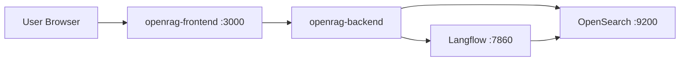

## 이 문서의 목적

- OpenRAG를 “일단 띄워서 UI를 본다” 관점으로, 레포에 존재하는 **가장 짧은 실행 루트**를 정리합니다.
- (중요) 이 레포는 환경 변수가 매우 많습니다. Quickstart에서는 “필수 키”만 먼저 설정하고 나머지는 확장 단계로 넘깁니다.

---

## 빠른 요약

- 환경 변수 템플릿: `.env.example`
- Docker 기반 전체 스택 실행: `Makefile`의 `make dev`(GPU), `make dev-cpu`(CPU)
- 로컬 백엔드 실행: `Makefile`의 `make backend`는 `uv run python src/main.py`로 실행합니다(단, `.env` 파일 존재를 검사). (`Makefile`)

---

## 1) 환경 변수(.env) 준비

레포 루트에 `.env.example`이 있으며, 다수의 서비스가 이를 참조합니다.

가장 먼저 확인/설정할 값(최소):

- `OPENSEARCH_PASSWORD` (OpenSearch 초기 관리자 비밀번호; 주석에 “복잡도 조건” 안내가 있음)
- `OPENAI_API_KEY` 또는 `ANTHROPIC_API_KEY` 등(사용할 LLM 공급자 키)
- `LANGFLOW_SECRET_KEY` (Langflow 관련)

근거:
- `.env.example`
- `docker-compose.yml` (서비스 환경 변수 참조)

실무적으로는:

```bash
cp .env.example .env
```

> 주의: 실제 시크릿은 커밋하지 마세요. `.env.example` 주석에도 “Do not commit real secrets.”가 포함됩니다.

---

## 2) Docker로 “전체 스택” 실행

`Makefile`에는 다음 타깃이 정의되어 있습니다.

- `make dev`: `docker-compose.yml` + `docker-compose.gpu.yml`로 `up -d`
- `make dev-cpu`: `docker-compose.yml`만으로 `up -d`

근거:
- `Makefile`의 `dev`, `dev-cpu`

예시:

```bash
make dev-cpu
```

`Makefile` 출력(서비스 접근 포인트) 기준:

- Frontend: `http://localhost:3000`
- Langflow: `http://localhost:7860`
- OpenSearch: `http://localhost:9200`
- Dashboards: `http://localhost:5601`

---

## 3) 로컬 개발(인프라 vs 앱)

`Makefile`은 “인프라만 먼저 띄우고, 백엔드/프론트를 로컬 프로세스로 실행”하는 흐름도 제공합니다.

- 인프라만: `make dev-local` 또는 `make dev-local-cpu`
- 백엔드: `make backend` (내부적으로 `uv run python src/main.py`)
- 프론트: `make frontend` (Next.js `next dev`)

근거:
- `Makefile`의 `dev-local*`, `backend`, `frontend`

---

## 실행 토폴로지(개략)



---

## 주의사항/함정

- `OPENSEARCH_PASSWORD`는 비어 있으면 보안 설정/초기화 단계에서 문제가 날 수 있습니다. (`.env.example`, `docker-compose.yml`)
- `.env` 파일이 없으면 `make backend`는 즉시 실패하도록 되어 있습니다. (`Makefile`)

---

## TODO / 확인 필요

- Quickstart에서 어떤 “Flow ID”를 쓰는지(`LANGFLOW_*_FLOW_ID`)는 `.env.example`에 기본값이 있으나, 실제 운영에서는 Langflow UI/배포 환경에 맞춰 재확인이 필요합니다.

---

## 위키 링크

- `[[OpenRAG Guide - Index]]` → [가이드 목차](/blog-repo/openrag-guide/)
- `[[OpenRAG Guide - Docker]]` → [03. Docker로 실행](/blog-repo/openrag-guide-03-docker/)
- `[[OpenRAG Guide - Architecture]]` → [04. 구성요소/아키텍처](/blog-repo/openrag-guide-04-architecture/)

---

*다음 글에서는 `docker-compose.yml`/`Dockerfile.*`를 근거로 컨테이너 관점 실행/구성 포인트를 더 구체화합니다.*

