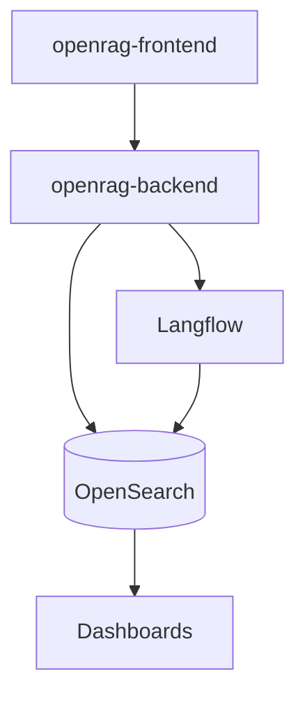

## 이 문서의 목적

- OpenRAG를 Docker로 띄울 때, 어떤 서비스가 함께 올라오고(또는 의존하는지) “파일로 확인 가능한 사실”을 정리합니다.
- 운영/디버깅에 필요한 “로그/헬스/정리” 커맨드를 Makefile 기준으로 묶습니다.

---

## 빠른 요약 (서비스 구성)

`docker-compose.yml` 기준 핵심 서비스:

- `openrag-frontend`: `FRONTEND_PORT`(기본 3000)로 노출
- `openrag-backend`: Langflow/OpenSearch 등과 연동하는 백엔드
- `langflow`: `LANGFLOW_PORT`(기본 7860)로 노출
- `opensearch`: `9200/9600` 포트 노출 + 데이터 볼륨 마운트
- `dashboards`: `5601` 포트 노출

---

## 1) 최소 실행: dev-cpu vs dev(GPU)

`Makefile` 정의:

- `make dev`: `docker-compose.yml` + `docker-compose.gpu.yml`로 `up -d`
- `make dev-cpu`: `docker-compose.yml`로 `up -d`

근거:
- `Makefile`의 `dev`, `dev-cpu`

---

## 2) 주요 볼륨 마운트(데이터/키/플로우)

`docker-compose.yml`에서 확인되는 대표 마운트:

- OpenSearch 데이터: `${OPENSEARCH_DATA_PATH:-./opensearch-data}:/usr/share/opensearch/data`
- 문서/키/플로우: `./openrag-documents`, `./keys`, `./flows`, `./config`, `./data`를 백엔드 컨테이너에 마운트
- Langflow도 `./flows`를 `/app/flows`로 마운트

근거:
- `docker-compose.yml`

---

## 3) “필수급” 환경 변수(파일 기준)

특히 OpenSearch 관련:

- `OPENSEARCH_PASSWORD` (주석: 복잡도 조건 및 secureconfig와 일치 필요)
- `OPENSEARCH_HOST`, `OPENSEARCH_PORT`, `OPENSEARCH_USERNAME`
- `OPENSEARCH_INDEX_NAME`(기본 `documents`)

근거:
- `.env.example`
- `docker-compose.yml`

LLM 키:

- `OPENAI_API_KEY`, `ANTHROPIC_API_KEY`, `WATSONX_*`, `OLLAMA_ENDPOINT` 등(선택)

근거:
- `.env.example`
- `docker-compose.yml`(langflow/openrag-backend 환경 변수로 전달)

---

## 4) 운영/디버깅 커맨드(Makefile)

Makefile 유틸(발췌):

- `make logs`: 전체 컨테이너 로그
- `make status`: 컨테이너 상태
- `make health`: 헬스 체크
- `make clean` / `make factory-reset`: 정리/초기화

근거:
- `Makefile`의 help/utility 섹션

---

## 컨테이너 아키텍처(개략)

---

## 주의사항/함정

- OpenSearch는 `OPENSEARCH_INITIAL_ADMIN_PASSWORD=${OPENSEARCH_PASSWORD}`에 의존합니다. `.env`에서 강한 비밀번호를 설정하지 않으면 초기화/보안 설정 단계에서 문제가 날 수 있습니다. (`docker-compose.yml`, `.env.example`)
- 볼륨 디렉토리(`opensearch-data`, `data`, `config`)는 호스트 권한/SELinux 라벨에 영향을 받을 수 있습니다(`:Z`, `:U,z` 옵션이 포함됨). (`docker-compose.yml`)

---

## TODO / 확인 필요

- GPU 모드(`docker-compose.gpu.yml`)에서 실제로 어떤 서비스에 GPU가 할당되는지는 해당 파일을 읽고 확정하는 것이 좋습니다(이 문서는 핵심 흐름만 다룸).

---

## 위키 링크

- `[[OpenRAG Guide - Index]]` → [가이드 목차](/blog-repo/openrag-guide/)
- `[[OpenRAG Guide - Quickstart]]` → [02. Quickstart로 실행](/blog-repo/openrag-guide-02-quickstart/)
- `[[OpenRAG Guide - Ops]]` → [05. 운영/확장/트러블슈팅](/blog-repo/openrag-guide-05-ops-and-troubleshooting/)

---

*다음 글에서는 코드 디렉토리(`src/`, `frontend/`, `flows/`)를 기준으로 구성요소/데이터 흐름을 구조화합니다.*

