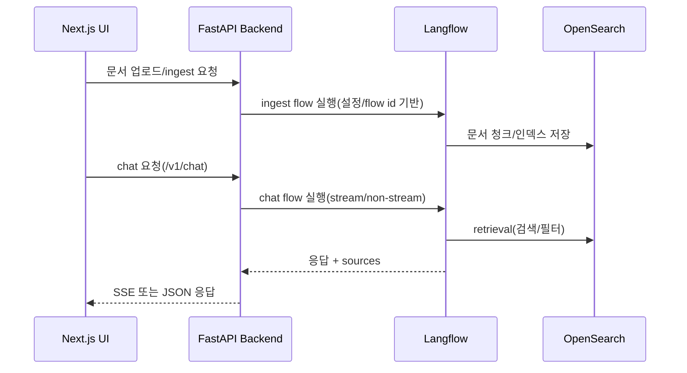

## 이 문서의 목적

- OpenRAG를 “코드 기준”으로 분해해서, 어디를 고치면 어떤 기능이 바뀌는지 탐색 가능한 지도를 만듭니다.
- UI/백엔드/API/연동(Langflow/OpenSearch) 경계를 명확히 합니다.

---

## 빠른 요약 (근거)

- 제품 스택 명시: “Built with FastAPI and Next.js” (`README.md`)
- 백엔드 API 구현 위치: `src/api/v1/*` (예: `chat.py`, `documents.py`, `search.py`)
- 프론트 Next.js 라우트/화면: `frontend/app/*` (chat/upload/knowledge/settings 등)
- 런타임 구성(서비스/포트/연동): `docker-compose.yml`

---

## 1) 백엔드(FastAPI) 구조

### API v1 모듈

`src/api/v1/`에 공개 API 엔드포인트 구현이 모여 있습니다.

- Chat: `src/api/v1/chat.py` (SSE 스트리밍 변환 로직 포함)
- Documents: `src/api/v1/documents.py` (multipart ingest + task status)
- Search: `src/api/v1/search.py`
- Knowledge filters: `src/api/v1/knowledge_filters.py`

근거:
- `src/api/v1/*`

### 인증/세션 컨텍스트

예: `src/api/v1/chat.py`는 `get_api_key_user_async` 의존성을 통해 API 키 기반 사용자를 주입받고, `set_auth_context(...)` 등을 호출합니다.

근거:
- `src/api/v1/chat.py`

---

## 2) 프론트(Next.js) 구조

`frontend/app/` 아래에 주요 화면/라우트가 존재합니다.

- `frontend/app/chat`
- `frontend/app/upload`
- `frontend/app/knowledge`
- `frontend/app/settings`

근거:
- `frontend/app/*` 디렉토리 구성

---

## 3) 연동 서비스(OpenSearch, Langflow, Dashboards)

`docker-compose.yml`에 따르면:

- 백엔드는 `OPENSEARCH_HOST/PORT/USERNAME/PASSWORD`를 받아 OpenSearch와 통신합니다.
- 백엔드는 `LANGFLOW_URL`(기본 `http://langflow:7860`)로 Langflow를 호출합니다.
- Langflow 컨테이너도 OpenSearch URL/인덱스/LLM 키 등을 환경 변수로 전달받습니다.

근거:
- `docker-compose.yml`
- `.env.example`

---

## 전체 데이터 흐름(업로드→인덱싱→대화)

---

## 주의사항/함정

- 스트리밍은 “Langflow 스트림 포맷 → SSE 이벤트”로 변환하는 코드가 들어가 있어, UI/클라이언트가 기대하는 이벤트 스키마를 바꾸면 백엔드 변환 로직도 함께 수정해야 합니다. (`src/api/v1/chat.py`)
- OpenSearch 보안 초기화/비밀번호는 `.env`에 크게 의존합니다. (`.env.example`, `docker-compose.yml`)

---

## TODO / 확인 필요

- “문서 처리(파서/청킹/Docling)”의 실제 호출 지점은 `src/services/` 및 `scripts/`(예: docling 관련)까지 확장해서 추적하면 더 정확한 아키텍처가 됩니다(이 챕터는 공개 API와 컨테이너 경계 중심).

---

## 위키 링크

- `[[OpenRAG Guide - Index]]` → [가이드 목차](/blog-repo/openrag-guide/)
- `[[OpenRAG Guide - Docker]]` → [03. Docker로 실행](/blog-repo/openrag-guide-03-docker/)
- `[[OpenRAG Guide - Ops]]` → [05. 운영/확장/트러블슈팅](/blog-repo/openrag-guide-05-ops-and-troubleshooting/)

---

*다음 글에서는 Makefile의 health/logs/초기화 루틴과 .env 키를 기준으로 운영/트러블슈팅 체크리스트를 만듭니다.*

