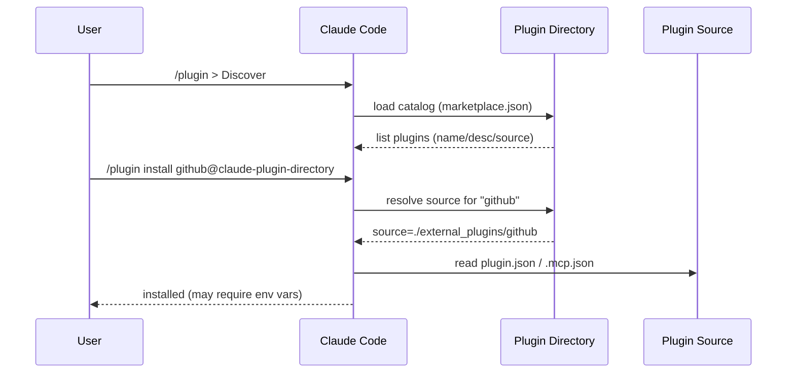

## 이 문서의 목적

`README.md`가 안내하는 설치 경로(명령/Discover)를 기준으로, 실제로 플러그인을 설치할 때 **무엇을 먼저 확인해야 하는지**(신뢰/권한/연결)까지 체크리스트로 묶습니다.

---

## 빠른 요약

- 설치 명령(README 안내): `/plugin install {plugin-name}@claude-plugin-directory`
- 탐색 UI(README 안내): `/plugin > Discover`
- 설치 전에는 최소한 아래를 확인:
  - 플러그인의 “메타/설명/소스 위치”: `.claude-plugin/marketplace.json`의 `plugins[].source`
  - 플러그인이 “외부 연결”을 하는지: `.mcp.json` 유무 및 URL/헤더/환경변수 사용
  - 플러그인이 “명령/에이전트/스킬”을 제공하는지: `commands/`, `agents/`, `skills/` 존재 여부

---

## 설치: `/plugin install ...@claude-plugin-directory`

`README.md`는 플러그인을 “이 마켓플레이스(디렉터리)에서 바로 설치”할 수 있다고 설명합니다.

```text
/plugin install {plugin-name}@claude-plugin-directory
```

예를 들어 이 레포의 카탈로그에는 아래 이름들이 있습니다. (`.claude-plugin/marketplace.json`)

- 내부 플러그인 예: `typescript-lsp`, `pyright-lsp`
- 외부 플러그인 예: `github`, `supabase`, `playwright`

---

## 탐색: `/plugin > Discover`

`README.md`는 Discover로도 플러그인을 “브라우징”할 수 있다고 안내합니다.

이때도 실제 목록의 기반 데이터는 “디렉터리 카탈로그”이므로, 이름/설명만 보고 설치하기보다 **카탈로그와 소스 파일을 함께** 확인하는 습관이 안전합니다.

---

## 설치 전 점검 체크리스트(실무형)

### 1) 카탈로그에서 `source` 확인

`.claude-plugin/marketplace.json`의 플러그인 엔트리(`plugins[]`)는 보통 `source`를 가집니다.

- `./plugins/...` → 레포에 포함된 내부 플러그인
- `./external_plugins/...` → 레포에 포함된 외부 플러그인
- `{ "source": "url", "url": "https://..." }` → 원격 Git URL 기반(레포 밖 소스)

### 2) `.mcp.json` 확인(외부 연결/인증)

MCP 연동 플러그인은 `.mcp.json`에 서버 정의를 둡니다. 예를 들어 GitHub 플러그인은 다음을 정의합니다. (`external_plugins/github/.mcp.json`)

- `type: "http"`
- `url: "https://api.githubcopilot.com/mcp/"`
- `headers.Authorization: "Bearer ${GITHUB_PERSONAL_ACCESS_TOKEN}"`

즉, 설치/실행 시 **환경변수(토큰)** 가 요구될 수 있고, 어떤 URL로 요청이 나가는지 확인해야 합니다.

### 3) 명령/스킬/에이전트/훅 확인(자동 실행/가이던스)

플러그인은 아래 디렉터리를 통해 Claude Code의 행동을 확장합니다. (`README.md`, `plugins/example-plugin/README.md`)

- `commands/` (슬래시 커맨드, Markdown + frontmatter)
- `skills/` (모델이 자율적으로 쓰는 스킬 정의)
- `agents/` (에이전트 정의)
- `hooks/` (이벤트 기반 자동화)

---

## Mermaid: 설치/탐색 흐름(요약)



---

## 근거(파일/경로)

- 설치/Discover 안내/주의: `README.md`
- 카탈로그(이름/설명/source/homepage): `.claude-plugin/marketplace.json`
- 외부 MCP 예시(GitHub): `external_plugins/github/.claude-plugin/plugin.json`, `external_plugins/github/.mcp.json`
- 플러그인 레퍼런스: `plugins/example-plugin/README.md`

---

## 주의사항/함정

- “마켓플레이스 설치”가 곧 “안전/검증 완료”를 의미하는 것은 아닙니다. README는 “신뢰”를 명시적으로 강조합니다. (`README.md`)
- `source`가 URL인 플러그인은 **이 레포 밖**의 코드가 설치 대상일 수 있습니다. 카탈로그의 `source` 형태를 먼저 확인하세요. (`.claude-plugin/marketplace.json`)

---

## TODO/확인 필요

- Claude Code가 설치 과정에서 어떤 검증(버전 고정/해시/승인)을 하는지는 이 레포만으로는 알 수 없습니다. 필요 시 공식 문서 확인이 필요합니다. (`README.md`의 문서 링크)

---

## 위키 링크

- `[[Claude Plugins Official Guide - Index]]` → [가이드 목차](/blog-repo/claude-plugins-official-guide/)
- `[[Claude Plugins Official Guide - Marketplace JSON]]` → [03. marketplace.json & 메타데이터](/blog-repo/claude-plugins-official-guide-03-marketplace-json-and-metadata/)

---

*다음 글에서는 `.claude-plugin/marketplace.json`의 구조와, `source`가 로컬 경로/외부 경로/원격 URL인 경우를 구체적으로 분해합니다.*

