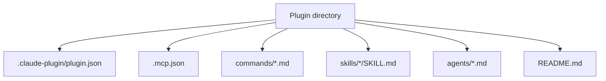

## 이 문서의 목적

`README.md`가 제시하는 “표준 플러그인 구조”를 기준으로, 실제 디렉터리에서 어떤 파일이 어떤 역할을 하는지와 “설치 전 점검” 관점에서 무엇을 봐야 하는지 정리합니다.

---

## 빠른 요약

- 필수: `.claude-plugin/plugin.json` (플러그인 메타데이터)
- 선택: `.mcp.json` (MCP 서버 구성)
- 선택: `commands/` (슬래시 커맨드), `agents/` (에이전트), `skills/` (스킬)
- 참고 구현: `plugins/example-plugin/`는 위 옵션들을 한 번에 보여주는 레퍼런스다.

---

## 표준 구조(README에 명시된 형태)

`README.md`는 각 플러그인이 다음 구조를 따른다고 설명합니다.

```text
plugin-name/
├── .claude-plugin/
│   └── plugin.json      # Plugin metadata (required)
├── .mcp.json            # MCP server configuration (optional)
├── commands/            # Slash commands (optional)
├── agents/              # Agent definitions (optional)
├── skills/              # Skill definitions (optional)
└── README.md            # Documentation
```

즉 “플러그인 디렉터리”는 **Claude Code가 읽어 의미를 부여하는 규약 파일 집합**에 가깝습니다.

---

## `.claude-plugin/plugin.json`: 최소 메타데이터

예: `external_plugins/github/.claude-plugin/plugin.json`에는 다음과 같은 핵심 정보가 존재합니다.

- `name`
- `description`
- `author`

---

## `.mcp.json`: 외부 도구/서비스 연결(MCP)

`.mcp.json`은 MCP 서버를 정의합니다. 예를 들어 GitHub 플러그인은 다음을 정의합니다. (`external_plugins/github/.mcp.json`)

- `type: "http"`
- `url: "https://api.githubcopilot.com/mcp/"`
- `headers.Authorization: "Bearer ${GITHUB_PERSONAL_ACCESS_TOKEN}"`

즉, 이 파일은 “외부로 나가는 요청”과 “인증/환경변수”를 드러내는 핵심 단서입니다.

---

## `commands/`: 슬래시 커맨드(사용자 호출)

`plugins/example-plugin/commands/example-command.md`는 커맨드가 “Markdown + YAML frontmatter”로 정의된다는 점을 보여줍니다.

- `description`
- `argument-hint`
- `allowed-tools`

---

## `skills/`: 스킬(모델 자율 호출)

`plugins/example-plugin/skills/example-skill/SKILL.md`는 스킬이 “frontmatter + 본문 가이드” 형태로 정의됨을 보여줍니다.

- `name`
- `description` (트리거/사용 조건)
- `version` (선택)

---

## Mermaid: 플러그인 구성요소 관계(개념)



---

## 근거(파일/경로)

- 표준 구조/설치 안내: `README.md`
- 예제 플러그인(레퍼런스): `plugins/example-plugin/`
- 커맨드 예시: `plugins/example-plugin/commands/example-command.md`
- 스킬 예시: `plugins/example-plugin/skills/example-skill/SKILL.md`
- 외부 MCP 예시(GitHub): `external_plugins/github/.claude-plugin/plugin.json`, `external_plugins/github/.mcp.json`

---

## 주의사항/함정

- `.mcp.json`이 있으면 외부 서비스 호출이 포함될 가능성이 큽니다. URL/헤더/토큰을 먼저 확인하세요.
- 표준 구조는 “권장”이지만, 실제 설치 대상이 원격 URL(source=url)인 경우 해당 레포의 구조가 다를 수 있습니다. (카탈로그의 `homepage`를 함께 확인) (`.claude-plugin/marketplace.json`)

---

## TODO/확인 필요

- “plugin.json의 전체 필드 스펙(추가 옵션)”은 이 레포의 예제만으로는 제한적입니다. 필요 시 공식 문서를 확인하세요. (`README.md` 링크)

---

## 위키 링크

- `[[Claude Plugins Official Guide - Index]]` → [가이드 목차](/blog-repo/claude-plugins-official-guide/)
- `[[Claude Plugins Official Guide - Example Plugin]]` → [05. example-plugin 딥다이브](/blog-repo/claude-plugins-official-guide-05-example-plugin-deep-dive/)

---

*다음 글에서는 `plugins/example-plugin/`을 기준으로 “커맨드/스킬/MCP가 실제로 어떤 파일 형식과 내용을 가지는지”를 한 번에 훑습니다.*

