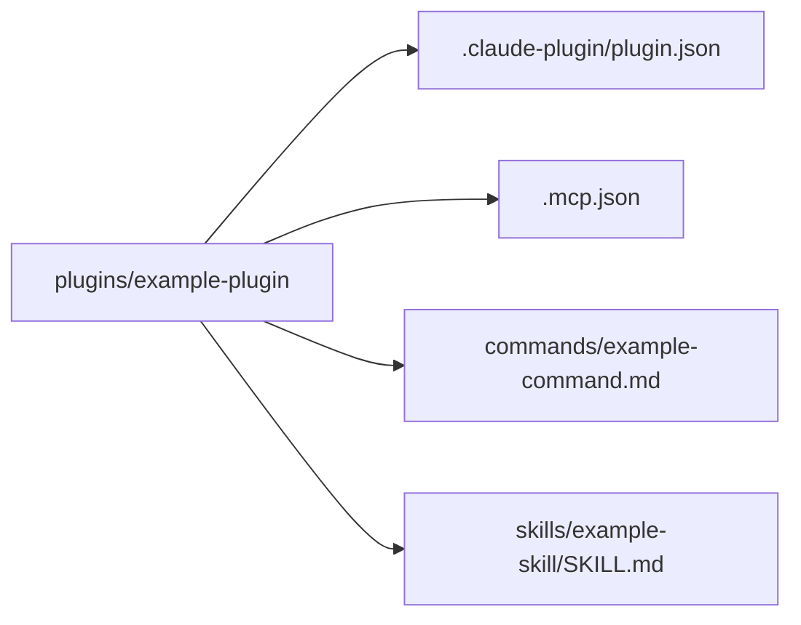

## 이 문서의 목적

`plugins/example-plugin/`은 README가 “참고 구현”으로 명시한 레퍼런스입니다. 이 챕터는 해당 디렉터리를 기준으로 플러그인 구성요소를 **실제 파일 근거**로 파악합니다.

---

## 빠른 요약

- 메타데이터: `plugins/example-plugin/.claude-plugin/plugin.json`
- MCP 설정: `plugins/example-plugin/.mcp.json`
- 커맨드: `plugins/example-plugin/commands/example-command.md` (frontmatter 포함)
- 스킬: `plugins/example-plugin/skills/example-skill/SKILL.md` (frontmatter 포함)

---

## 1) plugin.json: 최소 메타 + 작성자

`plugins/example-plugin/.claude-plugin/plugin.json`은 다음 필드를 포함합니다.

- `name`: `"example-plugin"`
- `description`: 확장 옵션(커맨드/에이전트/스킬/훅/MCP)을 모두 보여주는 예제라는 설명
- `author`: `name`, `email`

---

## 2) `.mcp.json`: MCP 서버 선언(예시)

`plugins/example-plugin/.mcp.json`은 `"example-server"`라는 서버를 HTTP 타입으로 등록하고, URL을 지정합니다.

```json
{
  "example-server": {
    "type": "http",
    "url": "https://mcp.example.com/api"
  }
}
```

---

## 3) 커맨드: `commands/example-command.md`

커맨드는 Markdown 상단 frontmatter로 옵션을 선언합니다.

- `description`
- `argument-hint`
- `allowed-tools`

그리고 본문에서는 `$ARGUMENTS` 같은 플레이스홀더를 사용해 “사용자 입력”을 핸들링하도록 안내합니다.

### 설치 전 점검 포인트(실무)

- `allowed-tools`가 과도하게 넓지 않은지
- 커맨드 본문이 “위험한 동작(대량 삭제/외부 업로드 등)”을 유도하지 않는지

---

## 4) 스킬: `skills/example-skill/SKILL.md`

스킬은 frontmatter로 `name`, `description`, `version`을 선언합니다.

이 예제는 “스킬은 사용자가 호출하는 커맨드가 아니라, 모델이 상황에 따라 자율적으로 쓰는 가이드”라는 점을 설명합니다.

### 설치 전 점검 포인트(실무)

- `description`이 트리거를 너무 광범위하게 잡지 않는지
- 레퍼런스/스크립트가 있다면 “실행/파일 접근”이 어떻게 이루어지는지

---

## Mermaid: example-plugin 구성요소 요약



---

## 근거(파일/경로)

- 구조/옵션 설명: `plugins/example-plugin/README.md`
- 메타데이터: `plugins/example-plugin/.claude-plugin/plugin.json`
- MCP 설정: `plugins/example-plugin/.mcp.json`
- 커맨드 예시: `plugins/example-plugin/commands/example-command.md`
- 스킬 예시: `plugins/example-plugin/skills/example-skill/SKILL.md`

---

## 주의사항/함정

- 예제의 `.mcp.json`은 “형식”을 보여주는 용도이며, 실제 플러그인에서는 인증/토큰/리소스 접근이 포함될 수 있습니다.
- `allowed-tools`는 권한 프롬프트/실행 범위를 크게 바꿀 수 있으므로, 설치 시에는 꼭 확인해야 합니다.

---

## TODO/확인 필요

- 이 예제는 “훅(hooks/)”이나 “에이전트(agents/)”를 실제 파일로 포함하지 않습니다(설명에는 포함). 다른 플러그인/공식 문서에서 훅/에이전트 구조를 추가 확인하는 것이 좋습니다. (`README.md`, `plugins/example-plugin/README.md`)

---

## 위키 링크

- `[[Claude Plugins Official Guide - Index]]` → [가이드 목차](/blog-repo/claude-plugins-official-guide/)
- `[[Claude Plugins Official Guide - LSP Plugins]]` → [06. LSP 플러그인 딥다이브](/blog-repo/claude-plugins-official-guide-06-lsp-plugins-deep-dive/)

---

*다음 글에서는 `.claude-plugin/marketplace.json`의 `lspServers` 설정과, typescript/pyright 같은 언어 서버 설치 포인트를 묶어 “LSP 플러그인”을 정리합니다.*

