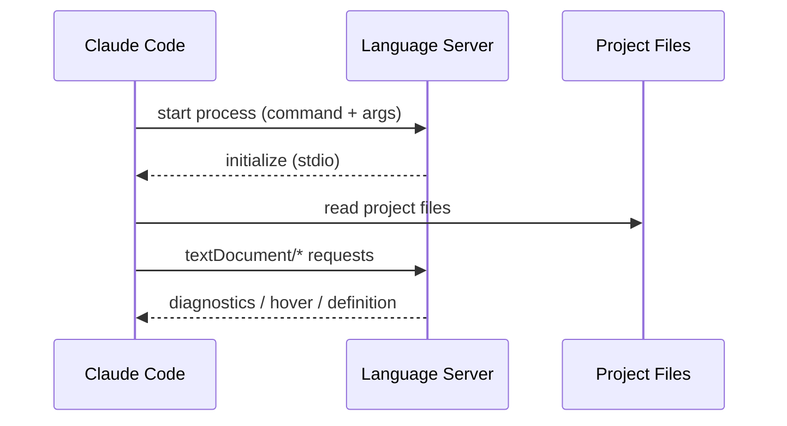

## 이 문서의 목적

이 레포에는 `typescript-lsp`, `pyright-lsp` 등 “언어 서버(LSP) 기반 코드 인텔리전스” 플러그인이 포함됩니다. 이 챕터는:

1) 카탈로그(`.claude-plugin/marketplace.json`)에서 LSP 플러그인이 어떻게 정의되는지,  
2) 각 플러그인 폴더 `README.md`가 어떤 설치 커맨드를 제시하는지  
를 근거로 LSP 플러그인의 작동 전제를 정리합니다.

---

## 빠른 요약

- LSP 플러그인 엔트리는 `lspServers`를 가진다. (`.claude-plugin/marketplace.json`)
- `typescript-lsp`는 `typescript-language-server`를, `pyright-lsp`는 `pyright-langserver`를 실행 대상으로 둔다. (카탈로그 기준)
- 각 플러그인 폴더 README는 “언어 서버를 사용자 환경에 설치”하는 방법을 제공한다. (`plugins/typescript-lsp/README.md`, `plugins/pyright-lsp/README.md`)

---

## 카탈로그 관점: `lspServers`란?

`.claude-plugin/marketplace.json`에서 LSP 플러그인은 다음 형태를 가집니다(개념적으로).

- `lspServers.{serverName}.command`: 실행 파일 이름(예: `pyright-langserver`)
- `args`: `--stdio` 등의 인자(플러그인마다 다름)
- `extensionToLanguage`: 확장자 → 언어 모드 매핑
- (일부) `startupTimeout`: 기동 시간(밀리초)

이 의미는 단순합니다: **Claude Code가 LSP 서버 프로세스를 실행할 수 있어야 한다**는 전제입니다.

---

## 플러그인 폴더 관점: 언어 서버 설치(typescript/pyright)

### typescript-lsp

`plugins/typescript-lsp/README.md`는 npm/yarn 전역 설치를 안내합니다.

```bash
npm install -g typescript-language-server typescript
```

또한 지원 확장자 목록을 명시합니다. (예: `.ts`, `.tsx`, `.js`, `.jsx`, …)

### pyright-lsp

`plugins/pyright-lsp/README.md`는 다양한 설치 경로를 제시합니다.

```bash
npm install -g pyright
```

또는 `pip`, `pipx` 경로도 언급합니다.

---

## Mermaid: Claude Code ↔ LSP 서버(개념)



---

## 주의사항/함정

- LSP 플러그인은 “레포 코드”보다 “외부 바이너리(언어 서버) 설치” 의존도가 큽니다. 따라서 플러그인 설치만으로는 동작하지 않을 수 있습니다.
- 일부 서버는 기동이 느려 `startupTimeout` 같은 옵션이 필요할 수 있습니다. (`.claude-plugin/marketplace.json`)

---

## TODO/확인 필요

- Claude Code가 LSP 서버 표준 설정(예: workspace root, initializationOptions)을 어떻게 전달하는지는 이 레포만으로는 확인하기 어렵습니다. 필요 시 공식 문서 확인이 필요합니다.

---

## 근거(파일/경로)

- LSP 서버 설정: `.claude-plugin/marketplace.json`의 `lspServers`
- TypeScript 플러그인 안내: `plugins/typescript-lsp/README.md`
- Pyright 플러그인 안내: `plugins/pyright-lsp/README.md`

---

## 위키 링크

- `[[Claude Plugins Official Guide - Index]]` → [가이드 목차](/blog-repo/claude-plugins-official-guide/)
- `[[Claude Plugins Official Guide - External MCP Plugin (GitHub)]]` → [07. 외부 MCP 플러그인 딥다이브(GitHub)](/blog-repo/claude-plugins-official-guide-07-external-mcp-plugin-github/)

---

*다음 글에서는 `external_plugins/github/`를 기준으로 `.mcp.json`의 인증/환경변수 패턴을 실제 파일로 분해합니다.*

