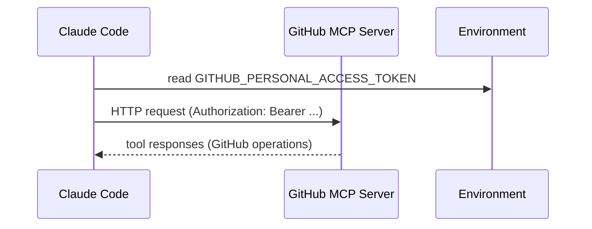

## 이 문서의 목적

외부 플러그인의 핵심은 “외부 서비스에 연결한다”는 점입니다. 이 챕터는 `external_plugins/github/`의 실제 파일을 근거로:

- 플러그인 메타데이터가 어디에 있는지
- MCP 서버가 어떤 URL/헤더/토큰을 요구하는지

를 명확히 드러냅니다.

---

## 빠른 요약

- 메타데이터: `external_plugins/github/.claude-plugin/plugin.json`
- MCP 설정: `external_plugins/github/.mcp.json`
- 이 플러그인은 HTTP MCP 서버 URL과 `Authorization` 헤더에 `${GITHUB_PERSONAL_ACCESS_TOKEN}` 환경변수를 사용한다. (`external_plugins/github/.mcp.json`)

---

## 1) plugin.json: “이 플러그인이 무엇인지”

`external_plugins/github/.claude-plugin/plugin.json`에는 다음이 담겨 있습니다.

- `name`: `github`
- `description`: GitHub MCP 서버를 통해 이슈/PR/검색/API 상호작용을 제공한다는 설명
- `author.name`: `GitHub`

---

## 2) `.mcp.json`: “어디로 어떻게 인증해서 붙는지”

`external_plugins/github/.mcp.json`의 핵심은 다음 3줄입니다.

- `type: "http"`
- `url: "https://api.githubcopilot.com/mcp/"`
- `headers.Authorization: "Bearer ${GITHUB_PERSONAL_ACCESS_TOKEN}"`

즉, 이 파일이 “외부로 나가는 요청”과 “토큰 주입”의 핵심 근거입니다.

---

## Mermaid: MCP HTTP 인증 흐름(개념)

---

## 주의사항/함정

- `.mcp.json`은 “연결 정보”이므로, URL/헤더/토큰 패턴이 바뀌면 플러그인 동작이 달라질 수 있습니다.
- 설치 전에는 반드시 해당 플러그인이 어떤 서버로 통신하는지 확인하세요(이 케이스는 `api.githubcopilot.com`). (`external_plugins/github/.mcp.json`)

---

## TODO/확인 필요

- GitHub MCP 서버의 구체적인 툴 목록/권한 요구사항은 이 레포만으로는 확정할 수 없습니다(서버 구현은 외부). 플러그인 홈페이지/공식 문서에서 확인이 필요합니다. (`.claude-plugin/marketplace.json`의 `homepage`)

---

## 근거(파일/경로)

- GitHub 플러그인 메타: `external_plugins/github/.claude-plugin/plugin.json`
- GitHub MCP 서버 설정/인증: `external_plugins/github/.mcp.json`
- 카탈로그 엔트리: `.claude-plugin/marketplace.json`의 `github`

---

## 위키 링크

- `[[Claude Plugins Official Guide - Index]]` → [가이드 목차](/blog-repo/claude-plugins-official-guide/)
- `[[Claude Plugins Official Guide - Security & Automation]]` → [08. 보안·문제해결·자동화](/blog-repo/claude-plugins-official-guide-08-security-troubleshooting-and-automation/)

---

*다음 글에서는 이 레포가 강조하는 “신뢰/보안” 경고를 출발점으로, CI 검증(Frontmatter)과 PR 정책까지 포함해 운영 체크리스트를 정리합니다.*

