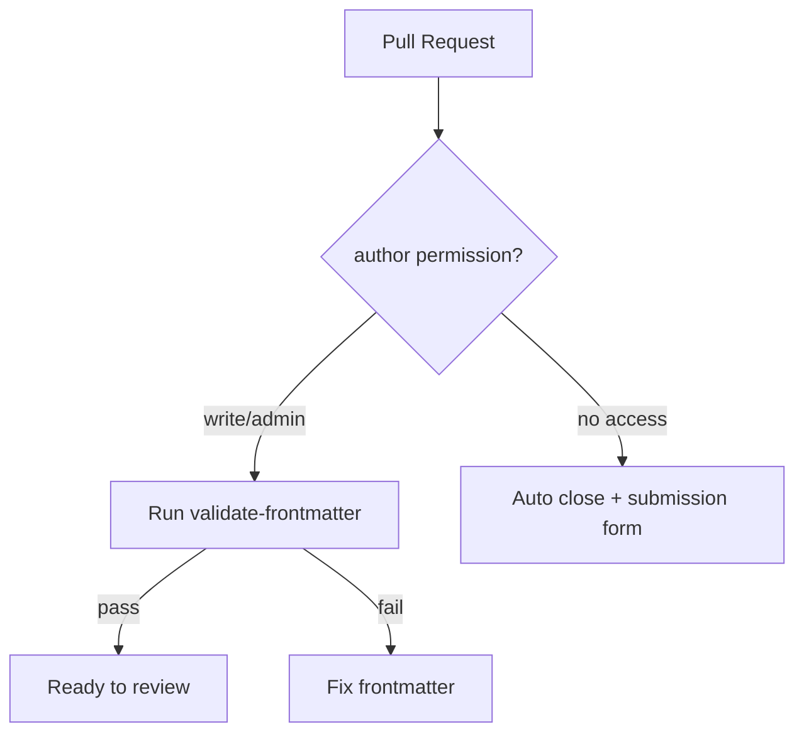

## 이 문서의 목적

이 레포의 README는 “플러그인을 신뢰하라”는 경고를 전면에 둡니다. 마지막 챕터에서는:

- 신뢰/보안 관점에서 “설치 전 점검”을 어떻게 체계화할지
- 레포가 제공하는 자동화(Frontmatter 검증)와 정책(외부 PR 종료)을 어떤 목적에서 쓰는지

를 **파일 근거**로 정리합니다.

---

## 빠른 요약

- README는 “설치/업데이트/사용 전 신뢰”를 강하게 요구한다. (`README.md`)
- 외부 기여 PR은 자동으로 닫히는 워크플로우가 있다. (`.github/workflows/close-external-prs.yml`)
- `agents/*.md`, `commands/*.md`, `skills/*/SKILL.md`의 YAML frontmatter는 CI에서 검증한다. (`.github/workflows/validate-frontmatter.yml`, `.github/scripts/validate-frontmatter.ts`)

---

## 1) 보안: “플러그인 신뢰”가 왜 최우선인가

`README.md`는 다음을 명시합니다.

- Anthropic은 플러그인 내부의 MCP 서버/파일/기타 소프트웨어를 통제하지 않는다.
- 플러그인이 의도대로 동작하거나 변경되지 않을 것을 보장할 수 없다.

따라서 설치/업데이트 전에 최소한 아래를 확인하는 것을 기본 루틴으로 권합니다.

### 설치 전 점검(권장)

1) 카탈로그에서 `source` 확인 (`.claude-plugin/marketplace.json`)  
2) 플러그인 폴더에서 `.mcp.json` 확인(외부 URL/토큰/헤더)  
3) `commands/` / `skills/` / `agents/` / `hooks/` 존재 여부 및 내용 확인  
4) (가능하면) 플러그인 홈페이지/원격 레포의 README/릴리스/변경 로그 확인 (`homepage`, URL source)

---

## 2) 정책: 외부 PR 자동 종료

`.github/workflows/close-external-prs.yml`은 PR 작성자의 권한을 확인한 뒤, write/admin이 아니면 PR을 닫고 “플러그인 제출 폼”으로 안내합니다.

- 안내 링크: `https://clau.de/plugin-directory-submission` (워크플로우 코멘트 본문)

---

## 3) 자동화: Frontmatter 검증 CI

`.github/workflows/validate-frontmatter.yml`은 PR에서 변경된 파일 중 아래 패턴을 찾아 검증합니다.

- `**/agents/*.md`
- `**/skills/*/SKILL.md`
- `**/commands/*.md`

검증 로직은 `.github/scripts/validate-frontmatter.ts`에 있으며, Bun으로 실행됩니다.

- command: `description` 필수
- agent: `name`, `description` 필수
- skill: `description` 또는 `when_to_use` 중 하나 필요

---

## Mermaid: PR → 검증/정책(개념)

---

## 문제해결: “설치했는데 동작이 이상함”

이 레포 자체는 “플러그인 소스/카탈로그”이므로, 이상 동작의 원인은 크게 3갈래로 나뉘기 쉽습니다.

1) **환경 의존성 문제**: LSP 플러그인의 경우 언어 서버 바이너리가 없으면 동작이 막힐 수 있음 (예: `plugins/typescript-lsp/README.md`, `plugins/pyright-lsp/README.md`)
2) **인증/환경변수 문제**: MCP 플러그인의 경우 토큰이 없거나 권한이 부족하면 실패할 수 있음 (예: `external_plugins/github/.mcp.json`)
3) **원격 소스 변경**: `source=url` 엔트리는 이 레포 바깥의 레포가 설치 대상일 수 있음 (`.claude-plugin/marketplace.json`)

---

## 베스트 프랙티스(요약)

- 설치 전 “카탈로그(source/homepage) → 로컬 파일(plugin.json/.mcp.json) → 원격 소스(있다면)” 순서로 점검
- 토큰/키는 환경변수로 주입하고, 최소 권한 + 로테이션
- LSP 플러그인은 “언어 서버 설치”를 완료한 뒤 검증
- 플러그인 구성요소(커맨드/스킬/에이전트)는 frontmatter 품질을 유지(레포 CI와 동일 기준으로 확인)

---

## 근거(파일/경로)

- 신뢰/보안 경고: `README.md`
- 외부 PR 종료 정책: `.github/workflows/close-external-prs.yml`
- frontmatter 검증 CI: `.github/workflows/validate-frontmatter.yml`
- 검증 스크립트(Bun): `.github/scripts/validate-frontmatter.ts`
- LSP 설치 안내: `plugins/typescript-lsp/README.md`, `plugins/pyright-lsp/README.md`
- MCP 토큰 패턴 예시: `external_plugins/github/.mcp.json`

---

## TODO/확인 필요

- Claude Code의 플러그인 업데이트/버전 고정/검증(서명/해시) 정책은 공식 문서 확인이 필요합니다. (`README.md`의 공식 문서 링크)

---

## 위키 링크

- `[[Claude Plugins Official Guide - Index]]` → [가이드 목차](/blog-repo/claude-plugins-official-guide/)

