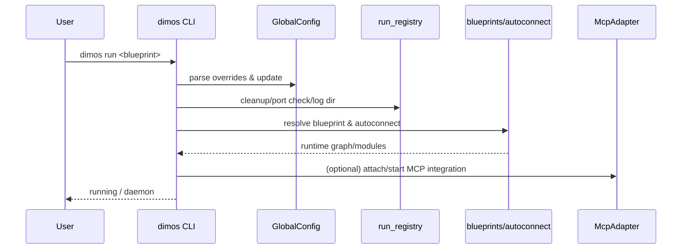

## 이 문서의 목적

- “dimos를 어떻게 실행/중지/관측하는지”를 CLI 코드 근거로 잡습니다.
- MCP 연동(어댑터/서버/클라이언트)이 어디에 구현되어 있는지 정리합니다.

---

## 빠른 요약 (코드 기반)

- CLI 엔트리: `pyproject.toml` → `dimos = "dimos.robot.cli.dimos:main"`
- CLI 구현: `dimos/robot/cli/dimos.py` (Typer 기반, `run` 커맨드 존재)
- 설정 오버라이드: `dimos/robot/cli/dimos.py`가 `GlobalConfig.model_fields`를 읽어 동적으로 옵션을 생성합니다.
- MCP: `dimos/agents/mcp/*` (adapter/client/server + 테스트 포함)

---

## 1) CLI 엔트리포인트와 “동적 옵션” 패턴

`dimos/robot/cli/dimos.py`는 `GlobalConfig`의 필드를 훑어 **CLI 옵션 시그니처를 동적으로 구성**합니다.

- 근거: `create_dynamic_callback()`가 `GlobalConfig.model_fields`를 순회하며 `--kebab-case` 옵션을 생성 (`dimos/robot/cli/dimos.py`)
- 결과: “설정 변경”을 위해 문서를 찾기 전에, CLI `--help`/옵션 목록이 사실상 설정 스키마가 됩니다.

---

## 2) `run` 커맨드(블루프린트 실행)

`dimos/robot/cli/dimos.py`의 `run(...)` 커맨드는 아래를 수행합니다(요약).

- 글로벌 설정 오버라이드 적용: `global_config.update(...)`
- 포트 충돌/스테일 정리: `dimos.core.run_registry.*`
- 블루프린트 선택/조립: `dimos.robot.get_all_blueprints.*` + `dimos.core.blueprints.autoconnect`
- 로그 디렉토리 설정: `dimos.utils.logging_config.set_run_log_dir(...)`

> 정확한 호출 관계는 `dimos/robot/cli/dimos.py`의 `run` 본문 기준으로 확인하세요.

---

## 3) MCP 어댑터 구조

MCP 관련 코드가 `dimos/agents/mcp/*`에 모여 있습니다.

- 어댑터: `dimos/agents/mcp/mcp_adapter.py`
- 서버/클라이언트: `dimos/agents/mcp/mcp_server.py`, `dimos/agents/mcp/mcp_client.py`
- 테스트: `dimos/agents/mcp/test_mcp_server.py` 등

문서 측면에서는 `docs/agents/index.md`와 README의 MCP 섹션을 출발점으로 삼는 편이 안전합니다. (`README.md`, `docs/agents/index.md`)

---

## (개략) 실행 시퀀스

---

## 근거(파일/경로)

- CLI 엔트리: `pyproject.toml`
- CLI 구현: `dimos/robot/cli/dimos.py`
- 설정: `dimos/core/global_config.py`
- 블루프린트 탐색: `dimos/robot/get_all_blueprints.py`
- MCP: `dimos/agents/mcp/*`
- 문서: `docs/agents/index.md`, `docs/usage/cli.md`, `docs/usage/blueprints.md`

---

## 주의사항/함정

- 로봇 런타임은 “긴 실행 + 다중 프로세스/스트림” 성격이라, 로그 디렉토리/런 레지스트리를 먼저 파악하는 편이 디버깅에 유리합니다. (`dimos/core/run_registry.py` 관련 import가 `dimos/robot/cli/dimos.py`에 존재)
- MCP 연동은 네트워크/권한/프로토콜에 민감하므로, 테스트(`dimos/agents/mcp/test_*`)를 먼저 보는 편이 빠를 수 있습니다.

---

## TODO/확인 필요

- `dimos/agents/mcp/README.md`(있다면)와 코드의 실제 역할 분담(어댑터 vs 서버)을 문서화
- “특정 blueprint 실행 시 MCP가 자동으로 붙는지” 여부를 `dimos/core/blueprints` 구현 근거로 확인

---

## 위키 링크

- `[[dimos Guide - Index]]` → [가이드 목차](/blog-repo/dimos-guide/)
- `[[dimos Guide - Ops]]` → [05. 운영/고급/트러블슈팅](/blog-repo/dimos-guide-05-ops-advanced-troubleshooting/)

---

*다음 글에서는 개발/운영 문서(`docs/development/*`)와 테스트 루트를 기준으로 안정화 체크리스트를 정리합니다.*

