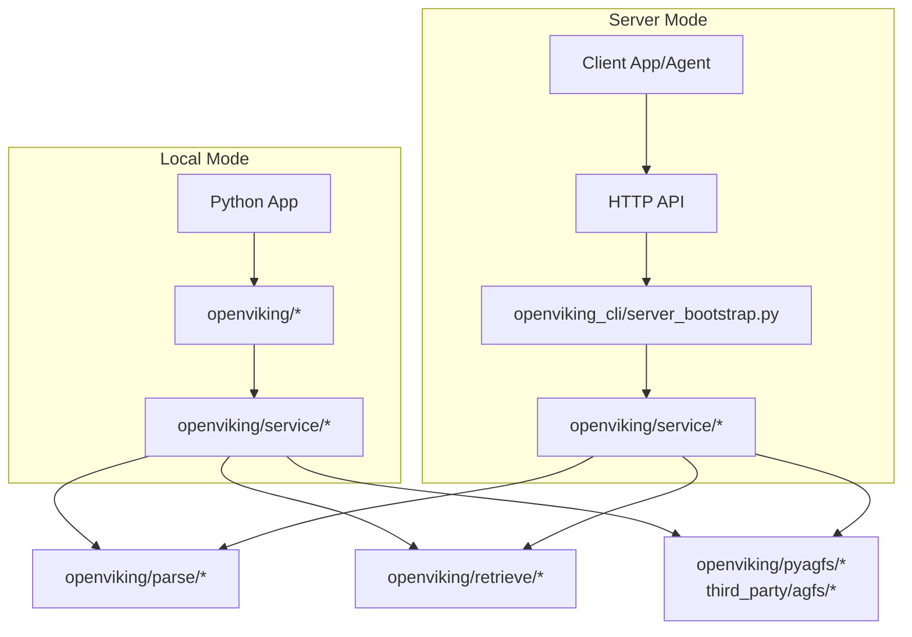
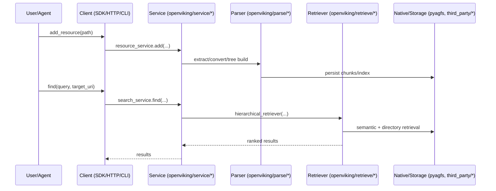

## 이 문서의 목적

- “어디가 무엇을 담당하는지”를 모듈 지도로 고정합니다.
- 문서(concepts/api)와 코드(openviking/*)를 서로 매핑하는 기준점을 만듭니다.

---

## 빠른 요약 (코드/문서 기반)

- Python 패키지(핵심): `openviking/*` (서비스/파싱/검색/세션)
- 서버 모드 진입점: `openviking_cli/server_bootstrap.py` (문서: `docs/en/getting-started/03-quickstart-server.md`)
- CLI: Python 래퍼 `openviking_cli/rust_cli.py` + Rust 구현 `crates/ov_cli/*`
- 네이티브/서드파티: `openviking/pyagfs/*`, `third_party/agfs/*`, 빌드 단서 `src/CMakeLists.txt`

---

## 1) 런타임 관점: 로컬 vs 서버

> 로컬/서버 모드 모두 결국 `openviking/service/*` 계층으로 수렴하는 구조를 의도한 것으로 보입니다(추정이 아니라 “코드 탐색의 가설”입니다). 실제 결합 지점은 `openviking/service/core.py` 및 각 서비스 모듈에서 확인하세요.

---

## 2) `openviking/` 모듈 지도(“서비스 단위”로 보기)

아래는 파일/디렉토리명만으로 확인 가능한 관심사 분리입니다.

- **Service Layer**: `openviking/service/*` (FS/리소스/검색/세션/디버그/코어)
- **Parsing/Extraction**: `openviking/parse/*` (VLM/트리 빌더/컨버터/레지스트리)
- **Retrieval**: `openviking/retrieve/*` (계층 리트리버/메모리 라이프사이클/의도 분석)
- **Client**: `openviking/client/*`, `openviking/sync_client.py`, `openviking/async_client.py`
- **Console**: `openviking/console/*` (내장 콘솔/정적 리소스 단서)
- **AGFS 바인딩**: `openviking/pyagfs/*`, `openviking/agfs_manager.py`

---

## 3) CLI: Python 엔트리포인트 ↔ Rust 구현

- `pyproject.toml`의 `[project.scripts]`에서 `openviking`, `ov`를 모두 `openviking_cli.rust_cli:main`으로 매핑합니다.
- 즉, “사용자가 실행하는 CLI”는 Python 패키지 안에 있지만, 핵심 CLI는 Rust 바이너리(`ov`)로 이어지는 구조입니다. (`openviking_cli/rust_cli.py`, `crates/ov_cli/*`)

---

## 4) (개략) “리소스 추가 → 처리 → 검색” 시퀀스

> 위 시퀀스는 문서(`docs/en/concepts/07-retrieval.md`)와 코드 디렉토리(`openviking/service/*`, `openviking/parse/*`, `openviking/retrieve/*`)를 연결하기 위한 “읽기용 지도”입니다.

---

## 근거(파일/경로)

- 개념/아키텍처: `docs/en/concepts/01-architecture.md`, `docs/en/concepts/07-retrieval.md`, `docs/en/concepts/08-session.md`
- 서비스 레이어: `openviking/service/*` (예: `core.py`, `fs_service.py`, `resource_service.py`, `search_service.py`)
- 파싱: `openviking/parse/*`
- 검색: `openviking/retrieve/*`
- 서버: `openviking_cli/server_bootstrap.py`
- CLI: `openviking_cli/rust_cli.py`, `crates/ov_cli/src/main.rs`
- 네이티브/서드파티: `openviking/pyagfs/*`, `third_party/agfs/*`, `src/CMakeLists.txt`

---

## 주의사항/함정

- 실제 구현은 “문서의 개념 분류”와 1:1로 매칭되지 않을 수 있습니다. 문서를 지도 삼되, 항상 `openviking/service/*`의 실제 호출 흐름을 확인하세요.
- 네이티브 컴포넌트(AGFS/기타 서드파티)는 OS/컴파일러/툴체인 영향을 크게 받습니다. 설치 문제를 겪으면 “파이썬만” 문제로 보지 말고 `src/CMakeLists.txt`, `third_party/*` 빌드 경로를 같이 점검하세요.

---

## TODO/확인 필요

- `openviking/service/core.py`의 “서비스 조립(Composition Root)” 역할 여부 확인
- `openviking/server/*`(예: `openviking/server/config.py`)와 `openviking_cli/server_bootstrap.py`의 설정 로딩 흐름 정리

---

## 위키 링크

- `[[OpenViking Guide - Index]]` → [가이드 목차](/blog-repo/openviking-guide/)
- `[[OpenViking Guide - Usage & API]]` → [04. 사용법 & API](/blog-repo/openviking-guide-04-usage-and-api/)

---

*다음 글에서는 `docs/en/api/*`와 `openviking_cli/client/*`를 기준으로 “API 표면”을 정리합니다.*

