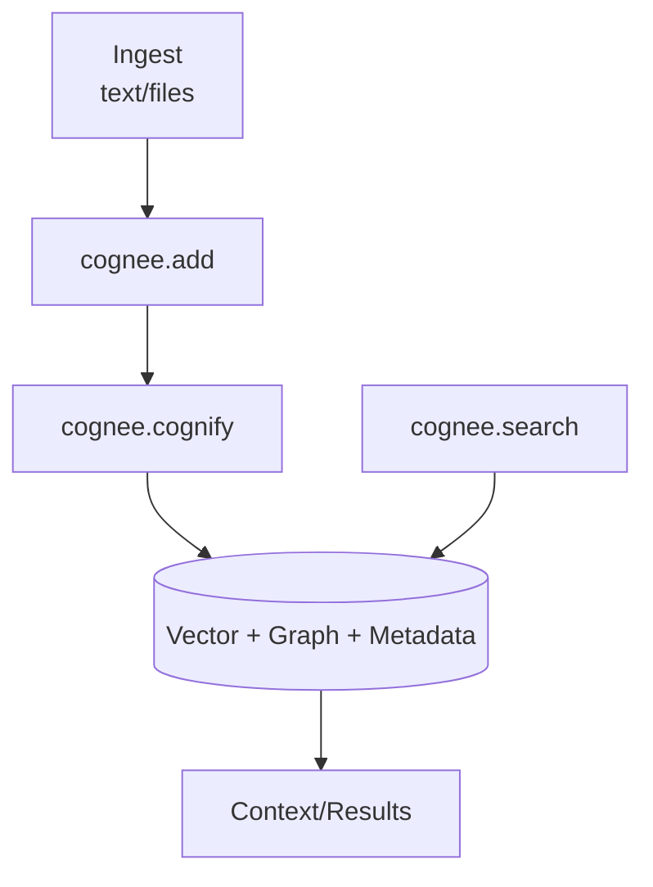

## 이 문서의 목적

- Cognee의 상위 흐름을 “입력→지식 엔진→검색” 관점으로 정리하고, 코드 디렉토리 구조와 연결합니다. (`README.md`, `cognee/`)
- API/MCP 같은 배포 형태가 어디에 있는지 “위치”를 고정합니다. (`cognee/api/`, `cognee-mcp/`)

---

## 빠른 요약(레포 구조/pyproject.toml 기반)

- 라이브러리: `cognee/`
- CLI: `cognee/cli/` (엔트리: `pyproject.toml`의 `cognee-cli = cognee.cli._cognee:main`)
- API 의존성(근거): `pyproject.toml`에 `fastapi`, `uvicorn`, `gunicorn` 포함
- MCP 서버: `cognee-mcp/` (별도 README에서 실행/트랜스포트 안내)

---

## 파이프라인 개념도(README 기반)

근거: `README.md`

---

## “스토리지/의존성” 힌트(근거)

`pyproject.toml` 의존성만으로도 Cognee가 어떤 축을 다루는지 힌트를 얻을 수 있습니다.

- API: `fastapi`, `uvicorn`, `gunicorn` (`pyproject.toml`)
- 그래프/DB 관련: `kuzu` (`pyproject.toml`)
- 벡터/임베딩 관련: `lancedb`, `fastembed`, `tiktoken` (`pyproject.toml`)
- 설정: `python-dotenv`, `pydantic-settings` (`pyproject.toml`)

> “정확히 어떤 DB를 기본으로 쓰는지 / 어떤 파일 레이아웃이 생기는지”는 `cognee/` 구현을 확인해야 확정할 수 있습니다.

---

## 근거(파일/경로)

- 파이프라인 개요/퀵스타트: `README.md`
- 패키지/의존성/CLI 엔트리: `pyproject.toml`
- CLI 디렉토리: `cognee/cli/`
- API 디렉토리: `cognee/api/`
- MCP 디렉토리: `cognee-mcp/`, `cognee-mcp/README.md`

---

## 주의사항/함정

- optional dependency 그룹이 많아(예: postgres/neo4j/redis/monitoring 등), 어떤 기능을 쓰는지에 따라 설치/배포 구성이 크게 달라질 수 있습니다. (`pyproject.toml`)

---

## TODO/확인 필요

- `cognee/cli/_cognee.py`에서 CLI 커맨드(add/cognify/search/delete)가 어떤 함수로 매핑되는지 정리
- API 서버의 엔트리/라우트가 어디인지 확인하고 “API 모드 vs 라이브러리 모드” 차이 문서화 (`cognee/api/`)

---

## 위키 링크

- `[[Cognee Guide - Index]]` → [가이드 목차](/blog-repo/cognee-guide/)
- `[[Cognee Guide - CLI/API/MCP]]` → [04. CLI/API/MCP 사용법](/blog-repo/cognee-guide-04-cli-api-mcp/)

---

*다음 글에서는 `cognee-cli`(scripts 근거)와 `cognee-mcp`(README 근거)의 실행 흐름을 정리합니다.*

