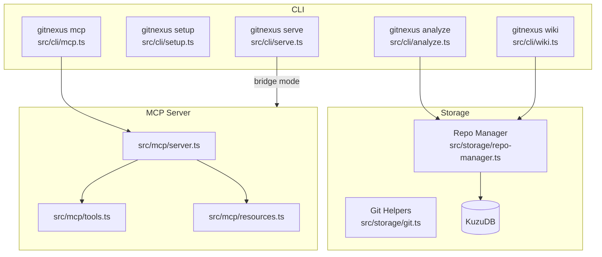

## 이 문서의 목적

- README의 “How It Works” 파이프라인(Structure→Parsing→Resolution→Clustering→Processes→Search)을 기준으로 아키텍처를 정리합니다. (`README.md`)
- 코드 상의 주요 모듈 위치를 지도처럼 찍어, 이후 상세 탐색의 출발점을 만듭니다. (`gitnexus/src/*`)

---

## 빠른 요약(README/코드 트리 기반)

- CLI 엔트리: `gitnexus/src/cli/index.ts` (파일 존재 근거)
- 핵심 CLI 기능 모듈들: `gitnexus/src/cli/analyze.ts`, `gitnexus/src/cli/mcp.ts`, `gitnexus/src/cli/serve.ts`, `gitnexus/src/cli/wiki.ts` 등 (`gitnexus/src/cli/*`)
- MCP 서버/도구: `gitnexus/src/mcp/server.ts`, `gitnexus/src/mcp/tools.ts`, `gitnexus/src/mcp/resources.ts` (`gitnexus/src/mcp/*`)
- 저장/레포 관리: `gitnexus/src/storage/repo-manager.ts`, `gitnexus/src/storage/git.ts` (`gitnexus/src/storage/*`)
- 의존성 근거: Tree-sitter, KuzuDB, MCP SDK (`gitnexus/package.json`)

---

## 파이프라인(README 단계) → 모듈(코드 위치)

README 단계(근거): `README.md`

1) Structure (파일 트리)
2) Parsing (Tree-sitter AST)
3) Resolution (imports/calls/heritage 등)
4) Clustering (커뮤니티/기능 그룹)
5) Processes (실행 플로우 추적)
6) Search (hybrid search)

코드 매핑은 이 챕터에서 “위치”까지를 고정하고, 정확한 호출 그래프는 추후 확인 대상으로 둡니다.

---

## 컴포넌트 다이어그램(개념도)

---

## 근거(파일/경로)

- 파이프라인 설명: `README.md`
- CLI 모듈 트리: `gitnexus/src/cli/*`
- MCP 모듈 트리: `gitnexus/src/mcp/*`
- 저장/레포 관리: `gitnexus/src/storage/*`
- 의존성/기술 스택: `gitnexus/package.json`

---

## 주의사항/함정

- README는 “전통적 Graph RAG vs GitNexus smart tools” 비교를 제공하지만, 실제로 어떤 정보를 “사전 계산”해 tool 응답에 포함하는지는 코드(`src/mcp/tools.ts` 및 파이프라인 구현)를 확인해야 확정할 수 있습니다. (`README.md`)

---

## TODO/확인 필요

- `gitnexus analyze` 실행 흐름(함수 호출) 트레이싱: `gitnexus/src/cli/analyze.ts`에서 시작해 실제 파이프라인 구현으로 연결
- MCP tools가 반환하는 데이터 구조(스키마)를 코드에서 정리: `gitnexus/src/mcp/tools.ts`, `gitnexus/src/types/*`

---

## 위키 링크

- `[[GitNexus Guide - Index]]` → [가이드 목차](/blog-repo/gitnexus-guide/)
- `[[GitNexus Guide - MCP]]` → [04. MCP 도구/통합](/blog-repo/gitnexus-guide-04-mcp-tools-and-integration/)

---

*다음 글에서는 README가 열거한 MCP tools(impact/query/context/…)를 “에디터 통합” 관점으로 정리하고, `.mcp.json`과 수동 설정 예시를 연결합니다.*

