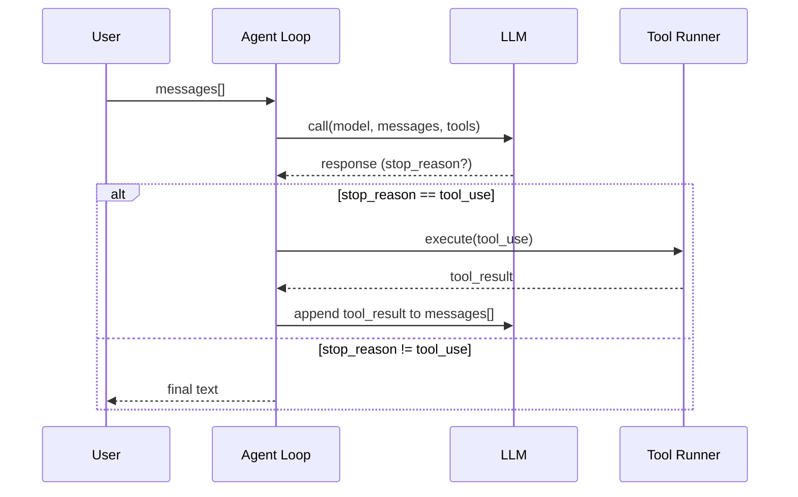

## 이 문서의 목적

- 레포가 제공하는 “12 progressive sessions”의 전체 지도를 잡고, 어디서부터 읽을지 정합니다. (`README.md`, `agents/`)
- 이후 챕터에서 다룰 핵심 개념(Loop/Tool Use/Planning/Skills/Teams/Isolation)을 “파일/경로”로 연결합니다.

---

## 빠른 요약(README 기반)

- 이 레포의 핵심 문장: “Every AI coding agent needs this loop.” (`README.md`)
- 구현 축은 `agents/s01_*.py` ~ `agents/s12_*.py`로 단계적으로 확장됩니다. (`agents/`)
- 문서는 `docs/{en,zh,ja}/`로 제공되고, 세션별 문서가 링크되어 있습니다. (`README.md`, `docs/en/`)

---

## 핵심 패턴: stop_reason 기반 툴 루프

README는 에이전트의 최소 루프를 아래 조건으로 설명합니다. (`README.md`)



코드 근거(최소 루프 구현):
- `agents/s01_agent_loop.py`

---

## 레포 구조(학습 관점)

README가 제시하는 구조를 “학습자가 실제로 만지는 것” 기준으로 재배치하면 아래와 같습니다. (`README.md`)

```text
learn-claude-code/
├── agents/                # s01~s12 Python 구현 + capstone(s_full)
├── docs/                  # 세션별 문서(EN/ZH/JA)
├── skills/                # s05에서 로딩하는 스킬 파일들
└── web/                   # Next.js 기반 인터랙티브 학습 플랫폼
```

---

## “세션”은 무엇을 추가하나?(README 표 기반)

레포는 s01~s12를 “한 세션 = 한 메커니즘”으로 설계합니다. (`README.md`, `agents/`)

- s01: **Loop**
- s02: **Tool Use 디스패치**
- s03: **Plan / TodoWrite**
- s04: **Subagents (fresh messages[])**
- s05: **Skill Loading (필요 시 로딩)**
- s06: **Context Compact (압축/유지)**
- s07~s12: **Persistence / Teams / Protocols / Autonomous / Worktree isolation**

이 시리즈에서는 파일 기반 근거를 중심으로 “왜 필요한가 / 어떻게 붙였나 / 어디를 바꾸면 되나”를 챕터로 나눠 정리합니다.

---

## 근거(파일/경로)

- 개요/학습 로드맵: `README.md`
- 세션 구현: `agents/s01_agent_loop.py` ~ `agents/s12_worktree_task_isolation.py`, `agents/s_full.py`
- 세션 문서(예: s01~s12): `docs/en/`
- Web 플랫폼: `web/README.md`, `web/package.json`

---

## 주의사항/함정(README 기반)

- README는 이 레포가 “학습용”이며 프로덕션에서 필요한 정책/권한/라이프사이클 레이어는 의도적으로 생략/단순화했음을 명시합니다. (`README.md`)

---

## TODO/확인 필요

- `docs/en/`의 세션 문서와 `agents/sXX_*.py` 구현이 1:1로 대응되는지(불일치 있으면 목록화)
- 각 세션이 추가하는 “상태(파일/디렉토리)”가 무엇인지(예: tasks 그래프, mailbox) 추출

---

## 위키 링크

- `[[Learn Claude Code Guide - Index]]` → [가이드 목차](/blog-repo/learn-claude-code-guide/)
- `[[Learn Claude Code Guide - Setup]]` → [02. 설치 및 첫 실행](/blog-repo/learn-claude-code-guide-02-setup-and-first-run/)

---

*다음 글에서는 `requirements.txt`와 `.env.example`를 기준으로 실행 환경을 세팅하고, `agents/s01_agent_loop.py`를 실제로 구동하는 최소 경로를 정리합니다.*

