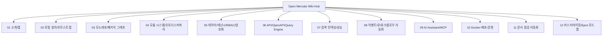

# Open Mercato 위키 가이드

> **모노레포 기반 CRM/ERP/Commerce 플랫폼 Open Mercato를 위키형 노드로 연결해 확장·운영·자동화까지 정리한 한국어 시리즈**

**Open Mercato (`open-mercato/open-mercato`)**는 Next.js + TypeScript + MikroORM + Awilix DI 위에 모듈형 비즈니스 기능(CRM/ERP/Commerce)과 AI Assistant(MCP)를 결합한 플랫폼입니다.

- 원문 저장소: https://github.com/open-mercato/open-mercato
- 공식 문서: https://docs.openmercato.com/

---

## 위키 맵 (Mermaid)



---

## 목차

| # | 제목 | 내용 |
|---|------|------|
| 01 | [소개/위키 맵](/blog-repo/open-mercato-guide-01-intro-and-wiki-map/) | 플랫폼 포지셔닝과 학습 경로 |
| 02 | [로컬 설치/부트스트랩](/blog-repo/open-mercato-guide-02-local-setup-and-bootstrap/) | Node 24 + Yarn 4 + 초기화 흐름 |
| 03 | [모노레포/패키지 그래프](/blog-repo/open-mercato-guide-03-monorepo-and-package-graph/) | apps/packages 분리와 터보 파이프라인 |
| 04 | [모듈 시스템/오토디스커버리](/blog-repo/open-mercato-guide-04-module-system-and-auto-discovery/) | module-registry 생성기와 경로 규칙 |
| 05 | [데이터/테넌시/RBAC/암호화](/blog-repo/open-mercato-guide-05-data-model-tenancy-rbac-and-encryption/) | 멀티테넌트 데이터 경계와 보안 설계 |
| 06 | [API/OpenAPI/Query Engine](/blog-repo/open-mercato-guide-06-api-openapi-and-query-engine/) | CRUD/API 문서화와 발견성 |
| 07 | [검색 인덱싱/성능](/blog-repo/open-mercato-guide-07-search-indexing-and-performance/) | 토큰/전문/벡터 하이브리드 검색 |
| 08 | [이벤트/큐/워크플로우 자동화](/blog-repo/open-mercato-guide-08-events-queue-and-workflow-automation/) | 이벤트 버스와 비동기 처리 전략 |
| 09 | [AI Assistant/MCP](/blog-repo/open-mercato-guide-09-ai-assistant-and-mcp-tooling/) | 도구 레지스트리와 API/스키마 탐색 |
| 10 | [Docker 배포/운영](/blog-repo/open-mercato-guide-10-docker-deployment-and-operations/) | dev/prod compose와 운영 체크포인트 |
| 11 | [문서 점검 자동화 체계](/blog-repo/open-mercato-guide-11-documentation-governance-and-automation/) | 위키 품질 점검 도구/체크리스트/CI |
| 12 | [커스터마이징/Eject 로드맵](/blog-repo/open-mercato-guide-12-customization-eject-and-extension-roadmap/) | standalone app 전략과 확장 경로 |

---

## 빠른 시작

```bash
git clone https://github.com/open-mercato/open-mercato.git
cd open-mercato
git checkout develop
yarn install
cp apps/mercato/.env.example apps/mercato/.env
yarn generate
yarn initialize
yarn dev
```

---

## 위키 링크

- `[[Open Mercato Wiki - Intro Map]]` → [01 소개/위키 맵](/blog-repo/open-mercato-guide-01-intro-and-wiki-map/)
- `[[Open Mercato Wiki - Module System]]` → [04 모듈 시스템/오토디스커버리](/blog-repo/open-mercato-guide-04-module-system-and-auto-discovery/)
- `[[Open Mercato Wiki - Doc Automation]]` → [11 문서 점검 자동화 체계](/blog-repo/open-mercato-guide-11-documentation-governance-and-automation/)
